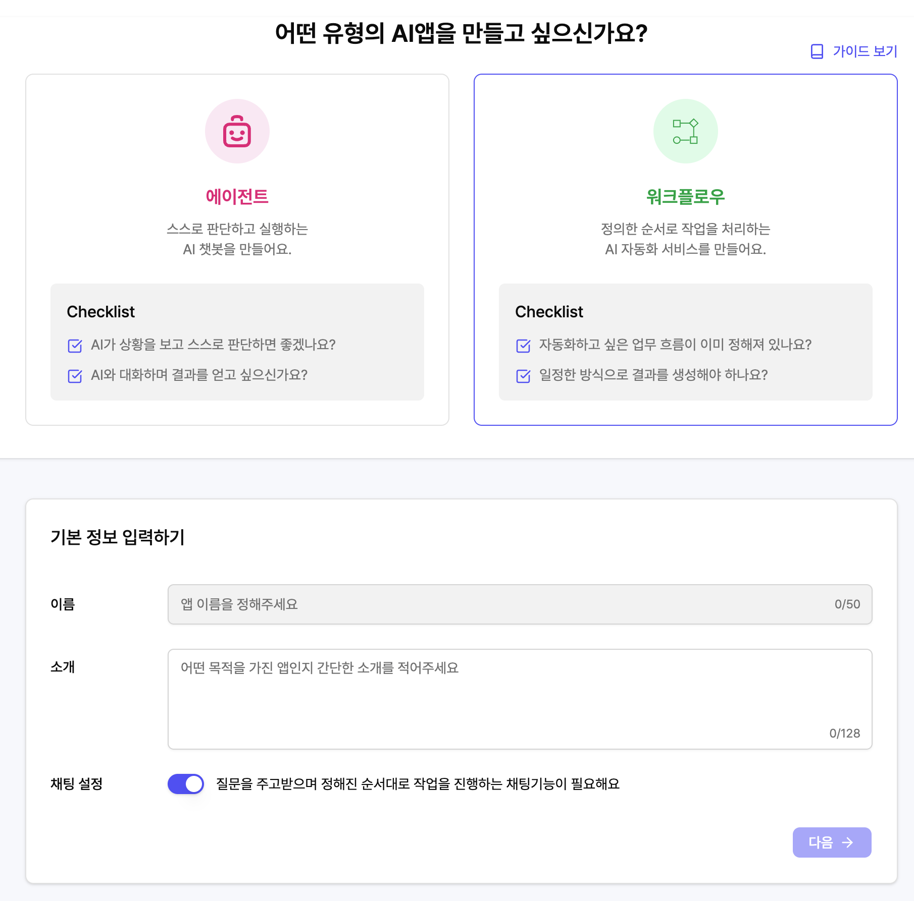

**일반 워크플로우**는 정해진 입력을 받아 미리 설계된 순서대로 작업을 실행하고 결과를 반환하는 방식입니다. 한 번 실행되면 정의된 흐름대로 처리되는 **자동화 프로세스**라고 생각하면 됩니다.

**채팅 워크플로우**는 채팅 인터페이스에서 실행되는 워크플로우입니다. 일반 워크플로우와 달리 **대화가 이어지며 이전 대화 내용을 기억할 수 있습니다.** 에이전트처럼 연속적인 대화가 가능하지만, 에이전트처럼 스스로 판단해 행동하지는 않고 **미리 정의된 워크플로우 로직 안에서만 응답**합니다.

<figure><figcaption></figcaption></figure>
