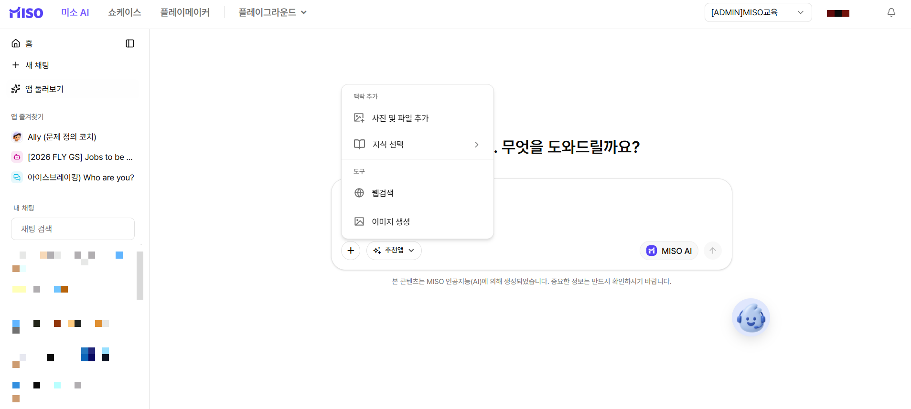

# 미소AI

미소AI는 MISO에서 제공하는 **엔터프라이즈 AI 어시스턴트**입니다.

채팅에서 질문하고, 파일과 사내 지식을 연결해 업무를 처리합니다.

사내에서 만든 자동화 앱도 검색하고 즐겨찾기에 추가해 사용할 수 있습니다.

<figure><figcaption>
미소AI
</figcaption></figure>

### 미소AI 기능 살펴보기

<table data-view="cards"><thead><tr><th>기능</th><th data-card-target data-type="content-ref">바로가기</th></tr></thead><tbody><tr><td>사진 및 파일 추가 이미지나 파일을 첨부해 요청에 필요한 맥락을 제공합니다.</td><td><a href="undefined.md">undefined.md</a></td></tr><tr><td>이미지 생성 이미지를 생성하거나 기존 이미지를 수정합니다.</td><td><a href="undefined-3.md">undefined-3.md</a></td></tr><tr><td>웹 검색 최신 웹 정보를 찾아 요청에 활용합니다.</td><td><a href="undefined-2.md">undefined-2.md</a></td></tr><tr><td>지식 검색 등록된 사내 지식을 선택해 답변에 활용합니다.</td><td><a href="undefined-1.md">undefined-1.md</a></td></tr><tr><td>미소 추천 앱 별도 설정 없이 사용할 수 있는 추천 앱을 확인합니다.</td><td><a href="undefined-4.md">undefined-4.md</a></td></tr><tr><td>앱 둘러보기 에이전트 앱을 찾고 즐겨찾기에 추가합니다.</td><td><a href="undefined-5.md">undefined-5.md</a></td></tr></tbody></table>
