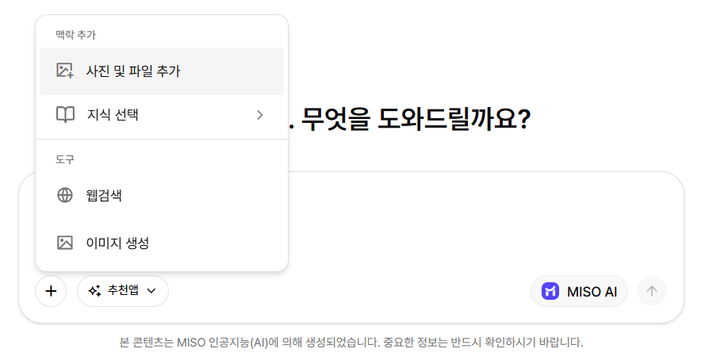

# 사진 및 파일 추가

메시지에 이미지나 파일을 첨부해 내용을 바탕으로 요청할 수 있습니다.

파일을 업로드한 뒤 요청 내용을 입력하고 메시지를 전송합니다.

<figure><figcaption>
사진 및 파일 업로드
</figcaption></figure>

### 지원 파일 형식

* **문서:** `txt`, `md`, `mdx`, `markdown`, `pdf`, `html`, `xlsx`, `xls`, `docx`, `csv`, `eml`, `msg`, `pptx`, `ppt`, `xml`, `epub`
* **이미지:** `jpg`, `jpeg`, `png`, `gif`, `webp`

### 파일 제한

* 문서는 파일당 최대 `50MB`까지 업로드할 수 있습니다.
* 이미지는 파일당 최대 `10MB`까지 업로드할 수 있습니다.
* 이미지의 최대 해상도는 `4096 × 4096`입니다.
