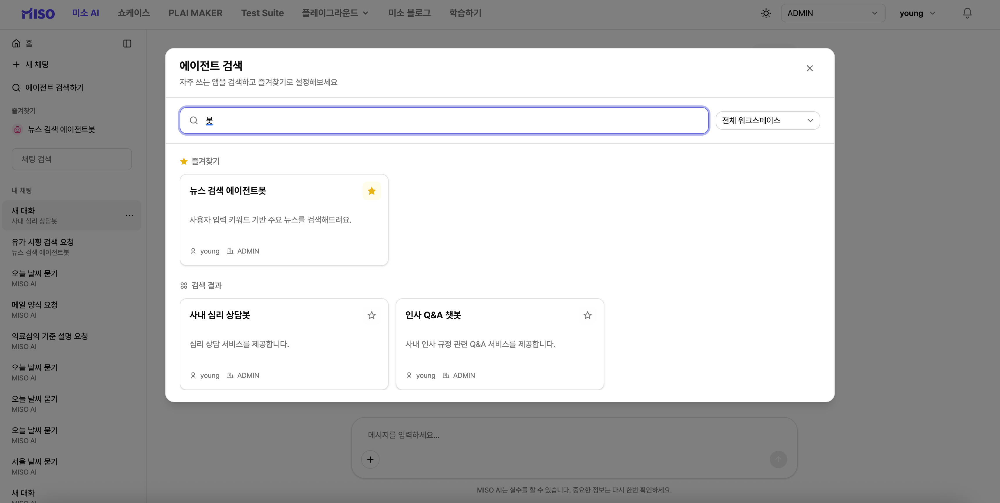

# 에이전트 APP 검색 및 즐겨찾기

사용자 혹은 동료가 만든 에이전트 APP을 검색하고 미소 AI 화면에서 즉시 실행하거나,\
즐겨 찾는 APP으로 설정하여 언제든 편리하게 사용할 수 있습니다.  

즐겨찾기로 설정한 APP은 좌측 사이드바 즐겨찾기 리스트에 항상 고정되며, \
사용자의 필요에 따라 미소 AI or 일반 에이전트 APP을 편리하게 전환하여 사용할 수 있습니다.

* **사이드바 상단 ‘에이전트 검색하기’**
* **에이전트 검색 모달 화면 내 에이전트 APP 이름/설명, 생성자명 으로 검색 가능**
* **검색 결과 APP 카드 클릭시 즉시 실행 or 별 클릭을 통해 즐겨찾기 지정/해제 가능**
* **즐겨찾기된 APP은 사이드바 좌상단에 고정되며, 리스트 클릭 후 즉시 실행 및 사용 가능**
* **좌하단 ‘내 채팅’의 채팅 리스트는 ‘미소 AI’ 대화와 ‘에이전트 APP’ 대화가 구분되어 표기됨**

<figure><figcaption>
&#x3C;에이전트 APP 검색 및 즐겨찾기 설정>
</figcaption></figure>
