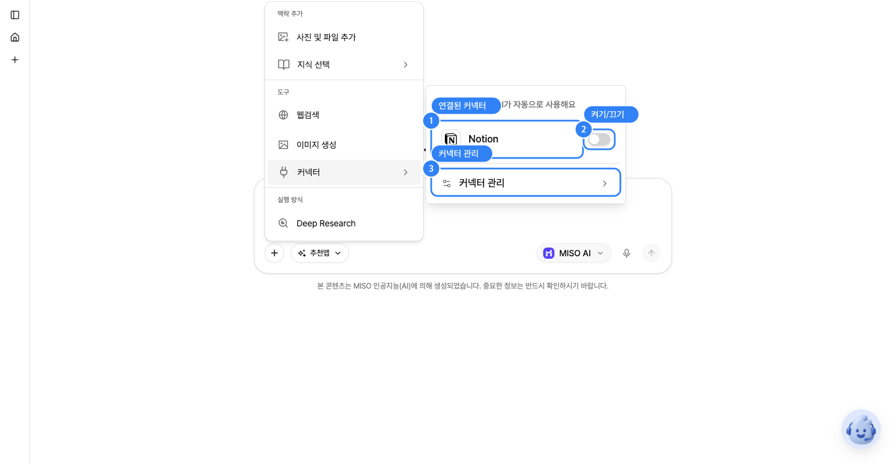
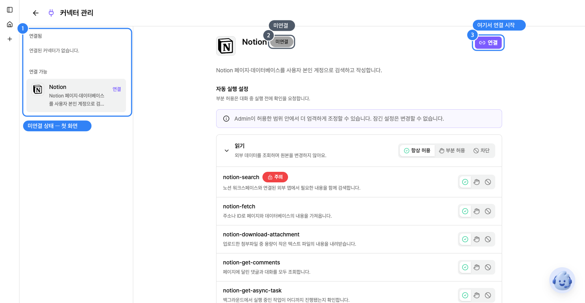
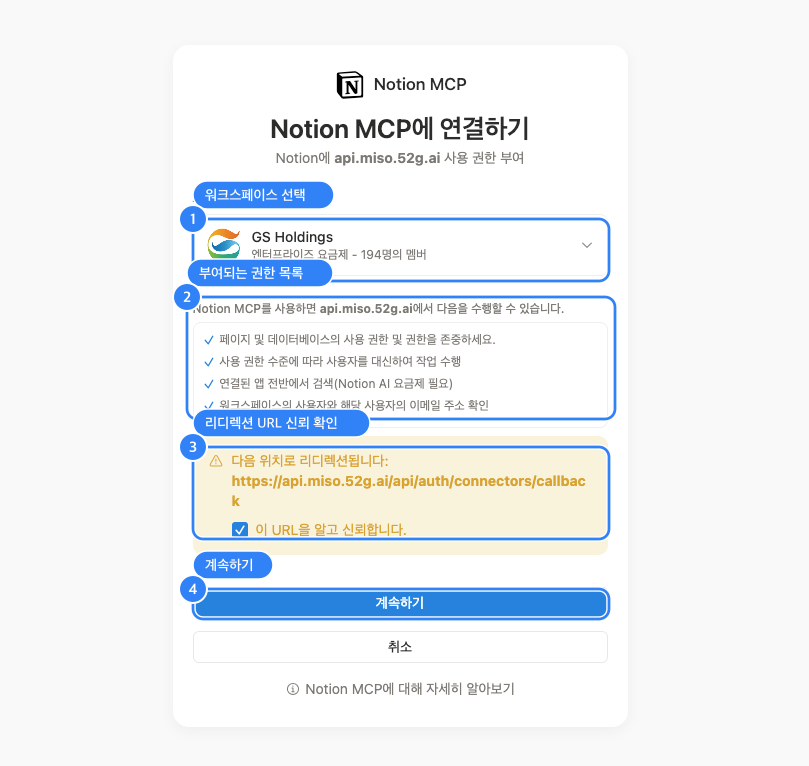
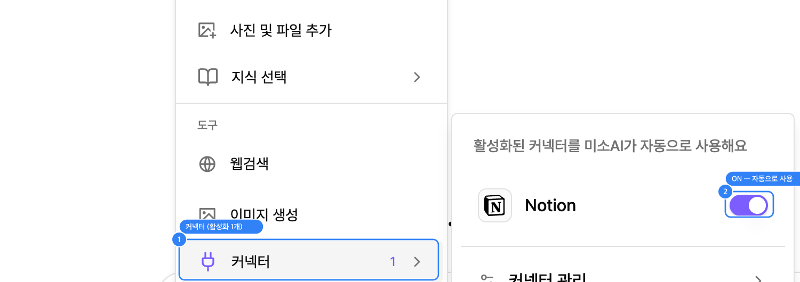
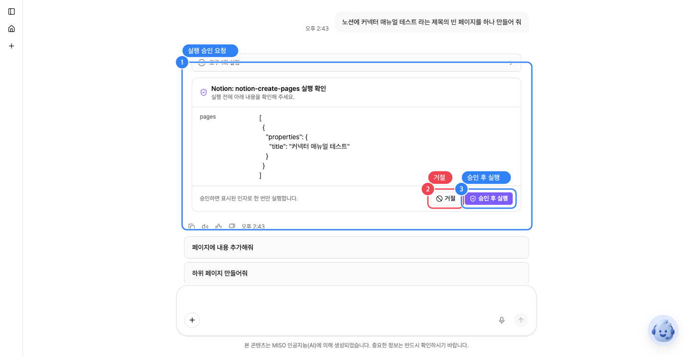
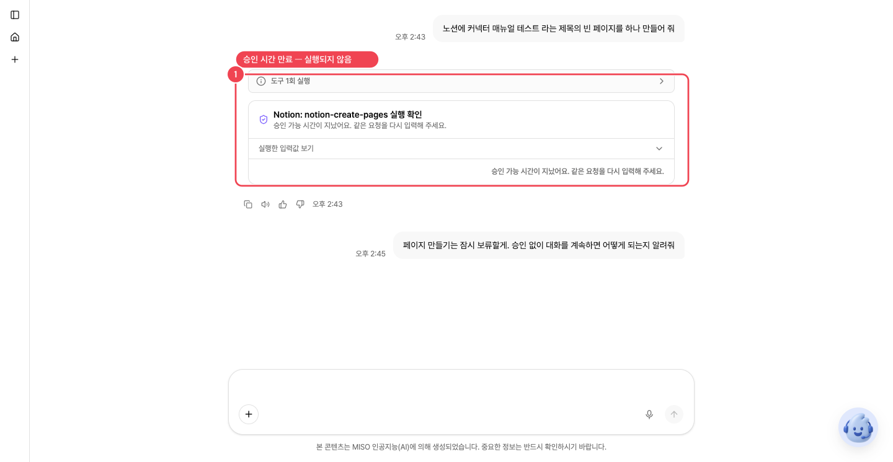
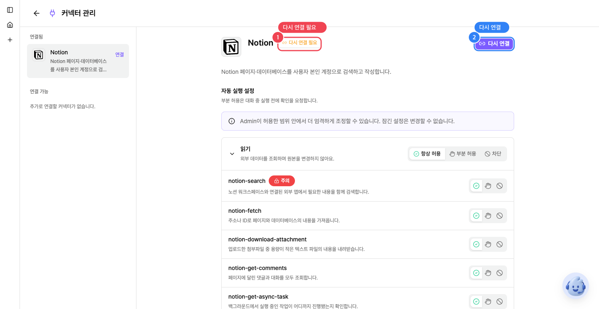

# 커넥터

### 커넥터란?

커넥터는 미소AI에서 조직에서 사용하는 서비스의 개인 계정을 연동하여, 대화 중 필요한 정보를 조회하거나 작업을 대신 수행하게 해주는 기능입니다. 노션처럼 평소 쓰는 서비스를 한 번 연결해두면, 이후에는 매번 서비스를 오가지 않고도 미소AI와의 대화 안에서 바로 조회하고 처리할 수 있습니다.

***

### 시작하기

#### 커넥터 메뉴 열기

1. 대화 입력창 왼쪽 아래의 **＋** 버튼을 선택합니다.
2. 맥락 추가, 도구, 실행 방식 세 구역으로 이루어진 메뉴가 열립니다. 도구 구역 안에 **커넥터** 항목이 있습니다.
3. 도구 구역의 커넥터를 선택하면 오른쪽에 서브메뉴가 열립니다.

<figure><figcaption></figcaption></figure>

> 💡 커넥터를 하나도 켜지 않았다면 "사용 가능한 커넥터가 없어요"라는 안내만 보입니다. 아래 **처음 연결하기**를 진행하세요.

***

### 처음 연결하기

커넥터 서브메뉴 아래의 **커넥터 관리**를 선택하면 연결 상태와 권한을 자세히 볼 수 있는 화면으로 이동합니다. 아직 연결한 적이 없다면 아래처럼 **미연결** 상태로 보입니다.

> 💡 관리자가 활성화하지 않은 커넥터는 노출되지 않습니다. 연결 가능 커넥터가 없을 경우 조직의 관리자에게 문의바랍니다.

<figure><figcaption></figcaption></figure>

#### 1. 연결 버튼 누르기

상세 패널 오른쪽 위의 **연결** 버튼을 누르면 해당 서비스의 로그인 화면으로 이동합니다. 예를 들어 노션은 아래와 같은 동의 화면을 보여줍니다.

<figure><figcaption></figcaption></figure>

이 화면에서 확인할 항목:

1. **워크스페이스 선택** - 여러 워크스페이스에 속해 있다면 연결할 워크스페이스를 고릅니다.
2. **부여되는 권한 목록** - 미소AI가 이 서비스에서 할 수 있는 일을 그대로 보여줍니다. 페이지·데이터베이스 접근, 사용자 대신 작업 수행, 검색, 워크스페이스 사용자 이메일 확인 등입니다.
3. **리디렉션 URL 신뢰 확인** - 인증이 끝난 뒤 어디로 돌아갈지 보여줍니다. 미소 API 주소가 맞는지 확인하고 체크합니다.
4. **계속하기** - 로그인과 권한 부여를 최종 승인합니다.

> 🔒 이 로그인과 동의 과정은 반드시 본인이 직접 진행해야 합니다. 미소AI나 다른 사람이 대신 로그인해 줄 수 없고, 그렇게 요청받아서도 안 됩니다.

#### 2. 연결 완료 확인하기

로그인과 권한 부여가 끝나면 자동으로 미소AI 화면으로 돌아오고, 상태가 연결됨으로 바뀝니다.&#x20;

이제 ＋ 버튼의 커넥터 항목을 열어보면 활성화된 커넥터를 확인할 수 있어요. 활성화된 커넥터는 미소AI가 사용자의 질문에 맞춰 자동으로 사용합니다.

<figure><figcaption></figcaption></figure>

#### 3. 미소AI에서 사용하기

연결과 활성화가 끝나면 별도의 명령어 없이, 평소 대화하듯 요청만 하면 미소AI가 알아서 커넥터를 사용합니다. "커넥터를 써줘"처럼 도구 이름을 언급할 필요는 없습니다.

예를 들어 아래처럼 노션 관련 내용을 물어보면:

> 노션에서 52g 디자인 가이드 관련 페이지를 찾아줘

미소AI는 질문 안에서 노션 커넥터가 필요하다는 것을 스스로 판단해 자동으로 실행합니다. 읽기 권한이 항상 허용으로 설정되어 있어 별도 승인 없이 바로 실행되고, 조회된 내용이 표나 목록처럼 정리된 형태로 대화에 나타납니다.

<figure><figcaption></figcaption></figure>

이후 "이 중에서 최근에 수정된 페이지 내용도 보여줘"처럼 같은 대화 안에서 후속 질문을 이어가면, 미소AI가 그 맥락을 유지한 채 계속 활용됩니다.

> 💡 부분 허용으로 설정된 동작을 요청하면, 결과가 바로 나오는 대신 앞서 본 승인 UI가 먼저 나타납니다.

***

### 자동 실행 권한 설정

커넥터의 동작마다 에이전트의 자동 실행 권한을 설정할 수 있습니다. 그룹 전체에 한 번에 적용하거나, 도구별로 따로 지정할 수 있습니다.

<figure><figcaption></figcaption></figure>

* **항상 허용** - 확인 절차 없이 즉시 실행됩니다. 검색처럼 되돌릴 필요가 없는 읽기 작업에 적합합니다.
* **차단** - 그 도구는 어떤 경우에도 실행되지 않습니다. 회사 정책상 절대 쓰면 안 되는 기능을 막을 때 사용합니다.
* **부분 허용** - 실행하기 전에 반드시 사람의 승인을 받습니다. 만료되거나 거절 시, 동작하지 않습니다.


{% column width="50%" %}
<figure><figcaption>
부분 허용 - 승인 대기 화면
</figcaption></figure>


{% column width="50%" %}
<figure><figcaption>
부분 허용 - 만료 화면
</figcaption></figure>




### 커넥터 기능 분류

#### 읽기 기능

**설명:** 외부 데이터를 조회하며 원본을 변경하지 않습니다.

검색, 조회, 목록 확인처럼 부작용이 없는 도구들이 여기 속합니다. (노션 기준: 페이지·데이터베이스 검색, 페이지 내용 가져오기, 댓글 조회, 팀스페이스·사용자 목록 조회 등 15개 이상)

패널 위쪽의 **자동 실행 설정** 안내에 따라, 그룹 오른쪽의 **항상 허용 · 부분 허용 · 차단** 중 하나를 선택해 전체 읽기 도구의 기본 동작을 정합니다. 특정 도구만 다르게 쓰고 싶다면 그 도구 줄의 개별 컨트롤을 따로 조정합니다.

#### 쓰기/삭제 기능

**설명:** 외부 데이터를 만들거나 수정·삭제해 다른 사용자에게 영향을 줄 수 있어요.

페이지 생성, 내용 수정, 이동, 삭제, 데이터베이스 변경처럼 실제 데이터를 바꾸는 도구들이 여기 속합니다. 여러 도구 옆에 빨간 **주의** 배지가 붙어 있는데, 되돌리기 어렵거나 다른 사람에게 영향을 주는 작업이라는 뜻입니다.

<figure><figcaption></figcaption></figure>

***

### 연결 관리 (재인증 · 연결 해제)

#### 다시 연결이 필요해졌을 때

토큰이 만료되었거나 외부 서비스 쪽 보안 정책으로 인증이 무효화되면 이 상태가 됩니다. 빨간색 **다시 연결 필요** 배지와 함께 **다시 연결** 버튼이 나타납니다.

이 상태에서는 대화에서 이 커넥터를 사용할 수 없습니다. ＋ 메뉴의 커넥터 서브메뉴에도 표시되지 않거나 실행이 거부됩니다. **다시 연결**을 눌러 재인증을 완료해야 다시 쓸 수 있습니다. 절차는 위의 **처음 연결하기**와 동일합니다.

<figure><figcaption></figcaption></figure>

#### 연결 해제하기

더 이상 이 커넥터를 쓰지 않으려면, 연결됨 상태의 상세 패널 오른쪽 위 **연결 해제** 버튼을 누릅니다. 해제하면 커넥터가 **연결 가능** 목록으로 옮겨가고, 대화에서 즉시 사용할 수 없게 됩니다.

연결이 해제된 커넥터는 미연결 상태가 되어 대화에서 즉시 사용할 수 없게 됩니다. 다시 쓰려면 연결 버튼으로 처음부터 인증을 다시 진행해야 합니다.
