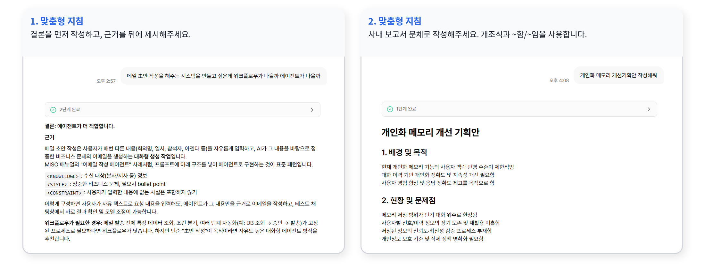
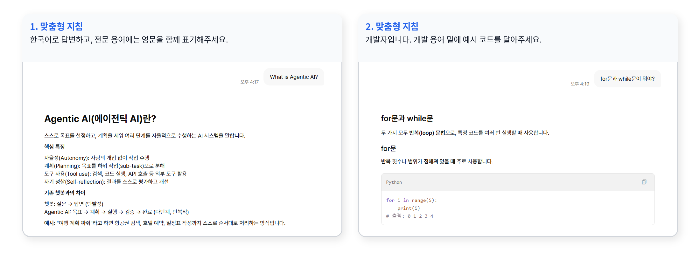
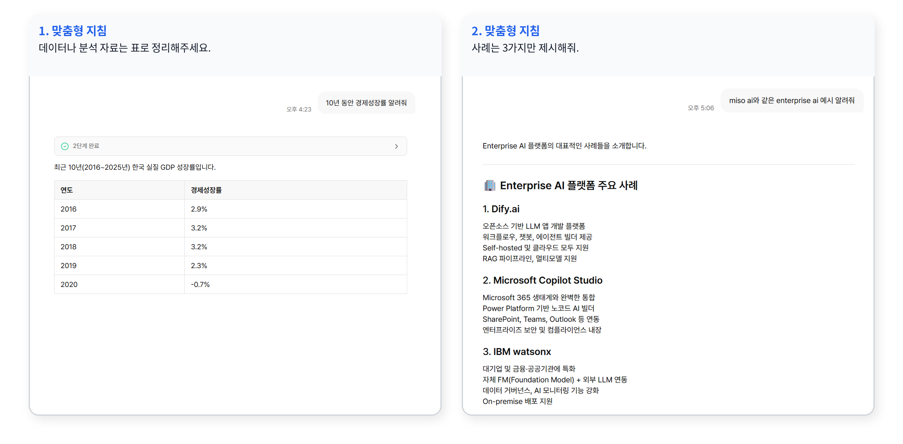

# 맞춤형 지침

<figure><figcaption></figcaption></figure>

맞춤형 지침은 모든 **"미소 AI"** 채팅에 적용하는 개인 규칙입니다. 자주 요청하는 말투와 형식을 미리 설정할 수 있습니다.

### 설정하기 좋은 경우

여러 채팅에서 반복되는 요구 지침을 설정하세요.

* 보고서나 고객 회신처럼 결과물의 문체와 구조가 일정한 경우.
* 불필요한 서론, 요약, 후속 제안을 줄이고 싶은 경우.
* 사내 용어, 표기 규칙, 응답 언어를 일관되게 적용할 경우.

<figure><figcaption></figcaption></figure>


맞춤형 지침은 모든 **"미소 AI"** 채팅에 적용됩니다. 특정 작업에만 필요한 규칙은 해당 대화에서 요청하세요.


### 작성할 내용

입력 형식은 자유이며, 최대 200자까지 작성할 수 있습니다. 아래 중 필요한 항목만 선택해 작성하세요.

<figure><figcaption></figcaption></figure>

#### 말투와 응답 형식

응답의 문체, 구조, 분량을 지정합니다.

**예시**

```
결론을 먼저 작성하고, 근거를 뒤에 제시해주세요.
```

```
사내 보고서 문체로 작성해주세요. 개조식과 ~함/~임을 사용합니다.
```

<figure><figcaption></figcaption></figure>


글자 수보다 구조를 구체적으로 지정하세요. 예를 들어 3\~4문장이나 선택지 3개 이하가 효과적입니다.


#### 역할 및 배경

변하지 않는 역할과 업무 배경을 작성하면 설명 수준을 맞출 수 있습니다.

**예시**

```
한국어로 답변하고, 전문 용어에는 영문을 함께 표기해주세요.
```

```
개발자입니다. 개발 용어 밑에 예시 코드를 달아주세요.
```

<figure><figcaption></figcaption></figure>


프로젝트명, 고객사, 최근 수치처럼 바뀌는 정보는 대화에서 직접 제공하세요.


#### 작업별 지침

조건이 있는 규칙은 적용할 상황을 분명히 작성하세요.

**예시**

```
데이터나 분석 자료는 표로 정리해주세요.
```

```
사례는 3가지만 제시해줘.
```

<figure><figcaption></figcaption></figure>

#### 피할 내용

원하지 않는 응답 요소를 명확히 지정하세요. 금지 대신 원하는 대안을 함께 쓰면 더 정확합니다.

**예시**

```
요청을 되짚는 서론 없이 본문부터 시작해주세요.
```

```
마지막에 앞 내용을 다시 요약하지 말아주세요.
```

### 작성 예시

#### 보고서·기획 담당자

```
사내 기획 업무 담당.
사내 보고서 문체로 작성.
결론 먼저, 근거는 뒤에 제시.
마크다운 기호 없이 평문으로 작성.
데이터와 분석 자료는 표로 정리.
확실하지 않은 수치는 "확인 필요"로 표시하고 추측하지 말 것.
서론 없이 본문부터 시작하고, 후속 제안은 붙이지 말 것.
```

<figure><figcaption><p>보고서·기획 담당자</p></figcaption></figure>

#### 고객 응대 담당자

```
고객 응대 업무 담당.
정중한 존댓말 이메일 문체로 작성.
완성된 회신 문안은 코드블록에 작성.
확정되지 않은 일정이나 보상은 단정하지 말 것.
이모지 사용 금지.
```

<figure><figcaption><p>고객 응대 담당자</p></figcaption></figure>

#### 데이터 분석

```
데이터 분석 결과를 사내 보고에 씁니다.
결론(수치와 방향)을 먼저, 근거는 뒤에.
비교·집계 결과는 표로 정리.
데이터에 없는 값은 추측하지 말고 "확인 필요"로 표시.
해석과 사실을 섞지 말고 구분해서 표기.
표본 수가 적으면 그 사실을 함께 알려줄 것.
```

<figure><figcaption><p>데이터 분석</p></figcaption></figure>


3\~7줄의 핵심 규칙이면 충분합니다. 한 줄에는 한 가지 규칙만 작성하세요. 반복해서 요청하게 되는 내용만 추가하며 다듬으세요.

