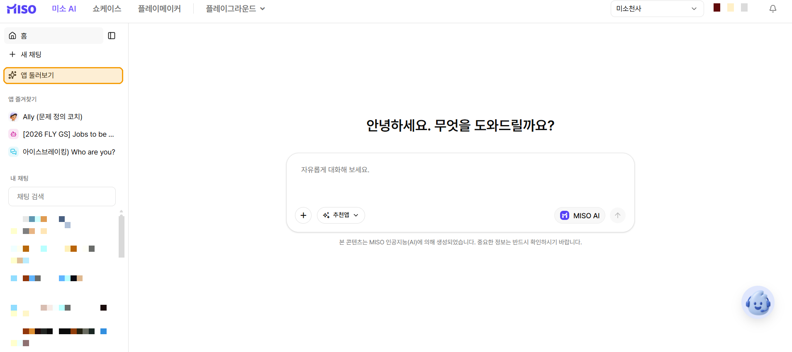

# 앱 둘러보기

<figure><figcaption></figcaption></figure>

**앱 둘러보기**에서는 추천 앱과 동료가 만든 앱을 찾고 실행할 수 있습니다.

자주 사용하는 에이전트와 챗플로우 앱은 즐겨찾기에 추가할 수 있습니다.

미소AI 사이드바에서 **앱 둘러보기**를 선택합니다.

### 앱 찾기

#### 미소 추천 앱

미소가 큐레이션한 앱과 워크스페이스의 공개 앱이 카드로 표시됩니다.

**더보기**를 선택하면 전체 목록을 확인할 수 있습니다.

#### 앱 검색

앱 이름, 설명, 태그로 검색합니다.

검색창 아래의 유형 탭에서 결과를 필터링할 수 있습니다.

* 전체
* 에이전트
* 챗플로우
* 워크플로우
* 웹사이트

<figure><figcaption></figcaption></figure>

### 앱 카드와 실행 방식

앱 카드에는 아이콘, 앱 이름, 유형, 설명, 태그, 제작자가 표시됩니다.

카드를 선택하면 앱 유형에 따라 다음과 같이 열립니다.

* **에이전트·챗플로우:** 미소AI 채팅 화면에서 바로 대화합니다.
* **워크플로우:** 새 창에서 실행 화면을 엽니다.
* **웹사이트:** 새 창에서 발행된 사이트를 엽니다.

### 즐겨찾기 관리

카드 오른쪽 위의 별(★)을 선택해 즐겨찾기를 추가하거나 해제합니다.

즐겨찾기에 추가한 앱은 왼쪽 사이드바의 **즐겨찾기** 목록에 고정됩니다.


즐겨찾기는 에이전트와 챗플로우 앱만 지원합니다.


### 알아두기

* **내 채팅** 목록에는 미소AI 대화와 에이전트 앱 대화가 구분되어 표시됩니다.
* 현재 사용할 수 있는 앱만 검색 결과에 표시됩니다.
