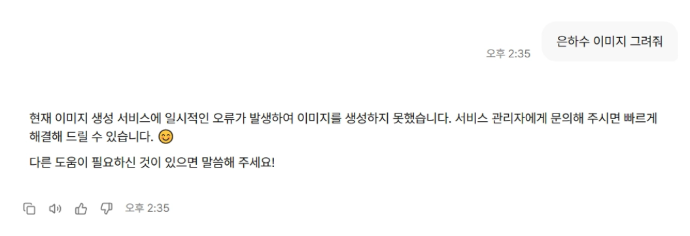
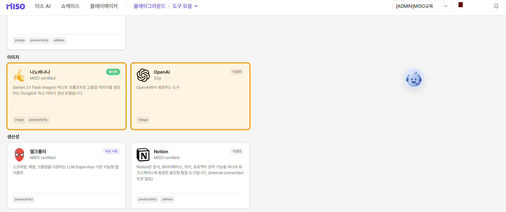

# 이미지 생성

이미지 생성 도구로 텍스트 프롬프트를 기반으로 새 이미지를 만듭니다.

업로드한 이미지의 색상, 배경, 스타일도 수정할 수 있습니다.

### 이미지 만들기



#### 이미지 생성 도구 활성화하기

메시지 입력창 아래의 **+** 버튼에서 이미지 생성 도구를 활성화합니다.



#### 생성 요청하기

스타일, 색상, 구도, 분위기를 포함해 원하는 이미지를 구체적으로 작성합니다.

요청 내용을 입력한 뒤 메시지를 전송합니다.



<figure><figcaption>
이미지 생성 도구 활성화 및 요청 입력
</figcaption></figure>

### 기존 이미지 수정하기

수정할 원본 이미지는 [사진 및 파일 추가](undefined.md)로 업로드합니다.

변경할 색상, 배경, 스타일을 프롬프트에 구체적으로 작성합니다.

<figure><figcaption>
기존 이미지를 업로드해 생성에 활용
</figcaption></figure>


#### 이미지 생성 오류 해결하기

이미지를 생성하지 못했다는 오류가 표시되면 이미지 생성 도구가 활성화되어 있는지 확인합니다.

MISO AI는 나노바나나 또는 OpenAI 도구를 사용해 이미지를 생성합니다.

도구가 활성화되어도 오류가 계속되면 API 키가 만료되었을 수 있습니다. MISO 담당 관리자에게 문의합니다.


<figure><figcaption>
이미지 생성 오류 예시
</figcaption></figure> <figure><figcaption>
이미지 도구 활성화
</figcaption></figure>

