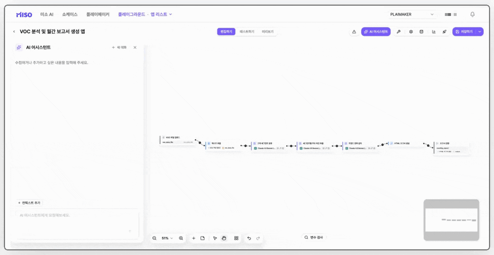
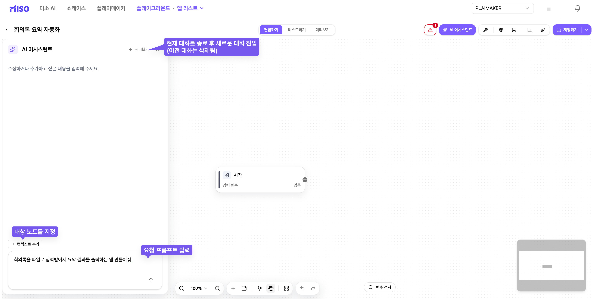
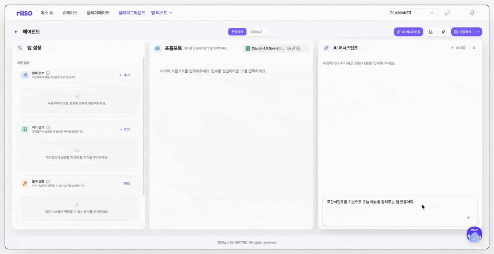

# AI 어시스턴트 활용하기

AI 어시스턴트는 자연어 요청으로 앱을 생성하고 수정하는 기능입니다.

원하는 기능과 결과를 설명하면 앱 구성과 구조를 빠르게 만들거나 개선할 수 있습니다.


#### 지원 기능

AI 어시스턴트는 MISO 앱에서 직접 편집할 수 있는 기능 범위에서 동작합니다.

**생성하기**

빈 영역에서 새 앱 제작을 요청합니다. 필요한 기능과 구조를 설명하면 앱 구성을 생성합니다.

**수정하기**

생성된 앱의 내용과 구조를 변경하거나 개선합니다.

**질문하기(적용 예정)**

편집 중인 MISO 앱과 관련된 질문을 지원할 예정입니다.


### AI 어시스턴트 열기

앱 편집 화면 오른쪽 위의 **AI 어시스턴트**를 선택하면 채팅창이 열립니다.

<figure><figcaption></figcaption></figure>


#### AI 어시스턴트가 보이지 않나요?

AI 어시스턴트는 실험실 기능입니다. 관리자가 기능을 **ON**으로 설정한 경우에만 사용할 수 있습니다.

기능이 보이지 않으면 MISO 담당 관리자에게 문의합니다.


### 앱 유형별 활용 가이드

#### 에이전트

**화면 구성**

* 오른쪽 채팅창에 요청을 입력합니다. 에이전트 AI 어시스턴트는 **컨텍스트 추가**를 지원하지 않습니다.
* 편집을 요청하면 변경 사항이 가운데 영역에 표시됩니다.
* 변경할 항목을 선택한 뒤 오른쪽 아래의 **선택 적용**을 선택합니다.

<figure><figcaption></figcaption></figure>

**앱 편집하기**

앱의 목적, 입력 방식, 응답 조건을 구체적으로 설명해 편집을 요청합니다.

예를 들어 다음과 같이 요청할 수 있습니다.

* **“주간 식단표를 기반으로 오늘 메뉴를 알려주는 앱 만들어줘”**
* **“파일 입력 기능을 활성화해서 사용자가 업로드한 파일을 기반으로도 대답할 수 있게 해줘”**
* **“입력변수에 오늘의 기분을 입력받고 사용자의 기분에 따라 응답 톤을 다르게 해줘”**

기능, 입력값, 응답 방식까지 함께 요청할 수 있습니다.

요청이 구체적일수록 원하는 구조와 설정을 더 정확하게 반영합니다.

<figure><figcaption></figcaption></figure>

**지원 범위**

AI 어시스턴트는 에이전트에서 다음 기능을 지원합니다.

<table><thead><tr><th width="159.86328125">명칭</th><th>설명</th><th>지원 불가 항목</th></tr></thead><tbody><tr><td>설정</td><td>환영 메시지, 질문 제안, 파일 업로드 기능, 스케줄러 등 에이전트 앱에서 제공하는 설정을 요청에 따라 생성하거나 수정할 수 있습니다.</td><td>에이전트에서 제공하지 않는 설정 항목은 지원하지 않습니다.</td></tr><tr><td>모델 및 프롬프트</td><td>입력 변수와 시스템 프롬프트를 요청에 따라 생성하거나 수정할 수 있습니다.</td><td>현재 워크스페이스에 설정되지 않은 모델을 추가할 수 없습니다.</td></tr><tr><td>지식</td><td>사용자가 접근 권한을 가진 지식을 활용하여 응답을 생성하거나 설정을 구성할 수 있습니다.</td><td>사용자가 접근할 수 없는 지식은 사용할 수 없습니다.</td></tr><tr><td>도구</td><td>현재 워크스페이스에서 활성화된 도구를 사용할 수 있습니다.</td><td>현재 워크스페이스에 활성화되지 않은 도구는 사용할 수 없습니다.</td></tr></tbody></table>

#### 워크플로우

**화면 구성**

<figure><figcaption></figcaption></figure>

* 아래 채팅창에 지시사항을 입력해 앱 편집을 요청합니다.
* **새 대화**를 선택하면 현재 대화를 종료하고 새 대화를 시작합니다. 이전 대화는 복원되지 않습니다.
* **컨텍스트 추가**로 대상 노드를 지정하면 더 정확하게 요청할 수 있습니다.
  * 상세 창을 연 노드는 자동으로 추가됩니다.
  *   **컨텍스트 추가**를 선택한 뒤 여러 노드를 선택할 수 있습니다.

      <figure><figcaption></figcaption></figure>

**앱 편집하기**

작업 지시를 입력하면 AI 어시스턴트가 내용을 분석하고 작업 계획을 만듭니다.

요청이 모호하거나 정보가 부족하면 설문 형태의 질문이 표시됩니다. 추가 정보를 입력해 작업을 구체화합니다.

<figure><figcaption></figcaption></figure>

요청이 구체화되면 작업 계획이 표시됩니다. 계획을 승인하면 작업을 시작합니다.

<figure><figcaption></figcaption></figure>

앱 편집이 완료되면 변경 내용을 요약합니다. 아래의 **취소** 또는 **승인**으로 반영 여부를 선택합니다.

<figure><figcaption></figcaption></figure>


변경 내용을 확인한 뒤 **취소** 또는 **승인**을 선택합니다.

한 번 **승인**하면 이전 상태로 되돌릴 수 없습니다.

안정적인 운영을 위해 AI 어시스턴트를 사용하기 전에는 기존 워크플로우를 먼저 발행합니다.


**지원 범위**

AI 어시스턴트는 일반 워크플로우와 대화형 워크플로우에서 다음 기능을 지원합니다.

<table><thead><tr><th width="106.36328125">명칭</th><th>설명</th><th>지원 불가 항목</th></tr></thead><tbody><tr><td>노드</td><td>미소에서 지원하는 기본 노드를 사용할 수 있습니다.</td><td>반복 노드, 루프 노드는 현재 지원하지 않으며 추후 지원 예정입니다.</td></tr><tr><td>도구</td><td>현재 워크스페이스에 설정되고 활성화된 도구를 사용할 수 있습니다.</td><td>현재 워크스페이스에 활성화되지 않은 도구는 사용할 수 없습니다.</td></tr><tr><td>지식</td><td>사용자가 접근 권한을 가진 지식을 활용할 수 있습니다.</td><td>사용자가 접근할 수 없는 지식은 사용할 수 없습니다.</td></tr><tr><td>설정</td><td>스케줄러 설정, 환영 메시지 등 앱에서 지원하는 설정 기능을 사용할 수 있습니다.</td><td>앱에서 제공하지 않는 설정 항목은 지원하지 않습니다.</td></tr></tbody></table>
