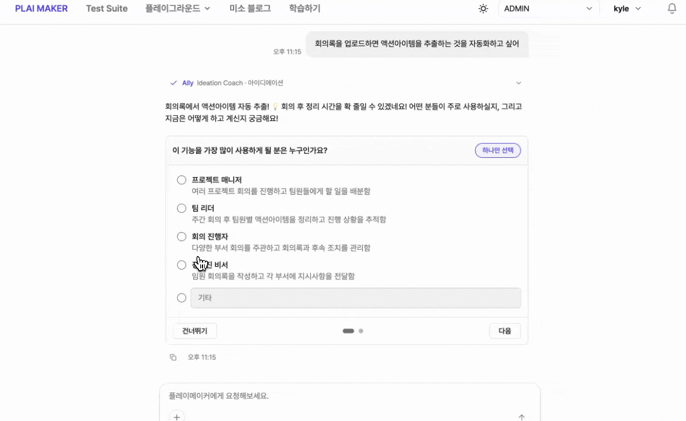
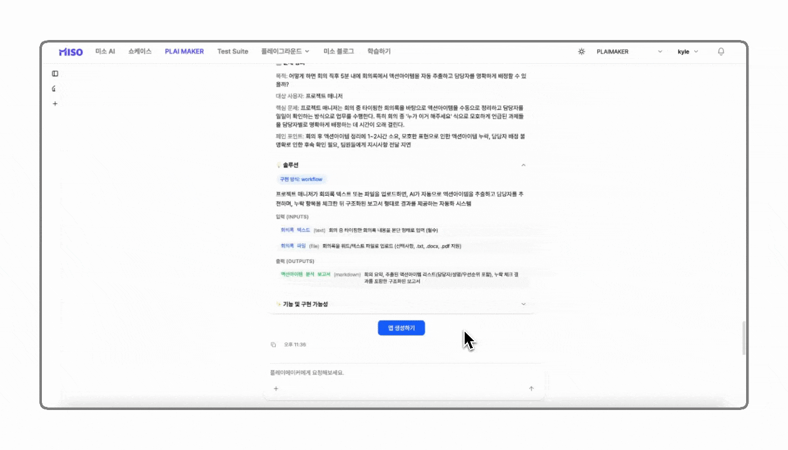

# 신규 앱 생성하기

### 1. 시작하기

1. 상단 메뉴에서 **3번째 탭(PLAI MAKER)** 을 클릭하여 진입합니다.
2. 화면 중앙의 **채팅창**에 제작하려는 앱의 내용 또는 해결하고 싶은 고민 사항을 입력합니다.
3. 에이전트가 입력된 요청을 기반으로 **단계별 진행 방식**에 따라 필요한 질문과 안내를 제공합니다.
4. 기존에 작성된 **기획서 또는 업무 문서가 있는 경우**, 채팅창의 **`+` 버튼**을 통해 파일을 첨부할 수 있습니다.

<figure><figcaption></figcaption></figure>


* 플레이메이커는 정해진 단계를 순차적으로 진행하는 방식이 아니라, **사용자의 초기 요청을 기준으로 진행 흐름을 설계합니다.**
* 처음 요청을 **구체적으로 작성할수록, 에이전트의 설계가 정교해지고 앱 생성 단계까지 더 빠르게 진행**할 수 있습니다.


### 2. 문제 정의하기

**아이데이션 코치 Ally 에이전트**와 함께 문제를 정리해 나가는 단계입니다.

문제 정의 단계에서는 Ally가 제공하는 설문(Form)에 응답하여 진행할 수 있습니다.


**설문 응답 방법**

1. 설문 화면에서 질문 내용을 확인합니다.
2. 질문에 해당하는 **객관식 선택지**를 클릭하여 응답합니다.
3. 적절한 선택지가 없는 경우 **기타**를 선택한 후 내용을 직접 입력합니다.
4. 모든 항목 입력 후 **제출** 버튼을 클릭하여 응답을 완료합니다.


<figure><figcaption></figcaption></figure>

문제 정의가 완료되면 Ally가 정리본을 제공합니다.\
정리본 확인 후 **수정이 필요한 경우 채팅창에 수정 사항을 입력**할 수 있으며, **“다음”** 을 입력하면 다음 단계로 진행됩니다.

<figure><figcaption></figcaption></figure>

### 3. 기능 설계하기

**기획자 에이전트 Kyle**과 함께 앱에 필요한 기능을 정리하고, 이에 맞는 **미소 앱 사양**을 설계하는 단계입니다.

첫 번째로 Kyle이 **필수 기능**과 **부가 기능**을 제안합니다.\
사용자는 제안된 기능 중 필요한 항목을 선택하여, 앱에 포함할 기능을 빠르고 쉽게 구상할 수 있습니다.

<figure><figcaption></figcaption></figure>

두 번째 단계에서는 선택한 기능을 구현하기 위해 필요한 **미소 앱의 상세 스펙**을 설정합니다.\
Kyle이 질문을 통해 필요한 정보를 확인하며, 사용자는 응답을 통해 앱의 동작 방식을 구체화할 수 있습니다.

<figure><figcaption></figcaption></figure>

이 단계에서 수집되는 정보는 아래와 같습니다.

<table><thead><tr><th width="144.2890625">설정 항목</th><th width="114.1796875">수집 여부</th><th>설명</th></tr></thead><tbody><tr><td><strong>앱 유형 선택</strong></td><td>필수</td><td>앱을 어떤 타입으로 제작할지 선택합니다. 미소에서 지원하는 <strong>워크플로우 / 대화형 워크플로우 / 에이전트</strong> 중 하나를 선택하며, 가장 적합한 앱 유형은 <strong>(추천)</strong> 표시로 안내됩니다.</td></tr><tr><td><strong>입력 데이터 설정</strong></td><td>필요 시 입력</td><td>앱에서 활용할 사용자 입력 데이터를 설정합니다. 사용자가 앱을 실행할 때 입력해야 할 정보 항목을 선택합니다.</td></tr><tr><td><strong>도구 선택</strong></td><td>선택</td><td>앱에서 사용할 외부 도구를 선택합니다. 예: 웹 검색, 메일 전송 등. 동일한 역할의 도구가 여러 개 있을 경우 선택지를 제공합니다.</td></tr><tr><td><strong>지식 선택</strong></td><td>선택</td><td>앱에서 지식 기반 정보가 필요한 경우 사용할 지식을 선택합니다. 앱의 목적에 맞는 지식이 존재할 때 선택할 수 있습니다.</td></tr><tr><td><strong>출력 형식 설정</strong></td><td>필수</td><td>사용자가 최종적으로 받아볼 출력 결과의 형식을 설정합니다. 앱이 생성해야 하는 최종 결과물의 양식을 선택합니다.</td></tr></tbody></table>


#### **도구나 지식이 표시되지 않나요?**

**지식**\
\- 지식은 현재 사용자가 접근 권한을 가진 항목만 불러오며, LLM이 현재 주제와의 연관성을 지식의 제목과 설명을 바탕으로 판단해 표시합니다. 원하는 지식이 보이지 않는 경우에는 **플레이그라운드 > 지식**에서 해당 지식의 제목, 설명, 내용을 보다 구체적으로 수정해 주세요.

\
**도구**\
\- 도구는 현재 워크스페이스에서 활성화된 항목만 사용할 수 있습니다. 필요한 도구가 보이지 않는다면 아직 활성화되지 않은 상태일 수 있으므로, 관리자에게 문의해 주세요.



해당 단계에서 설정한 내용은 이후 제작되는 앱 결과물에 직접 반영되므로, 필요한 형태를 명확히 정의하는 것이 중요합니다.


### 4. 기획서 최종 승인

에이전트가 작성한 기획서를 최종 검토하는 단계입니다. 해당 기획서를 기준으로 앱이 제작되므로 내용을 꼼꼼하게 확인해야 합니다.

<figure><figcaption></figcaption></figure>

기획서의 **기능 및 구현 가능성**은 앱을 생성하기 전에, 선택한 기능이 미소에서 실제로 구현 가능한지 여부를 사전에 판단한 결과를 보여줍니다.&#x20;

이후 앱 생성 에이전트는 **구현 가능한 기능만 포함하여** 앱 제작을 진행합니다.

<table><thead><tr><th width="146.5361328125">구현 가능성</th><th>의미</th><th>앱 생성 시 반영 방식</th></tr></thead><tbody><tr><td>✅ 완전 구현</td><td>미소의 기능만으로 해당 기능을 모두 만들 수 있는 상태</td><td>별도 개발 없이 바로 앱 생성 가능</td></tr><tr><td>❌ 구현 불가</td><td>미소 플랫폼 구조상 지원하지 않는 기능</td><td>앱 생성 불가기능 수정 또는 대안 필요</td></tr></tbody></table>

<figure><figcaption></figcaption></figure>


검토 중 잘못된 부분이나 보완이 필요한 내용이 있는 경우, **채팅창에 수정 요청 사항을 입력**하여 반영할 수 있습니다.


### 5. 앱 생성하기

기획서 검토가 완료되면 **“앱 생성하기”** 버튼을 클릭합니다.\
클릭 시 확정된 기획서를 바탕으로 **Ian 에이전트가 미소 워크플로우 제작을 자동으로 진행**합니다.


**에이전트가 앱을 설계하는 과정**

1. **분석 및 설계**\
   기획서에 정의된 앱의 스펙과 기능을 분석하여, 구현에 필요한 워크플로우 노드를 식별하고 전체 흐름을 설계합니다.
2. **구성 및 검증**\
   각 노드의 생성 지침에 따라 노드를 생성·배치하고, 샘플 입력값으로 실행 테스트를 진행해 정상 동작 여부를 확인합니다.\
   문제가 있을 경우 수정과 검증을 반복합니다.
3. **최종 완성**\
   검증을 통과한 워크플로우를 최종 확정하여, **즉시 실행 가능한 상태의 앱**을 제공합니다.


<figure><figcaption></figcaption></figure>

미소 에이전트는 앱 생성 완료 시 기존 미소 앱 리스트에 자동으로 추가됩니다.\
사용자는 채팅을 통해 추가 수정 요청을 진행하거나, 우측 상단의 **‘플레이그라운드에서 확인하기’** 버튼을 클릭하여\
기존 미소 앱의 편집 화면으로 이동할 수 있습니다.

이후의 앱 수정 및 활용 절차는 기존 미소 앱 만들기 환경과 동일하게 진행됩니다.

#### 워크플로우 앱 생성 예시

<figure><figcaption></figcaption></figure>

#### 에이전트 앱 생성 예시

<figure><figcaption></figcaption></figure>


#### 플레이메이커는 더 수정할 수 없나요?

플레이메이커 화면에서는 초안 생성까지만 지원합니다. 이후 수정 작업은 플레이그라운드로 이동한 뒤 우측 상단의 AI 어시스턴트를 통해 계속 이어서 진행할 수 있습니다. 자세한 방법은 아래 **6. 앱 수정하기**를 참고해주세요.


### 6. 앱 수정하기

플레이그라운드로 이동 버튼을 클릭하면 앱 편집 화면으로 이동합니다. 이후 우측 상단에 위치한 **AI 어시스턴트** 버튼을 통해 계속해서 AI의 도움을 받아 작업을 진행할 수 있습니다.

<figure><figcaption></figcaption></figure>



**AI 어시스턴트의 활용법에 대해서는 다음 페이지에서 계속해서 알아보겠습니다.**
