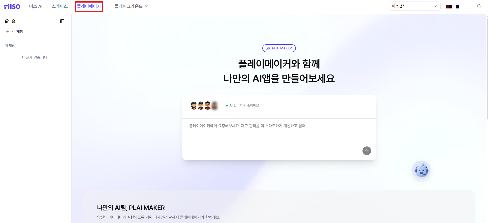
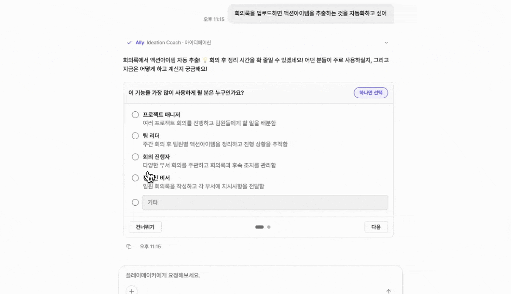
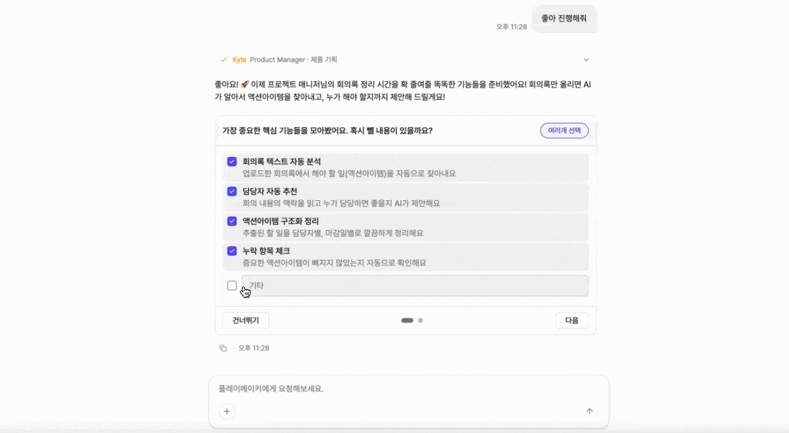
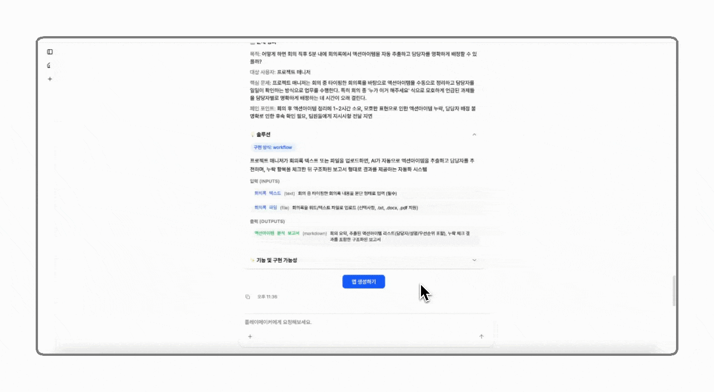
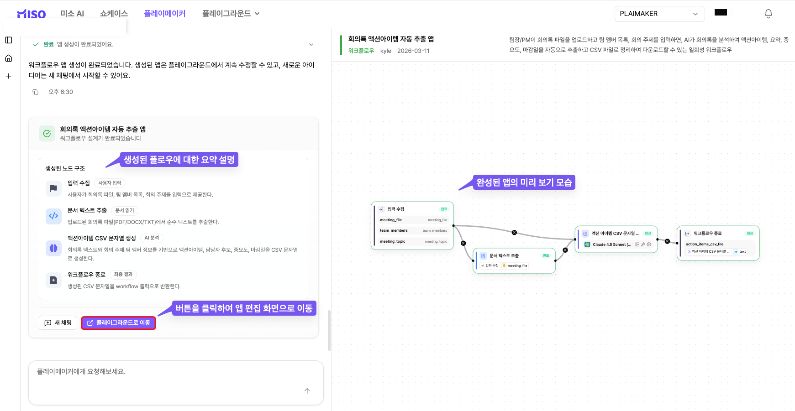
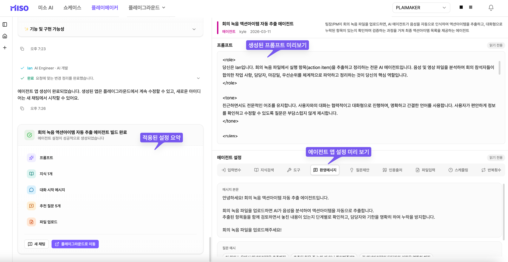
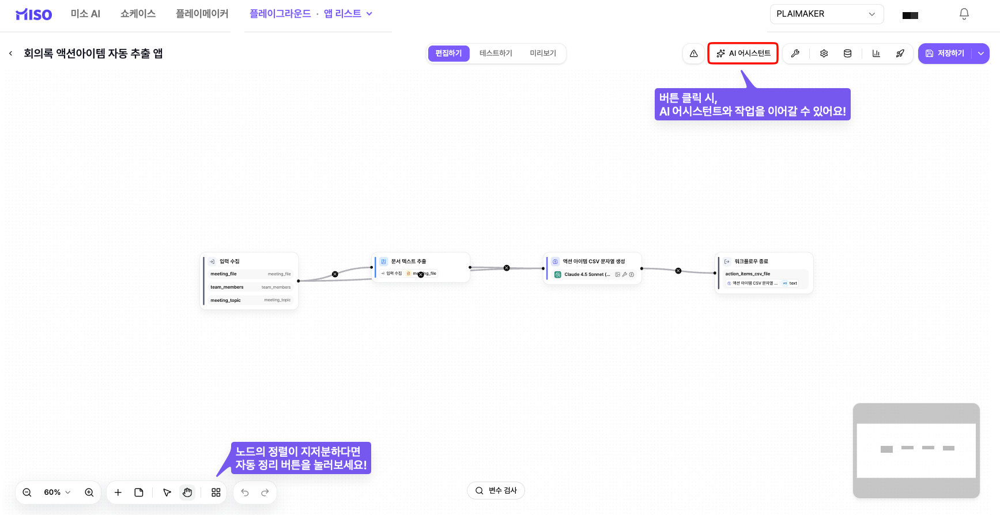

# 코치와 함께 신규 앱 생성하기

### 시작하기



#### 플레이메이커 열기

상단 메뉴의 세 번째 탭인 **PLAI MAKER**를 선택합니다.



#### 앱 아이디어 입력하기

화면 중앙의 채팅창에 만들 앱이나 해결하려는 업무 고민을 입력합니다.

기존 기획서나 업무 문서가 있으면 채팅창의 **+** 버튼으로 첨부합니다.



#### 진행 흐름 확인하기

에이전트는 초기 요청을 바탕으로 진행 흐름을 설계하고 필요한 질문과 안내를 제공합니다.



<figure><figcaption></figcaption></figure>


플레이메이커는 정해진 순서대로만 진행하지 않습니다. 초기 요청을 기준으로 흐름을 설계합니다. \
처음 요청을 구체적으로 작성할수록 앱 생성까지 더 빠르게 진행할 수 있습니다.


### 문제 정의하기

아이데이션 코치 **Ally**와 함께 문제를 정리합니다.

Ally가 제공하는 설문에 응답해 진행할 수 있습니다.


설문에서 질문을 확인하고 객관식 선택지를 선택합니다.

적절한 선택지가 없으면 **기타**를 선택해 직접 입력합니다. 모든 항목을 작성한 뒤 **제출**을 선택합니다.


<figure><figcaption></figcaption></figure>

문제 정의가 완료되면 Ally가 정리본을 제공합니다.

수정이 필요하면 채팅창에 요청을 입력합니다. **다음**을 입력하면 기능 설계로 진행합니다.

<figure><figcaption></figcaption></figure>

### 기능 설계하기

기획자 에이전트 **Kyle**과 함께 필요한 기능과 MISO 앱 사양을 설계합니다.

Kyle은 필수 기능과 부가 기능을 제안합니다. 필요한 항목을 선택해 앱에 포함할 기능을 정합니다.

<figure><figcaption></figcaption></figure>

Kyle은 질문을 통해 상세 사양을 확인합니다. 답변을 통해 앱의 동작 방식을 구체화합니다.

<figure><figcaption></figcaption></figure>

이 단계에서는 다음 정보를 설정합니다.

* **앱 유형:** 워크플로우, 대화형 워크플로우, 에이전트 중 하나를 선택합니다. 가장 적합한 유형은 **추천**으로 표시됩니다.
* **입력 데이터:** 앱 실행 시 사용자가 입력할 정보를 설정합니다.
* **도구와 지식:** 필요에 따라 외부 도구와 지식을 선택합니다.
* **출력 형식:** 사용자가 받을 최종 결과물의 형식을 설정합니다.


#### **도구나 지식이 표시되지 않나요?**

**지식**

접근 권한이 있는 지식만 표시됩니다. LLM은 지식의 제목과 설명을 바탕으로 현재 주제와의 연관성을 판단합니다.

원하는 지식이 보이지 않으면 **플레이그라운드 → 지식**에서 제목, 설명, 내용을 더 구체적으로 수정합니다.

**도구**

현재 워크스페이스에서 활성화된 도구만 사용할 수 있습니다. 필요한 도구가 보이지 않으면 관리자에게 문의합니다.



이 단계에서 설정한 내용은 생성되는 앱에 직접 반영됩니다. 필요한 형태를 명확히 정의합니다.


### 기획서 최종 승인

에이전트가 작성한 기획서를 최종 검토합니다. 승인한 기획서를 기준으로 앱이 만들어집니다.

<figure><figcaption></figcaption></figure>

기획서의 **기능 및 구현 가능성**은 선택한 기능을 MISO에서 구현할 수 있는지 판단한 결과입니다.

앱 생성 에이전트는 구현 가능한 기능만 포함해 앱을 만듭니다.

* **완전 구현:** MISO 기능만으로 구현할 수 있습니다. 별도 개발 없이 앱을 생성합니다.
* **구현 불가:** MISO 플랫폼에서 지원하지 않는 기능입니다. 기능을 수정하거나 대안을 마련해야 합니다.

<figure><figcaption></figcaption></figure>


수정하거나 보완할 내용이 있으면 채팅창에 요청을 입력합니다.


### 앱 생성하기

기획서 검토를 마친 뒤 **앱 생성하기**를 선택합니다.

Ian 에이전트가 확정한 기획서를 바탕으로 MISO 워크플로우를 자동으로 만듭니다.


Ian은 기획서의 사양과 기능을 분석해 필요한 워크플로우 노드와 실행 흐름을 설계합니다.

노드를 생성하고 배치한 뒤, 샘플 입력값으로 실행을 검증합니다. 문제가 있으면 수정과 검증을 반복합니다.

검증을 통과하면 즉시 실행할 수 있는 앱을 제공합니다.


<figure><figcaption></figcaption></figure>

앱 생성이 완료되면 MISO 앱 리스트에 자동으로 추가됩니다.

채팅으로 추가 수정을 요청하거나, 오른쪽 위의 **플레이그라운드에서 확인하기**를 선택해 앱 편집 화면으로 이동합니다.

이후 앱 수정과 활용은 기존 MISO 앱 만들기 환경과 같습니다.

#### 워크플로우 앱 예시

<figure><figcaption></figcaption></figure>

#### 에이전트 앱 예시

<figure><figcaption></figcaption></figure>


#### 플레이메이커에서 앱을 더 수정할 수 있나요?

플레이메이커에서는 앱 초안 생성까지만 지원합니다. 이후 수정은 플레이그라운드의 AI 어시스턴트에서 진행합니다.


### 앱 수정하기

**플레이그라운드로 이동**을 선택하면 앱 편집 화면으로 이동합니다.

오른쪽 위의 **AI 어시스턴트**에서 AI의 도움을 받아 앱을 계속 수정할 수 있습니다.

<figure><figcaption></figcaption></figure>



[AI 어시스턴트 활용하기](ai.md)에서 이어서 확인합니다.
