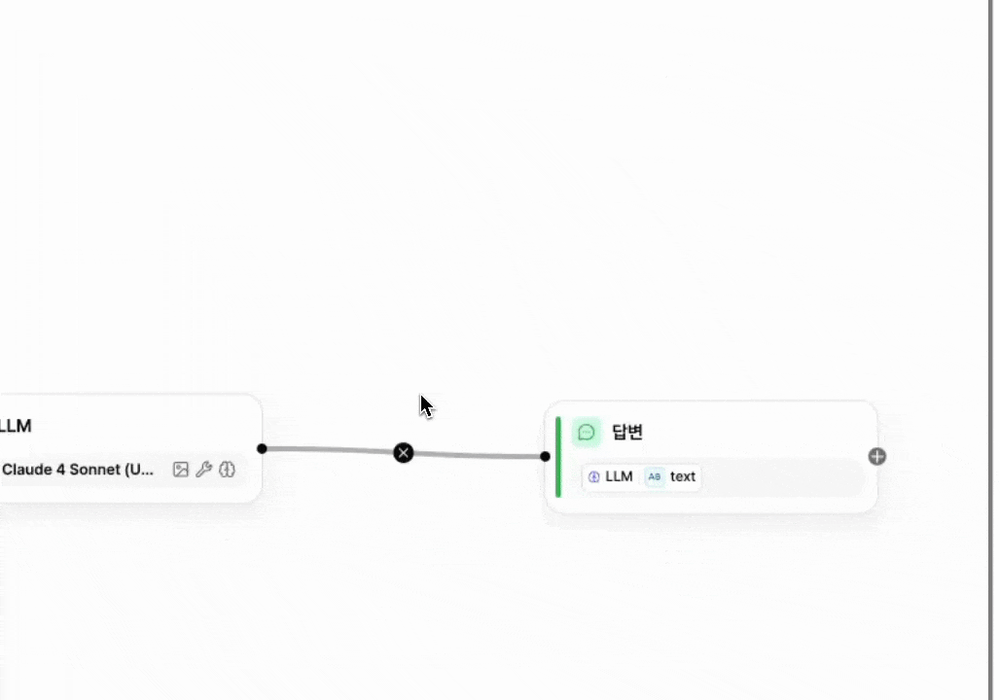
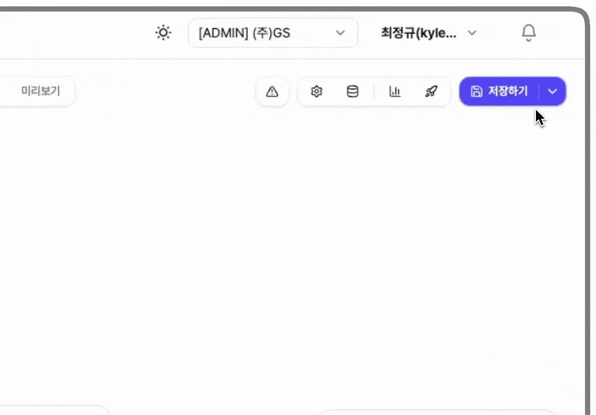

# 앱 발행하기

미소에서는 앱을 수정하는 과정에서 아직 완성되지 않은 내용이 실제 사용자에게 바로 적용되지 않도록, **저장하기**와 **발행하기**를 나누어 관리할 수 있습니다.

<figure><figcaption></figcaption></figure>

#### 저장하기

저장하기 기능은 앱을 편집하면서 변경한 내용을 저장하는 기능입니다.\
저장된 내용은 편집 화면의 상태에만 반영되며, 이 단계에서는 실제 앱을 사용하는 사용자에게는 변경 사항이 적용되지 않습니다.

<figure><figcaption></figcaption></figure>

#### 발행하기

발행하기는 저장된 편집 내용을 실제 미소 앱 서비스에 반영하는 기능입니다.\
발행을 완료하면 앱을 사용하는 사용자들이 변경된 내용을 바로 확인하고 사용할 수 있습니다.

<figure><figcaption></figcaption></figure>


**발행방법**

1. **저장하기** 우측의 **아래 화살표(▼)** 클릭
2. 발행할 **버전 이름**과 **수정사항(선택)** 입력
3. **발행하기** 클릭

※ 발행 시, **현재 편집 중인 내용은 자동으로 저장된 후 발행됩니다.**


#### 버전관리

버전관리는 앱의 이전 발행 내역을 확인하고, 필요할 경우 특정 버전으로 되돌릴 수 있는 기능입니다.

발행하기 버튼 하단의 **버전관리**를 클릭하면 버전 목록이 표시됩니다.\
목록에서 **이전에 발행했던 내역을 확인**할 수 있으며, **발행된 버전의 이름도 수정**할 수 있습니다.

<figure><figcaption></figcaption></figure>

**버전관리**를 통해 **이전에 발행했던 버전을 불러오거나 복원**할 수 있습니다.\
앱을 제작하는 과정에서 이전에 구성했던 버전이 더 적합한 경우, 새로 앱을 만들 필요 없이 해당 버전을 불러와 현재 상태로 복원할 수 있습니다.

<figure><figcaption></figcaption></figure>


**이전 버전 불러오기**

1. 버전 목록에서 불러올 버전 클릭
2. 우측 하단의 **선택 버전 불러오기** 클릭
3. 선택한 버전의 내용을 미리보기로 확인
4. 우측 상단의 **이 버전으로 저장** 클릭 시 해당 버전이 불러와짐

※ 이전 버전을 불러오면 현재 발행되지 않은 편집 내용은 삭제될 수 있습니다. 보관이 필요한 경우, 이전 버전을 불러오기 전에 반드시 **발행**해 주세요.

