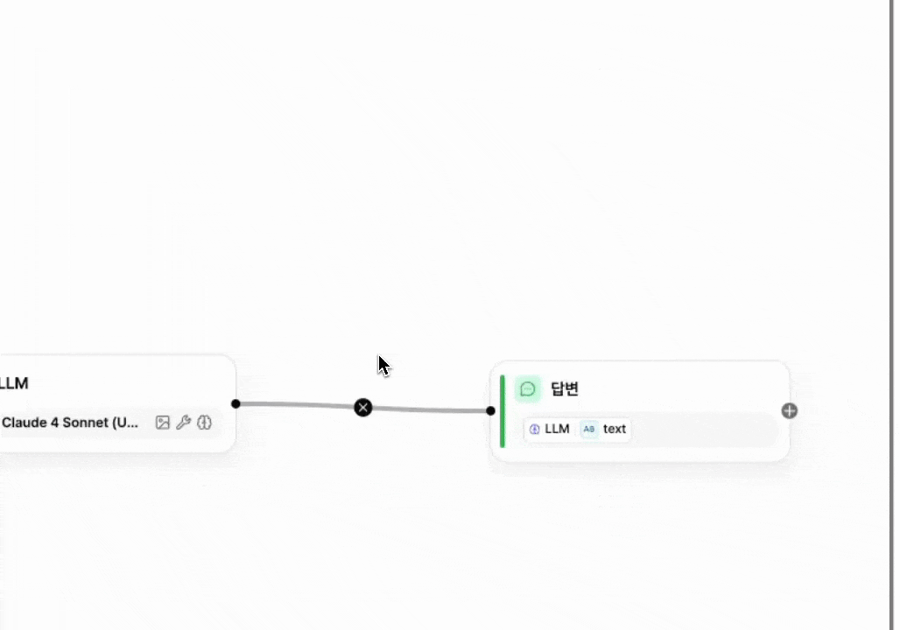
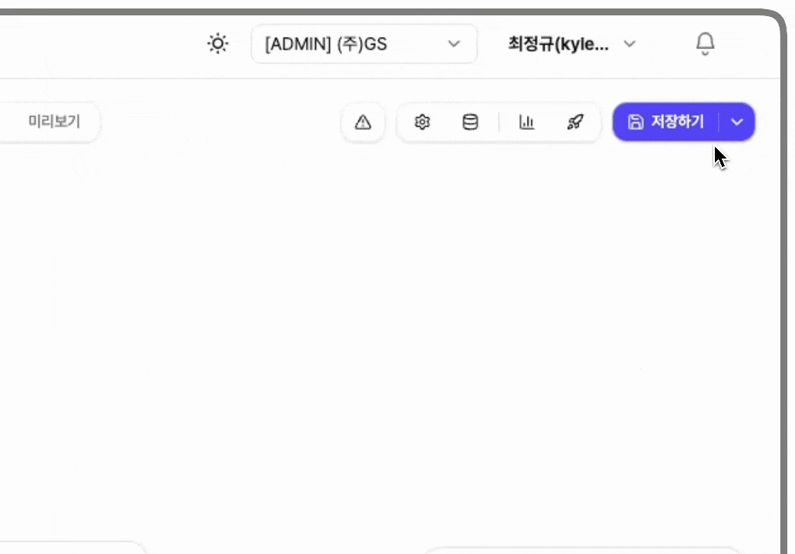

# 에이전트와 워크플로우 발행하기

**저장**과 **발행**을 분리하면 편집 중인 변경 사항을 사용자에게 바로 노출하지 않습니다.

<figure><figcaption></figcaption></figure>

### 저장

편집한 변경 사항을 저장합니다.

저장한 내용은 편집 화면에만 반영됩니다. 앱 사용자에게는 적용되지 않습니다.

<figure><figcaption></figcaption></figure>

### 발행

저장한 변경 사항을 실제 앱 서비스에 반영합니다.

발행이 끝나면 앱 사용자가 변경된 내용을 사용할 수 있습니다.

<figure><figcaption></figcaption></figure>


#### 발행 방법

1. **저장** 오른쪽의 ▼를 선택합니다.
2. 버전 이름과 수정 사항을 입력합니다.
3. **발행**을 선택합니다.

발행하면 현재 편집 내용이 자동으로 저장됩니다.


### 버전 관리

이전 발행 이력을 확인하고 특정 버전으로 복원할 수 있습니다.

**발행** 아래의 **버전 관리**를 선택하면 버전 목록이 표시됩니다.

발행 이력을 확인하고 발행한 버전의 이름을 수정할 수 있습니다.

<figure><figcaption></figcaption></figure>

이전에 발행한 버전을 불러와 현재 편집 상태로 복원할 수 있습니다.

<figure><figcaption></figcaption></figure>


#### 이전 버전 불러오기

1. 버전 목록에서 불러올 버전을 선택합니다.
2. **선택 버전 불러오기**를 선택합니다.
3. 미리보기에서 내용을 확인합니다.
4. **이 버전으로 저장**을 선택합니다.

발행하지 않은 편집 내용은 이전 버전을 불러올 때 삭제될 수 있습니다. 필요한 변경 사항은 먼저 발행하세요.

