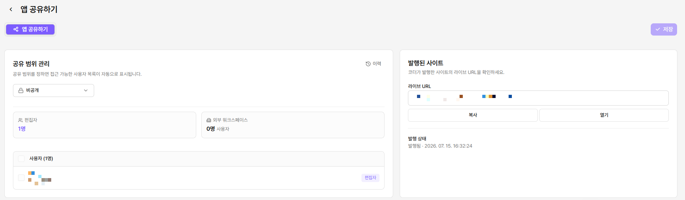
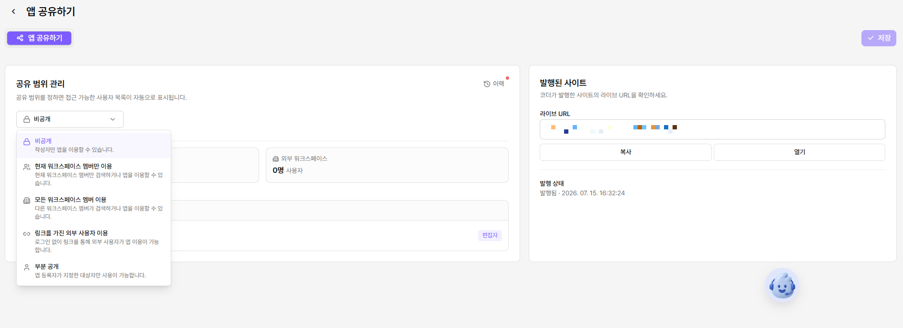
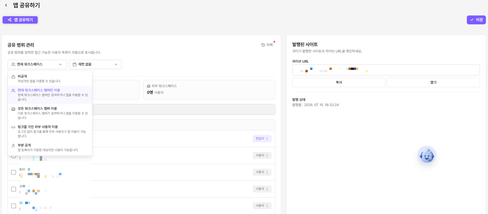
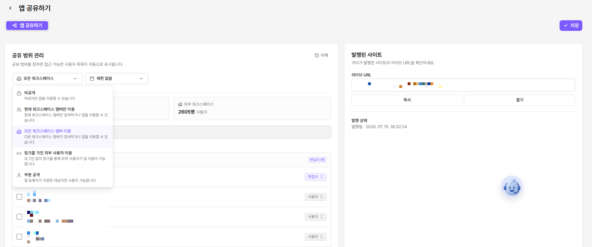
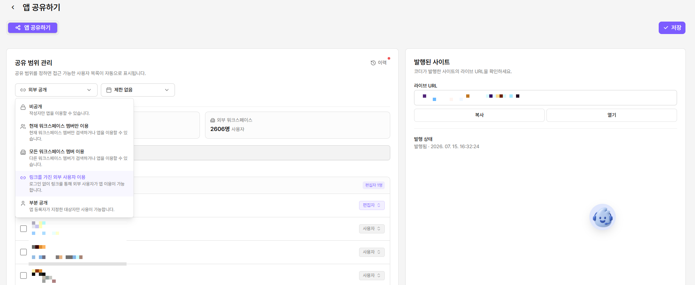
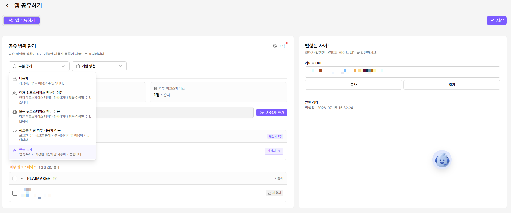
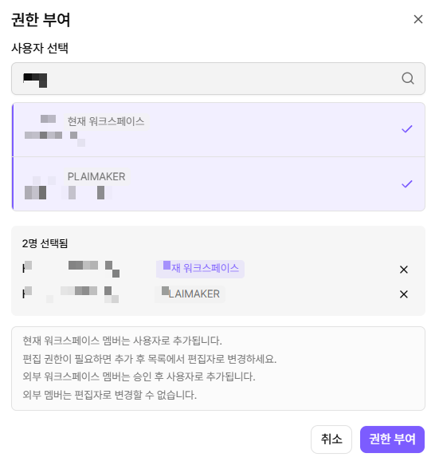

# 앱 공유하기

### 앱 권한

<figure><figcaption></figcaption></figure>

#### 사용자

앱을 실행하고 구성을 확인할 수 있습니다.

에이전트 앱에서는 프롬프트와 도구 구성을 확인합니다. 워크플로우 앱에서는 노드 구성과 설정을 확인합니다.

공유 범위에 포함된 사용자는 기본적으로 사용자 권한을 받습니다. 앱 워크스페이스 외부 사용자는 앱 설정에 접근할 수 없습니다.

#### 편집자

앱을 수정하고 사용 현황 로그를 확인할 수 있습니다.

에이전트 앱에서는 프롬프트, 도구, 참조 지식을 편집합니다. 워크플로우 앱에서는 노드를 추가, 수정, 삭제합니다.

편집자 권한은 현재 워크스페이스 사용자에게만 부여할 수 있습니다.

#### 앱 소유자

앱 소유자는 사용자와 편집자가 수행하는 모든 작업을 할 수 있습니다.

앱 설명을 수정하고, 소유권을 이전하며, 앱을 삭제할 수 있습니다.

### 공유 범위

#### 비공개

앱 생성 시 기본으로 설정됩니다. 앱 소유자만 실행할 수 있습니다.

다른 사용자에게 접근 권한을 부여할 수 없습니다.

<figure><figcaption></figcaption></figure>

#### 현재 워크스페이스 공개

현재 워크스페이스 사용자에게 앱 사용자 권한을 부여합니다.

관리자 승인 없이 설정할 수 있습니다. 현재 워크스페이스 사용자에게는 편집자 권한도 부여할 수 있습니다.

사용자 목록의 토글로 권한을 설정합니다. 체크박스로 권한을 일괄 부여하거나 해제할 수 있습니다.

<figure><figcaption></figcaption></figure>

#### 모든 워크스페이스 공개

모든 워크스페이스 사용자에게 앱 사용자 권한을 부여합니다.

관리자 승인이 필요합니다. 승인 전에는 이전 공유 범위가 유지됩니다.

외부 워크스페이스 사용자의 상세 목록은 확인할 수 없습니다. 외부 사용자에게 편집자 권한을 부여할 수 없습니다.

<figure><figcaption></figcaption></figure>

#### 외부 공개

발행한 앱을 URL로 누구나 실행할 수 있습니다. 로그인하지 않은 사용자도 포함됩니다.

관리자 승인이 필요합니다. 승인 전에는 이전 공유 범위가 유지됩니다.

편집자 권한은 현재 워크스페이스 사용자에게만 부여할 수 있습니다.

<figure><figcaption></figcaption></figure>

외부 공개에서는 IP 접근을 제한할 수 있습니다.

기본값은 모든 IP 허용입니다. IP 제한을 활성화하면 허용 목록과 차단 목록을 설정할 수 있습니다.

<figure><figcaption>
IP 설정
</figcaption></figure>

#### 부분 공개

특정 MISO 사용자에게 실행 권한을 부여합니다.

**사용자 추가**를 선택해 권한을 부여할 사용자를 찾습니다. 편집자 권한은 현재 워크스페이스 사용자에게만 부여할 수 있습니다.

<figure><figcaption></figcaption></figure> <figure><figcaption></figcaption></figure>

### 공유 설정 변경 승인

관리자 승인이 필요한 공유 범위는 승인 전까지 이전 설정을 유지합니다.

공유 요청 이력은 **공유 범위 관리 → 이력**에서 확인할 수 있습니다.

<figure><figcaption>
&#x3C;승인 요청 팝업>
</figcaption></figure> <figure><figcaption>
&#x3C;공유 요청 이력 팝업>
</figcaption></figure>

