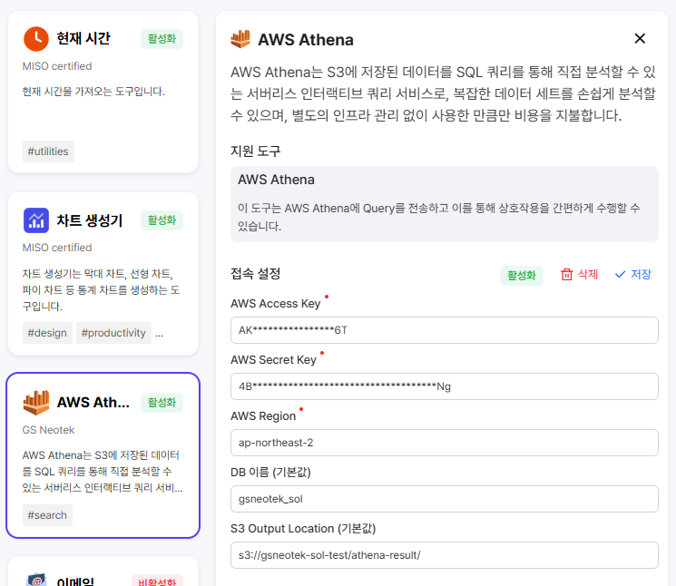
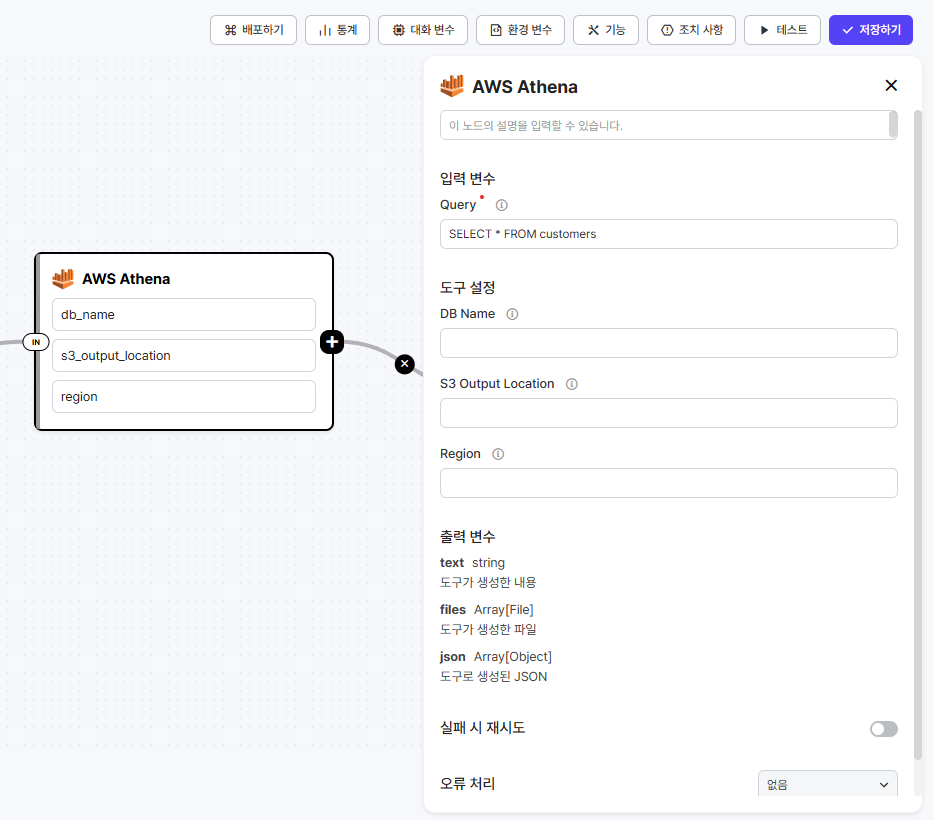
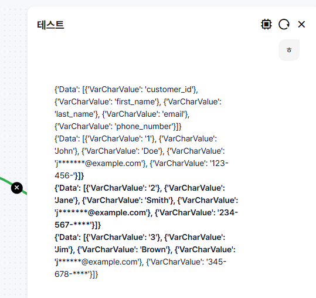

# AWS Athena

#### 도구 활성화&#x20;

* Access / Secret Key 입력 Athena 에 적절한 접근 권한이 있어야 합니다.
* Region 입력
* (선택) DB 이름 앱의 노드에서 사용 시 DB 이름 입력을 하지 않을 경우 기본값으로 사용됩니다.
* (선택) S3 Output Location 입력 앱의 노드에서 사용 시 Output 경로를 입력 하지 않을 경우 기본값으로 사용됩니다. Athena 는 출력 결과를 S3 에 저장하는 구조를 갖습니다.

<figure><figcaption></figcaption></figure>

#### 앱에서 활용

* 입력 변수
  * Query Athena 에 전송하는 SQL
* 도구 설정
  * 도구 활성화 시 입력된 값이 없다면 입력해야 합니다.
  * 도구 활성화 시 입력된 값이 있다면, 이 곳에 입력한 값이 우선순위가 더 높습니다.

<figure><figcaption></figcaption></figure>

#### 출력 결과

* 기본적으로 JSON 배열 형태로 응답합니다. LLM 의 프롬프트나 코드 등 다른 노드 이용하여 사용합니다.

<figure><figcaption></figcaption></figure>

#### 실제 활용 시

* 지식에 적절한 DB 의 정보가 있다면 선행 노드로 LLM 등을 이용하여 SQL 를 생성하도록 합니다.
