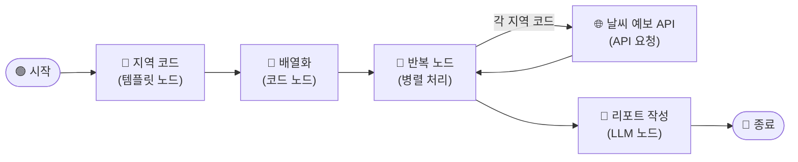

# \[레벨 2] 반복 노드로 여러 지역 처리하기

> _앞에서 서울의 날씨 정보를 받아오는 API 워크플로우를 만들어보았습니다. 이제 여러 지역에 대해서 똑같은 작업을 진행할 수 있도록 워크플로우를 고도화해봅시다._

레벨 2에서는 **3개 권역의 날씨 API를 간단하게 호출하고, 그 결과를 하나의 통합 리포트로 만드는 워크플로우**를 완성합니다.&#x20;

핵심은 `반복` 노드입니다. 각 지역에 대해 똑같은 API 호출 작업을 반복 노드가 수행합니다.

다만 반복 노드를 활용하기 위해서는 입력값에 대한 이해와, 내부에서 작동하는 방식에 대한 직관적인 이해가 필요합니다. 이번 레벨에서 함께 알아보도록 하겠습니다!



***

#### 반복 노드란?

[iteration.md](../../../manual/workflow/node-definition/iteration.md "mention")

먼저 이번 레벨의 핵심 역할을 하는 반복 노드에 관해서 알아봅시다.

반복 노드는 목록(배열) 안의 항목 하나하나에 대해, **똑같은 작업을 실행**해줍니다.

이번 예제에서 하고 싶은 일을 한 문장으로 표현하면 이렇습니다.

▎ _<mark style="color:$danger;">서울, 제주도, 경상북도</mark>에 대해 각각 <mark style="color:$primary;">날씨 API를 호출하여 결과값을 받아온다</mark>._

<mark style="color:$danger;">지역</mark>만 다를 뿐, <mark style="color:$primary;">매번 하는 작업</mark>은 <mark style="color:$primary;">똑같습니다</mark>. 기상청 API에 지역 코드를 넣어 날씨 데이터를 받아오는 것. 반복 노드는 바로 이 "대상만 바뀌는 반복 작업"을 자동으로 처리합니다.

그렇다면, 바뀌는 대상을 반복 노드 외부에서 제공해주는 방법과, 반복 노드 내부에서 반복되는 작업들을 세팅하는 방법을 알아야 합니다.

### \[1] 입력 값 처리 : 템플릿 노드 + 코드 노드

우선, 반복 노드에 넘겨줄 지역 코드 `목록`을 준비해야 합니다. 지역 코드를 API 요청 노드 안에 직접 써두는 방법도 있지만, 나중에 권역을 추가하거나 바꿀 때마다 반복 노드 내부를 수정해야 해서 번거롭습니다. **템플릿 노드에 지역 코드를 저장해두면, 권역을 변경할 때 이 노드 하나만 수정하면 됩니다.**

**템플릿 노드**는 고정된 텍스트를 출력하거나, 여러 변수를 조합해 하나의 문자열을 만드는 노드입니다. 코드를 작성하지 않아도 되고, LLM을 호출하지 않아 빠르고 비용이 없습니다.

이번 레벨 1 예제에서는 3개의 지역을 쉼표로 구분하여 템플릿 노드에 미리 입력해줍니다.


1. **시작 노드** 오른쪽의 **\[+]** 버튼을 클릭합니다.
2. 노드 선택 패널에서 **\[템플릿]** 노드를 선택합니다.
3. 아래와 같이 설정합니다.
   1. **제목**: `지역 코드`
   2. **템플릿** 영역에 3개 지역을 선정하여 입력합니다.

<figure><figcaption></figcaption></figure>

> **ℹ️ 지역 코드 목록**
>
> 권역을 추가하거나 변경할 때는 이 노드의 템플릿 내용만 수정하면 됩니다. 쉼표(`,`)로 구분해 원하는 코드를 나열하세요.

| 코드         | 지역       |
| ---------- | -------- |
| `11B00000` | 서울·인천·경기 |
| `11C00000` | 충청도      |
| `11F00000` | 전라도      |
| `11G00000` | 제주도      |
| `11H10000` | 경상북도     |
| `11H20000` | 경상남도     |



_**그런데 반복 노드는 이 템플릿 노드의 결과물인 "문자열"을 그대로 받을 수 없습니다.**_&#x20;


반복노드는 작동 특징 상, 입력값으로 **배열(array)** 형식만 받기 때문입니다.&#x20;

아래 이미지를 보시면 그 이유를 이해할 수 있습니다.

<figure><figcaption><p>과일 1개 당 지역 1곳이라고 생각해봅시다.</p></figcaption></figure>

왼쪽은 현재 템플릿 노드의 문자열 상태입니다.

왼쪽 상태 그대로 반복 노드가 받게 되면, 각 과일을 1개씩 바구니에서 집어서 빼고 싶어도 구분되어 있지 않다보니 불가능하죠.

그치만 오른쪽 상태처럼 각 과일을 나누어놓은 뒤 바구니에 담게 되면, 필요할 때 1개씩 집어서 빼는 것이 가능합니다.

템플릿 노드 상에서는 아직 왼쪽 상태로 머물러 있는 것이기 때문에, 이제 오른쪽 형태로 만들어주기 위해서 코드 노드 작업으로 넘어가야 합니다.

***

### \[2] 코드 노드 — 배열화

쉼표로 구분된 지역 코드 문자열을 반복 노드가 처리할 수 있는 배열로 바꾸는 작업을 코드 노드로 처리합니다.

매번 정해진 양식의 문자열에 대해서 배열로 만드는 작업을 진행할 것이기에 코드 노드를 사용하면 효율적인 작업 처리가 가능하기 때문입니다.

하지만 Python 코드를 직접 쓸 필요는 없으니, 미소 AI를 통해서 필요한 코드를 받아보겠습니다.

<div><figure><figcaption></figcaption></figure> <figure><figcaption></figcaption></figure></div>


코드 요청을 할 때는 다음과 같은 구조로 하시는 걸 추천드립니다.

**구현하고 싶은 기능에 대한 설명 + 활용할 도구 + 목적**

\
이번 질문의 경우, 제 의도는 아래와 같았습니다.

구현 기능에 대한 설명 : 템플릿 노드를 활용해서 \~\~ 구조로 만들려고 해.

활용할 도구 : 코드 노드

목적 : (미소 AI 에서 어떻게 세팅해야 하는지 방법을) 알려줘.

\
충분한 맥락을 설명해줬을 때, 딱 현재 나에게 필요한 정보를 구조적으로 답변 받기 좋습니다.


미소가 코드를 대신 짜주고, 입력 변수와 출력 변수 형태까지 알려주었습니다.

이제 워크플로우에서 노드로 구현해볼까요?


1. **지역 코드** 노드 오른쪽의 **\[+]** 버튼을 클릭하여 **\[코드]** 노드를 추가합니다.
2. 아래와 같이 설정합니다.
   1. **제목**: `배열화`
   2. **변수 매핑** 영역에 아래와 같이 설정합니다.
      * **변수명**: `regions`
      * **값**: `/`를 입력하고 `지역 코드 - output`을 선택합니다.
        * 템플릿 코드에서 설정해두었던 지역 목록을 넣어줍니다.
   3. **코드** 영역에 아래 코드를 입력합니다.

```python
def main(region_string):
    # 1. 쉼표(,)를 기준으로 문자열 분리
    # 2. 각 항목의 앞뒤 공백 제거(strip)
    # 3. 빈 항목이 있을 경우 제외(if code.strip())
    region_list = [code.strip() for code in region_string.split(',') if code.strip()]
    
    # 결과를 딕셔너리 형태로 반환
    return {
        "region_array": region_list
    }
```

4. 출력 변수에 `region_array` 로 변수명을 설정하고, type에는  `Array[string]` 으로 설정합니다.

> **⚠️ 출력 변수 타입 확인**&#x20;
>
> 출력 변수의 타입이 `array[string]`으로 설정되어 있어야 합니다.\
> 타입이 `string`으로 설정된 경우, 반복 노드에서 `iterator input must be an array` 오류가 발생합니다.\
> 타입 선택 드롭다운에서 `array[string]`을 직접 선택해주세요.

<figure><figcaption></figcaption></figure>

이제 지역 코드가 배열 형태로 준비되었습니다. 이 배열을 반복 노드에 연결하면, 반복 노드가 각 지역 코드를 하나씩 꺼내서 API 요청을 실행할 수 있습니다.

***

### \[3] 반복 노드 설정

이제 반복 작업 처리를 위해 반복 노드를 설정해보도록 하겠습니다!

지역 목록 배열을 입력 변수로 설정해주고, 내부에서 작업할 노드를 배치해준 뒤, 출력 변수도 정의해주면 됩니다.

1. 마우스 우클릭 후 **\[+ 노드 추가]** 버튼을 클릭합니다.
2. **\[반복]** 노드를 선택합니다.
3. 아래와 같이 설정합니다.
   1. **반복 입력**: `/`를 입력하고 `배열화 - result`를 선택합니다.
   2. **병렬 처리**: 활성화한 뒤, 3으로 설정합니다.

<div align="left"><figure><figcaption></figcaption></figure></div>

반복 노드가 추가되었습니다.&#x20;

\
이제 이 노드 **내부**에 반복적으로 진행할 작업, 즉 이번 문제의 경우 날씨 API 요청 노드를 배치하면 됩니다.


**유의할 점**

종종 반복 노드 바깥에서 노드를 만들거나, 이미 만들어놨던 노드를 반복 노드 공간 내부로 끌고 온 뒤, **\[+]** 시작 점과 이어보려고 하실 때가 있습니다.

반복 노드 내부에서 진행되는 작업은 1. 과 같은 방법으로 반복 노드 내의 **\[+]** 버튼을 클릭해서만 추가할 수 있으니 유의하시길 바랍니다.


1. **반복 노드** 내부의 반복 시작 지점 오른쪽 **\[+]** 버튼을 클릭합니다.
2. **\[API 요청]** 노드를 선택합니다.
3. API 세부 설정은 레벨1 에서와 똑같이 설정합니다. [#id-6-.-api](1-api.md#id-6-.-api "mention")
   * 다만, 이번에는 지역변수를 반복 노드의 입력 변수로 받은 지역 코드 변수로 설정해줍니다.

<figure><figcaption></figcaption></figure>

> **ℹ️ 반복 노드 vs 노드를 3개 직접 연결하는 방법**&#x20;
>
> 노드를 3개 복사하여, 병렬로 연결해도 비슷한 작업을 할 수 있습니다. \
> 하지만 처리해야 할 지역이 10개, 50개로 늘어난다면 그때마다 매번 복사할 수는 없겠죠?
>
> 반복 노드는 배열 크기에 따라 실행 횟수가 자동으로 결정됩니다. \
> 템플릿 노드의 지역 코드만 추가하면 반복 노드가 알아서 더 여러번 실행합니다.

> **ℹ️ `{{#반복.item#}}` 이란?**&#x20;
>
> 반복 노드가 현재 처리 중인 배열의 항목을 참조하는 특수 변수입니다.\
> 첫 번째 반복에서는 `11B00000`, 두 번째에서는 `11G00000`, 세 번째에서는 `11H10000`이 차례로 대입됩니다.

3개 지역의 날씨 데이터가 수집되면, 반복 노드가 그 결과를 배열로 모아 출력합니다.&#x20;

이 결과물을 이제 LLM 노드에 전달해 지역별 발주 참고 리포트를 작성해 보도록 합시다.

***

#### \[4] LLM 노드 — 보고서 작성

**LLM 노드**는 AI 모델에 요청을 보내고 응답을 받는 노드입니다.&#x20;

반복 노드가 수집한 3개 지역 API 응답 배열을 배경지식으로 받아, 지역별로 정리된 발주 참고 리포트를 작성합니다.


1. **반복** 노드 오른쪽의 **\[+]** 버튼을 클릭합니다.
2. **\[LLM]** 노드를 선택합니다.
3. 아래와 같이 설정합니다.
   1. **제목**: `리포트 작성 LLM`
   2. **모델**: 사용할 LLM 모델을 선택합니다.
   3. **배경지식(컨텍스트)** 항목에서 **\[+ 추가]** 를 클릭합니다.
      * `/`를 입력하고 `반복 - output`을 선택합니다.
4. **시스템 프롬프트** 영역에 아래 내용을 입력합니다.


```
당신은 GS25 점포운영팀의 주간 발주 참고 리포트를 작성하는 어시스턴트입니다.
여러 지역의 기상청 중기예보 API 응답 배열을 받아, 하나의 통합 리포트를 작성합니다.

[regId → 지역명 대응표]
11B00000 = 서울·인천·경기
11C00000 = 충청도
11C10000 = 충청북도
11C20000 = 충청남도
11D10000 = 강원영서
11D20000 = 강원영동
11F00000 = 전라도
11F10000 = 전북자치도
11F20000 = 전라남도
11G00000 = 제주도
11H00000 = 경상도
11H10000 = 경상북도
11H20000 = 경상남도
API 응답의 regId 값을 위 표에서 찾아 각 섹션의 지역명으로 사용합니다.

[날씨 필드 해석 규칙]
- wfNAm / wfNPm : N일 후 오전/오후 날씨
- rnStNAm / rnStNPm : N일 후 오전/오후 강수확률 (%)
- 8~10일은 rnStN / wfN (오전/오후 구분 없음)
- 날짜 대응 (금요일 실행 기준): 4=월, 5=화, 6=수, 7=목, 8=금, 9=토, 10=일

[리포트 형식 — 반드시 이 구조로 출력]

📊 GS25 전국 권역 주간 발주 참고 리포트
🗓️ {다음주 월요일(MM/DD)} ~ {다음주 일요일(MM/DD)}

배열로 전달된 각 지역 데이터를 순서대로 처리하여 아래 형식의 섹션을 반복 작성합니다.

━━━━━━━━━━━━━━━━━━━━━━━━
📍 {지역명} 권역
📋 날씨 요약: {한 문장}
☂️ 우산·우비 :
🧊 아이스음료·빙과류 :
🍺 야간 음료·맥주 :
☕ 따뜻한 음료·간편식 :
⚡ 핵심 액션: {한 줄}

(지역 수만큼 위 섹션 반복)
```


5. **사용자 메시지** 영역에 아래 내용을 입력합니다.

```
오늘 날짜: 20260608

[전체 지역 API 응답 배열]
{{배경지식}}

배열 안의 각 항목이 지역 하나의 API 응답입니다.
모든 지역의 섹션을 포함한 통합 리포트를 작성해주세요.
```


***

마지막으로 종료 노드를 추가하여 반복 작업까지의 워크플로우 구축을 마무리하고 결과를 확인해봅니다.

1. **리포트 작성 LLM** 노드 오른쪽의 **\[+]** 버튼을 클릭합니다.
2. **\[종료]** 노드를 선택합니다.
3. **출력 변수** 항목에서 **\[+ 추가]** 를 클릭합니다.
   1. **변수명**: `report`
   2. **값**: `/`를 입력하고 `리포트 작성 LLM - text`를 선택합니다.


***

#### 테스트하기

**\[테스트하기]** 버튼을 클릭합니다. 이 워크플로우는 입력 변수가 없으므로 바로 실행됩니다.

반복 노드가 3개 API를 병렬로 호출하므로 처리가 빠르게 완료됩니다. 종료 노드의 출력 탭에서 3개 권역의 발주 리포트가 모두 포함된 결과를 확인합니다.


```
📊 GS25 전국 권역 주간 발주 참고 리포트
🗓️ 06/11 ~ 06/17

━━━━━━━━━━━━━━━━━━━━━━━━
📍 서울·인천·경기 권역
📋 날씨 요약: 주 초반 맑고 더운 날씨, 주 후반 비 예보
☂️ 우산·우비 : 목~일 강수확률 60% 이상, 발주량 +20% 권장
🧊 아이스음료·빙과류 : 월~수 폭염, 발주량 +30% 권장
🍺 야간 음료·맥주 : 주 초반 야간 활동 예상, 유지
☕ 따뜻한 음료·간편식 : 비 예보일 실내 소비 고려
⚡ 핵심 액션: 목요일 이후 우산·우비 전면 배치 권장

━━━━━━━━━━━━━━━━━━━━━━━━
📍 제주도 권역
...
```


워크플로우가 정상 동작하는 것을 확인했습니다! 그런데 지금 상태로는 매주 실행할 때마다 두 가지 작업을 직접 해야 합니다. **API 요청 노드의 `tmFc`를 오늘 날짜로 바꾸는 것**, 그리고 **워크플로우를 직접 실행하는 것**. 레벨 3에서는 이 두 가지까지 모두 자동화하여 매주 금요일 오전마다 알아서 보고서가 작성되도록 해봅시다.
