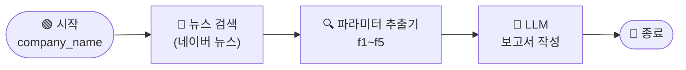

# \[레벨 2] 단일 기사로 Five-Forces 분석하기

> _앞에서 네이버 뉴스 검색 도구를 MISO에 연결했습니다. 이제 이 도구를 워크플로우에 연결해서, 기업명을 입력하면 뉴스 기사에서 Five-Forces 분석 내용을 추출하고 보고서를 작성하는 흐름을 만들어봅시다._

레벨 2에서는 **기업명 하나를 입력하면 뉴스 기사에서 Five-Forces 5개 섹션을 추출하고, LLM이 보고서를 작성하는 워크플로우**를 완성합니다.



***

**파라미터 추출기란?**

파라미터 추출기는 **입력된 텍스트에서 사전에 정의한 항목들을 구조화된 변수로 추출하는 노드**입니다.

일반 LLM 노드는 텍스트를 하나의 덩어리로 출력합니다. 반면 파라미터 추출기는 `f1`, `f2`, `f3`처럼 **이름이 붙은 변수**로 결과를 바로 꺼낼 수 있습니다. 내부적으로 LLM을 호출하지만, 출력이 구조화되어 있어 이후 노드에서 각 항목을 독립적으로 활용하기 좋습니다.

이번 레벨에서는 뉴스 기사에서 Five-Forces 5개 항목에 해당하는 내용을 각각 변수로 추출합니다.

***

#### \[1] 시작 노드 — 기업명 변수 추가

시작 노드를 클릭하고 **\[+ 변수 추가]** 를 클릭합니다.

* **변수명**: `company_name`
* **유형**: 텍스트

< 시작 노드 설정 — company\_name 변수 추가 화면 >

***

#### \[2] 뉴스 검색 노드

레벨 1에서 인증까지 완료한 네이버 뉴스 검색 노드를 시작 노드 다음에 연결합니다.

노드 설정 패널에서 **검색어** 항목에 `/`를 입력하고 `시작 - company_name`을 선택합니다.

< 네이버 뉴스 검색 노드 — 검색어에 시작 - company\_name 연결 화면 >

***

#### \[3] 파라미터 추출기 — f1\~f5 추출

뉴스 검색 노드 오른쪽에 파라미터 추출기 노드를 추가합니다.

캔버스에서 **\[+ 노드 추가]** 클릭 후 **\[파라미터 추출기]** 를 선택합니다.

**입력(배경지식) 설정**

설정 패널의 **배경지식** 항목에서 **\[+ 추가]** 를 클릭합니다.

* `/`를 입력하고 `뉴스 검색 - result`를 선택합니다.

**지시사항 입력**

**지시사항** 영역에 아래 내용을 입력합니다.

```
뉴스 기사에서 Five-Forces 각 항목에 해당하는 내용을 추출합니다. 없으면 빈 문자열로 출력합니다.
```

**추출할 파라미터 5개 추가**

**\[+ 파라미터 추가]** 버튼을 클릭하여 아래 5개를 순서대로 추가합니다.

| 변수명  | 설명                      | 유형  |
| ---- | ----------------------- | --- |
| `f1` | F1 기존 경쟁자와의 경쟁 강도 관련 내용 | 텍스트 |
| `f2` | F2 신규 진입자의 위협 관련 내용     | 텍스트 |
| `f3` | F3 대체재의 위협 관련 내용        | 텍스트 |
| `f4` | F4 공급자 교섭력 관련 내용        | 텍스트 |
| `f5` | F5 구매자 교섭력 관련 내용        | 텍스트 |

< 파라미터 추출기 설정 패널 — f1\~f5 항목 목록 화면 >

***

#### \[4] LLM 노드 — 보고서 작성

파라미터 추출기 오른쪽에 LLM 노드를 추가합니다.

**배경지식 설정**

파라미터 추출기에서 추출한 f1\~f5를 배경지식으로 각각 연결합니다.

**\[+ 추가]** 를 5번 클릭하여 아래와 같이 설정합니다.

* `파라미터 추출기 - f1`
* `파라미터 추출기 - f2`
* `파라미터 추출기 - f3`
* `파라미터 추출기 - f4`
* `파라미터 추출기 - f5`

< LLM 노드 — 배경지식에 f1\~f5 연결 화면 >

**시스템 프롬프트 입력**

```
당신은 투자 분석 어시스턴트입니다.
입력된 내용을 바탕으로 마이클 포터의 Five-Forces 분석 보고서를 아래 형식으로 작성합니다.

[보고서 형식]
## {기업명} Five-Forces 분석

### F1. 기존 경쟁자와의 경쟁 강도
{내용}

### F2. 신규 진입자의 위협
{내용}

### F3. 대체재의 위협
{내용}

### F4. 공급자 교섭력
{내용}

### F5. 구매자 교섭력
{내용}

각 섹션에 근거 내용이 없으면 "관련 정보 없음"으로 작성합니다.
```

**사용자 메시지 입력**

> **ℹ️ 변수 참조 문법**
>
> MISO 사용자 메시지 입력창에서 `/`를 입력하면 이전 노드의 변수를 선택할 수 있고, 선택하면 `{{#노드명.변수명#}}` 형태로 자동 삽입됩니다.
>
> 배경지식으로 연결한 항목은 `{{배경지식[순서]}}` 형태로 참조합니다. 순서는 배경지식을 추가한 순서대로 0부터 시작합니다.

아래 내용을 그대로 입력합니다.

```
기업명: {{#시작.company_name#}}

[F1 — 기존 경쟁자와의 경쟁 강도]
{{배경지식[0]}}

[F2 — 신규 진입자의 위협]
{{배경지식[1]}}

[F3 — 대체재의 위협]
{{배경지식[2]}}

[F4 — 공급자 교섭력]
{{배경지식[3]}}

[F5 — 구매자 교섭력]
{{배경지식[4]}}

위 내용을 바탕으로 Five-Forces 분석 보고서를 작성해주세요.
```

< LLM 노드 설정 — 시스템 프롬프트 및 사용자 메시지 입력 화면 >

***

#### \[5] 종료 노드

LLM 노드 오른쪽에 종료 노드를 추가합니다.

출력 변수 항목에서 **\[+ 추가]** 를 클릭합니다.

* **변수명**: `report`
* **값**: `/`를 입력하고 `LLM - text`를 선택합니다.

***

단일 기사에서 Five-Forces 내용을 추출하는 흐름을 완성했습니다. 레벨 3에서는 이 흐름을 루프 노드로 여러 기사에 걸쳐 반복해봅시다.
