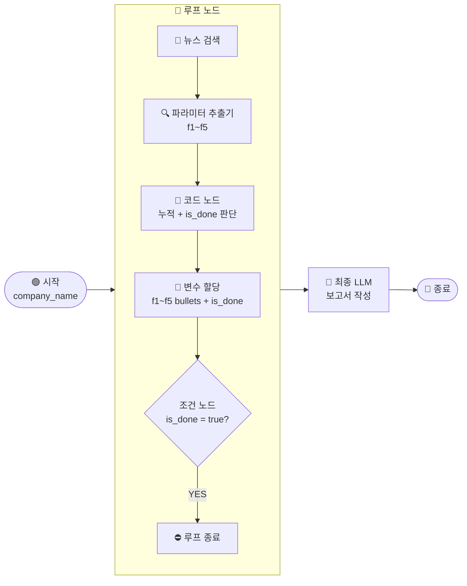

# \[레벨 3] 루프 패키지로 자동화하기

> _앞에서 단일 기사로 Five-Forces 내용을 추출하는 흐름을 완성했습니다. 이제 루프 노드를 추가해서, 기사를 반복 검색하며 5개 섹션이 충분히 채워질 때까지 자동으로 수집하는 워크플로우를 만들어봅시다._

레벨 3에서는 **루프 노드를 활용해 뉴스 기사를 반복 검색하고, 섹션별 bullet이 3개 이상 쌓이면 자동으로 멈춰서 보고서를 작성하는 워크플로우**를 완성합니다.



***

**루프 노드란?**

루프 노드는 **조건이 충족될 때까지 같은 흐름을 반복**하는 노드입니다.

반복 노드와 헷갈릴 수 있는데, 차이는 이렇습니다. 반복 노드는 미리 준비한 배열의 항목 하나하나를 처리합니다. 루프 노드는 배열이 없어도 동작합니다. 대신, **"언제 멈출지" 조건을 직접 정의**합니다.

루프 노드를 쓸 때는 아래 구조가 기본 세트입니다.

```
루프 노드 (루프 변수 정의)
  ↓
[루프 내부] 처리 흐름
  ↓
코드 노드 (이번 반복 결과 + 기존 루프 변수 → 합산)
  ↓
변수 할당 노드 (코드 노드 결과를 루프 변수에 업데이트)
  ↓
조건 노드 (종료 조건 확인)
  ↓ [YES]
루프 종료 노드
```

각 역할을 한 줄로 정리하면:

* **코드 노드**: 루프 변수는 "대입"만 할 수 있습니다. "기존 값 + 새 값"처럼 누적 연산이 필요할 때는 코드 노드에서 먼저 계산합니다.
* **변수 할당 노드**: 루프 내부에서 처리한 결과를 루프 변수에 저장합니다. 루프 변수만이 다음 반복까지 값을 이어받습니다. 변수 할당 노드로만 업데이트할 수 있습니다.
* **조건 노드 + 루프 종료 노드**: 조건이 참이면 루프를 즉시 중단합니다.

이번 예제에서는 반복할 때마다 뉴스 기사를 한 건 검색하고, Five-Forces 5개 섹션의 내용이 누적됩니다. 5개 섹션 모두 bullet이 3개 이상 쌓이면 자동으로 멈춥니다.

***

#### \[1] 루프 노드 추가 및 루프 변수 설정

시작 노드 다음에 루프 노드를 추가합니다.

캔버스 빈 공간에서 **\[+ 노드 추가]** 클릭 후 **\[루프]** 를 선택합니다.

루프 노드를 시작 노드와 연결합니다.

**최대 반복 횟수 설정**

루프 노드 설정 패널에서 **최대 반복 횟수**를 `30`으로 설정합니다.

**루프 변수 추가**

루프 변수는 반복이 이어지는 동안 값을 기억하는 저장소입니다. **\[+ 변수 추가]** 를 클릭하여 아래 6개를 추가합니다.

| 변수명          | 유형  | 기본값   |
| ------------ | --- | ----- |
| `f1_bullets` | 문자열 | (빈칸)  |
| `f2_bullets` | 문자열 | (빈칸)  |
| `f3_bullets` | 문자열 | (빈칸)  |
| `f4_bullets` | 문자열 | (빈칸)  |
| `f5_bullets` | 문자열 | (빈칸)  |
| `is_done`    | 불리언 | false |

< 루프 노드 설정 패널 — 루프 변수 6개 목록 >

***

#### \[2] 루프 내부 — 뉴스 검색

루프 노드 내부 시작 지점의 **\[+]** 버튼을 클릭하고 **네이버 뉴스 검색** 노드를 추가합니다.

> **⚠️ 루프 내부에서 노드를 추가하는 방법**
>
> 루프 내부에서 진행되는 작업은 루프 노드 내의 **\[+]** 버튼을 클릭해서만 추가할 수 있습니다. 캔버스 빈 공간에서 만든 노드를 루프 내부로 드래그해도 내부 노드로 인식되지 않습니다.

설정은 레벨 2와 동일합니다. **검색어** 항목에 `/`를 입력하고 `시작 - company_name`을 선택합니다.

< 루프 내부 뉴스 검색 노드 — 검색어 연결 화면 >

***

#### \[3] 루프 내부 — 파라미터 추출기

뉴스 검색 노드 오른쪽에 파라미터 추출기 노드를 추가합니다.

설정은 레벨 2와 동일합니다.

* **배경지식**: `뉴스 검색 - result`
* **지시사항**: `뉴스 기사에서 Five-Forces 각 항목에 해당하는 내용을 추출합니다. 각 항목은 -로 시작하는 bullet 형식으로 작성합니다. 관련 내용이 없으면 빈 문자열로 출력합니다.`
* **파라미터**: `f1`, `f2`, `f3`, `f4`, `f5` (각각 텍스트)

***

#### \[4] 루프 내부 — 코드 노드 (섹션별 누적 + is\_done)

파라미터 추출기 오른쪽에 **\[코드]** 노드를 추가합니다.

**입력 변수 설정**

**\[+ 추가]** 를 클릭하여 아래 10개의 입력 변수를 추가합니다.

| 변수명      | 값                 |
| -------- | ----------------- |
| `f1`     | `루프 - f1_bullets` |
| `f2`     | `루프 - f2_bullets` |
| `f3`     | `루프 - f3_bullets` |
| `f4`     | `루프 - f4_bullets` |
| `f5`     | `루프 - f5_bullets` |
| `new_f1` | `파라미터 추출기 - f1`   |
| `new_f2` | `파라미터 추출기 - f2`   |
| `new_f3` | `파라미터 추출기 - f3`   |
| `new_f4` | `파라미터 추출기 - f4`   |
| `new_f5` | `파라미터 추출기 - f5`   |

`f1`~~`f5`는 현재까지 쌓인 루프 변수 값이고, `new_f1`~~`new_f5`는 이번 반복에서 새로 추출한 값입니다.

**코드 입력**

```python
def main(f1, f2, f3, f4, f5, new_f1, new_f2, new_f3, new_f4, new_f5):
    def merge(existing, new_text):
        new_text = (new_text or "").strip()
        if not new_text:
            return existing
        return (existing + "\n" + new_text).strip()

    f1_u = merge(f1, new_f1)
    f2_u = merge(f2, new_f2)
    f3_u = merge(f3, new_f3)
    f4_u = merge(f4, new_f4)
    f5_u = merge(f5, new_f5)

    def count(text):
        return len([l for l in text.splitlines() if l.strip().startswith("-")])

    is_done = all(count(s) >= 3 for s in [f1_u, f2_u, f3_u, f4_u, f5_u])

    return {"f1": f1_u, "f2": f2_u, "f3": f3_u, "f4": f4_u, "f5": f5_u, "is_done": is_done}
```

**출력 변수 설정**

| 변수명       | 유형  |
| --------- | --- |
| `f1`      | 문자열 |
| `f2`      | 문자열 |
| `f3`      | 문자열 |
| `f4`      | 문자열 |
| `f5`      | 문자열 |
| `is_done` | 불리언 |

출력 변수 이름은 코드의 `return` dict 키와 정확히 일치해야 합니다. 이름이 다르면 이후 노드에서 값을 불러올 수 없습니다.

> **ℹ️ 코드가 하는 일**
>
> `merge` 함수는 기존 루프 변수 값에 이번에 새로 추출한 내용을 줄바꿈으로 이어붙입니다. 새로 추출한 내용이 비어있으면 기존 값을 그대로 유지합니다.
>
> `count` 함수는 섹션 안에서 `-`로 시작하는 줄(bullet)의 개수를 셉니다. 5개 섹션 모두 bullet이 3개 이상이면 `is_done`을 `true`로 설정합니다.

< 코드 노드 설정 — 입력 변수, 코드, 출력 변수 화면 >

***

#### \[5] 루프 내부 — 변수 할당

코드 노드 오른쪽에 **\[변수 할당]** 노드를 추가합니다.

**\[+ 추가]** 를 클릭하여 아래 6개를 설정합니다.

| 루프 변수        | 할당할 값             |
| ------------ | ----------------- |
| `f1_bullets` | `코드 노드 - f1`      |
| `f2_bullets` | `코드 노드 - f2`      |
| `f3_bullets` | `코드 노드 - f3`      |
| `f4_bullets` | `코드 노드 - f4`      |
| `f5_bullets` | `코드 노드 - f5`      |
| `is_done`    | `코드 노드 - is_done` |

< 변수 할당 노드 설정 — 루프 변수 6개 업데이트 화면 >

***

#### \[6] 루프 내부 — 조건 노드 + 루프 종료 노드

변수 할당 노드 오른쪽에 **\[조건]** 노드를 추가합니다.

**조건 설정**

조건 노드의 설정 패널에는 세 칸이 있습니다. 왼쪽부터 순서대로 **변수 / 연산자 / 비교값**입니다.

< 조건 노드 설정 패널 — 세 칸 구조 (변수 / 연산자 / 비교값) >

아래와 같이 설정합니다.

* **왼쪽 (변수)**: `루프 - is_done`
* **가운데 (연산자)**: `=`
* **오른쪽 (비교값)**: `true`

**분기 연결**

* **IF 분기** (조건이 참인 경우): **\[루프 종료]** 노드를 추가하고 연결합니다.
* **ELSE 분기** (조건이 거짓인 경우): 연결하지 않습니다. MISO에서는 루프 내부의 조건 노드 ELSE 분기가 미연결 상태이면 루프가 자동으로 처음부터 다시 실행됩니다. ELSE를 루프 종료나 루프 외부 노드에 연결하지 않도록 주의합니다.

< 조건 노드 — IF → 루프 종료, ELSE → 연결 없음 구성 화면 >

***

#### \[7] 최종 LLM 노드 — 보고서 작성

루프 노드 오른쪽에 LLM 노드를 추가합니다. (루프 내부가 아닌 외부입니다.)

**배경지식 설정**

루프가 끝난 뒤 최종적으로 쌓인 섹션 내용을 배경지식으로 연결합니다. 루프 변수는 루프가 완료된 이후에도 루프 외부에서 `루프 - 변수명` 형태로 그대로 참조할 수 있습니다. **\[+ 추가]** 를 5번 클릭합니다.

* `루프 - f1_bullets`
* `루프 - f2_bullets`
* `루프 - f3_bullets`
* `루프 - f4_bullets`
* `루프 - f5_bullets`

**시스템 프롬프트 입력**

```
당신은 투자 분석 어시스턴트입니다.
입력된 내용을 바탕으로 마이클 포터의 Five-Forces 분석 보고서를 아래 형식으로 작성합니다.

[보고서 형식]
## {기업명} Five-Forces 분석

### F1. 기존 경쟁자와의 경쟁 강도
{내용}

### F2. 신규 진입자의 위협
{내용}

### F3. 대체재의 위협
{내용}

### F4. 공급자 교섭력
{내용}

### F5. 구매자 교섭력
{내용}

각 섹션에 근거 내용이 없으면 "관련 정보 없음"으로 작성합니다.
```

**사용자 메시지 입력**

레벨 2에서 설명한 변수 참조 문법(`{{#...#}}`, `{{배경지식[n]}}`)을 그대로 사용합니다. 아래 내용을 입력합니다.

```
기업명: {{#시작.company_name#}}

[F1 — 기존 경쟁자와의 경쟁 강도]
{{배경지식[0]}}

[F2 — 신규 진입자의 위협]
{{배경지식[1]}}

[F3 — 대체재의 위협]
{{배경지식[2]}}

[F4 — 공급자 교섭력]
{{배경지식[3]}}

[F5 — 구매자 교섭력]
{{배경지식[4]}}

위 내용을 바탕으로 Five-Forces 분석 보고서를 작성해주세요.
```

***

#### \[8] 종료 노드

최종 LLM 노드 오른쪽에 종료 노드를 추가합니다.

출력 변수 항목에서 **\[+ 추가]** 를 클릭합니다.

* **변수명**: `report`
* **값**: `/`를 입력하고 `최종 LLM - text`를 선택합니다.

***

**테스트하기**

**\[테스트하기]** 버튼을 클릭합니다.

입력창에 분석하고 싶은 기업명을 입력합니다. (예: `카카오`)

워크플로우가 실행되면 루프 노드가 반복을 시작합니다. 테스트 실행 후 좌측 패널에서 루프 노드를 클릭하면 **\[상세 로그]** 탭이 나타납니다. 여기서 반복 횟수와 각 반복마다 누적된 f1\~f5 값을 확인할 수 있습니다.

5개 섹션 모두 bullet이 3개 이상 쌓이면 루프가 멈추고, 최종 LLM 노드가 보고서를 작성합니다.

종료 노드의 출력 탭에서 완성된 Five-Forces 분석 보고서를 확인합니다.

< 테스트 결과 — 최종 보고서 출력 화면 >

***

이번 챕터에서는 네이버 뉴스 API를 연동하고, 루프 노드로 기사를 반복 검색하며 Five-Forces 분석 보고서를 자동 작성하는 워크플로우를 완성했습니다!

* 수집 기준을 바꾸려면 코드 노드에서 `count(s) >= 3` 의 숫자만 수정하면 됩니다.
* 분석 프레임워크를 바꾸려면 파라미터 추출기의 항목 이름과 LLM 프롬프트만 수정하면 됩니다.
* 최대 반복 횟수를 늘리려면 루프 노드의 **최대 반복 횟수** 설정만 바꾸면 됩니다.

고생하셨습니다\~!
