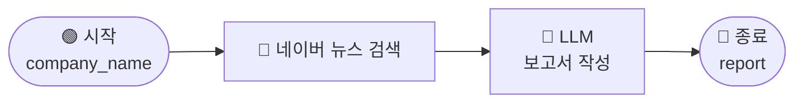

# \[레벨 1] 1개 기사로 기업 분석 보고서 작성하기

> **ℹ️ 이 레벨의 목표**
>
> 네이버 뉴스 검색 도구와 LLM 노드를 연결합니다. 기업명을 입력하면 최신 뉴스를 검색하고 기업 분석 보고서를 생성하는 워크플로우를 완성합니다.

***

이번 레벨에서 만드는 워크플로우는 다음과 같습니다.



기업명을 입력하면 네이버 뉴스 검색이 실행됩니다. LLM은 검색 결과를 바탕으로 분석 보고서를 작성합니다. 결과는 종료 노드의 `report` 변수로 출력됩니다.

***

네이버 뉴스 검색 도구는 네이버 개발자 API를 사용합니다. 먼저 Client ID와 Client Secret을 발급받습니다.

### 1단계. 네이버 API HUB에서 뉴스 API 발급



### 네이버 API HUB 신청하기

네이버 뉴스 검색 기능을 사용하려면 먼저 NAVER API HUB를 신청해야 합니다. 계정이 없다면 회원가입을 완료합니다.

[https://www.ncloud.com/product/applicationService/naverApiHub](https://www.ncloud.com/product/applicationService/naverApiHub)

<figure><figcaption><p>NAVER API HUB 신청하기</p></figcaption></figure>



### NAVER API HUB 열기

**MENU → ALL SERVICE → APPLICATION SERVICE → NAVER API HUB**로 이동합니다.

<figure><figcaption><p>MENU > ALL SERVICE</p></figcaption></figure>

<figure><figcaption><p>NAVER API HUB</p></figcaption></figure>



### 애플리케이션 등록

**Application 등록**을 선택합니다. API 서비스에서 **뉴스**를 선택한 뒤 애플리케이션 이름을 입력합니다.

<figure><figcaption><p>Application 등록</p></figcaption></figure>

<figure><figcaption><p>뉴스 선택</p></figcaption></figure>

<figure><figcaption><p>Application 이름 설정</p></figcaption></figure>



### 인증 정보 확인

등록한 애플리케이션의 **인증 정보**를 엽니다. `Client ID`와 `Client Secret`을 각각 복사합니다.

<figure><figcaption><p>인증 정보 확인</p></figcaption></figure>

<figure><figcaption><p>Client ID와 Client Secret 복사</p></figcaption></figure>



### MISO 네이버 뉴스 도구 활성화하기

MISO에서 네이버 뉴스 검색 도구를 추가한 뒤, 발급받은 인증 정보를 연결합니다.


네이버 뉴스 검색 인증 정보는 매니저 이상 역할만 등록할 수 있습니다. 일반 사용자는 관리자에게 권한을 요청하세요.

도구를 활성화하면 워크스페이스 구성원 모두가 사용할 수 있습니다. API 키에는 일별·월별 호출 제한이 적용됩니다. 사용량이 많을 수 있는 워크스페이스에서는 개인 API 키 등록에 유의하세요.


<figure><figcaption><p>네이버 뉴스 검색 도구 활성화</p></figcaption></figure>



***

### 2단계. MISO에서 네이버 뉴스 도구 연결

인증 정보를 연결하기 전에는 네이버 뉴스 검색 도구에 오류 메시지가 표시됩니다.

<figure><figcaption></figcaption></figure>

워크플로우 편집 화면에서 네이버 뉴스 검색 도구를 추가하고, 발급받은 인증 정보를 연결합니다.

<figure><figcaption></figcaption></figure>



### 노드 추가

캔버스에서 우클릭한 뒤 `노드 추가`를 선택합니다.



### 네이버 뉴스 검색 선택

왼쪽 카테고리에서 `도구`를 선택합니다. **네이버 뉴스 검색**을 선택합니다.

<figure><figcaption></figcaption></figure>



### 인증 정보 입력

노드 설정 패널에서 `인증 추가`를 선택합니다.

<figure><figcaption></figcaption></figure>

인증 추가 창에서 1단계에서 발급받은 값을 입력합니다.

* **Client ID**: 네이버 개발자 센터에서 확인한 Client ID
* **Client Secret**: 네이버 개발자 센터에서 확인한 Client Secret

`저장`을 선택합니다.

<figure><figcaption></figcaption></figure>

저장하면 검색어와 도구 설정을 입력할 수 있습니다.



***

### 3단계. 뉴스 검색 워크플로우 구성

도구 연결을 확인하기 위해 기업명을 입력받아 뉴스를 검색하는 워크플로우를 만듭니다.



### 시작 변수 추가

**시작 노드**를 선택하고 `+ 변수 추가`를 선택합니다.

* **변수명**: `company_name`
* **유형**: 텍스트



### 검색어 연결

시작 노드와 **네이버 뉴스 검색** 노드를 연결합니다. **검색어**에 `/`를 입력하고 `시작 - company_name`을 선택합니다.

<figure><figcaption></figcaption></figure>



### 검색 결과 출력

네이버 뉴스 검색 노드 오른쪽에 **종료** 노드를 추가합니다. 출력 변수를 다음과 같이 설정합니다.

* **변수명**: `result`
* **값**: `네이버 뉴스 검색 - text`

<figure><figcaption></figcaption></figure>



### 검색 테스트

`테스트하기`를 선택하고 기업명을 입력합니다. 예를 들어 `GS칼텍스`를 입력합니다.

<figure><figcaption></figcaption></figure>

기사 제목, URL, 날짜가 포함된 결과가 표시되면 연결이 완료된 것입니다.

이제 검색 결과를 LLM 노드에 전달해 기업 분석 보고서를 만듭니다.



***

### 4단계. 기업 분석 보고서 생성

뉴스 검색 노드와 종료 노드 사이에 LLM 노드를 추가합니다. LLM은 뉴스 검색 결과를 배경지식으로 사용합니다.



### LLM 노드 추가

네이버 뉴스 검색 노드 오른쪽에 **LLM** 노드를 추가합니다.



### 배경지식 연결

**배경지식**에서 `네이버 뉴스 검색 - text`를 선택합니다.



### 시스템 프롬프트 작성

**시스템 프롬프트**에 다음 내용을 입력합니다.


```
당신은 기업 분석 전문가입니다.
뉴스 기사를 바탕으로 기업 분석 보고서를 작성합니다.

아래 규칙을 반드시 지킵니다.
- 제공된 뉴스 기사에 없는 내용은 지어내지 않습니다. 관련 정보가 없으면 '해당 정보 없음'으로 표시합니다.
- 보고서는 반드시 아래 형식을 따릅니다. 형식 외의 문장은 출력하지 않습니다.

[출력 형식]
## {기업명} 뉴스 분석 보고서

### 핵심 요약
{1~2줄 요약}

### 주요 내용
- ...
- ...

### 투자 관점 시사점
{2~3줄}
```




### 사용자 프롬프트 작성

**사용자 프롬프트**에 다음 내용을 입력합니다.

```
분석 대상 기업: {{#시작.company_name#}}

아래 뉴스 기사를 참고하여 위 기업의 분석 보고서를 작성해주세요.

{{#context#}}
```

<div><figure><figcaption></figcaption></figure> <figure><figcaption></figcaption></figure></div>



### 보고서 출력 설정

LLM 노드 오른쪽에 **종료** 노드를 추가합니다. 종료 노드에서 `+ 변수 추가`를 선택하고 다음과 같이 설정합니다.

* **변수명**: `report`
* **값**: `/`를 입력하고 `LLM - text`를 선택합니다.

<figure><figcaption></figcaption></figure>



***

### 5단계. 테스트

`테스트하기`를 선택하고 `GS칼텍스`를 입력합니다.

<figure><figcaption></figcaption></figure>

최근 뉴스 기사를 바탕으로 기업 분석 보고서가 생성됩니다.

***

기업명 하나로 뉴스를 검색하고 기업 분석 보고서를 작성하는 워크플로우를 완성했습니다.

현재 워크플로우는 제한된 기사만 분석합니다. 특정 시점이나 관점에 치우친 결과가 나올 수 있습니다.

다음 레벨에서는 반복 노드로 여러 기업의 기사를 순서대로 분석합니다. 그 결과를 바탕으로 산업 동향 보고서를 작성합니다.
