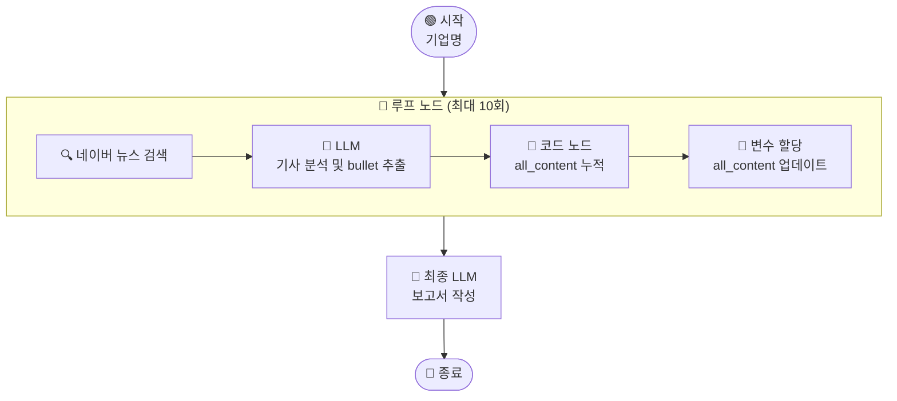

# \[레벨 1] 루프로 기사 읽고 내용 쌓기

> **ℹ️ 이 페이지의 목표**
>
> 이번 레벨의 목표는 **루프 노드의 기본 구조**를 익히는 것입니다. 기업명을 입력하면 뉴스를 자동으로 검색하고, 읽을 때마다 Five-Forces 관련 내용을 `all_content`라는 변수에 누적해갑니다.

이번 레벨 1에서는 루프 노드가 어떻게 동작하는지를 이해하는 것에 집중합니다. 그래서 워크플로우를 의도적으로 단순하게 만듭니다. "각 섹션이 충분히 채워졌는지 추적하기", "모두 채워지면 자동으로 멈추기" 같은 기능은 지금 당장 다루지 않습니다. 루프 변수가 어떻게 반복마다 값을 이어받는지, 변수 할당 노드가 왜 필요한지를 먼저 익히고 나면, 레벨 2에서 자연스럽게 확장할 수 있습니다.



***

**루프 노드란?**

루프 노드는 "조건이 충족될 때까지" 또는 "정해진 횟수만큼" 같은 작업을 반복 실행하는 노드입니다.

루프 노드는 배열 없이도 동작합니다. 뉴스 기사처럼 "몇 개를 읽어야 충분한지 미리 알 수 없는 상황"에 딱 맞는 노드입니다.

루프 노드에는 **루프 변수**라는 개념이 있습니다. 반복이 진행되는 동안 값을 기억해두는 저장소입니다. 처음 루프가 시작될 때 기본값을 지정해두고, 매 반복이 끝날 때마다 업데이트된 값으로 덮어씁니다. 이번 레벨에서는 지금까지 추출한 내용을 누적하는 `all_content` 변수 하나를 사용합니다.

***

#### \[1] 시작 노드 — 기업명 입력 변수 추가

분석할 기업 이름을 입력받기 위해 시작 노드에 변수를 추가합니다.

1. **시작 노드**를 클릭합니다.
2. **\[+ 변수 추가]** 를 클릭하고 아래와 같이 설정합니다.
   * **변수명**: `company_name`
   * **유형**: 텍스트
   * **입력 필드 이름**: `분석할 기업명`
3. **\[저장]** 버튼을 클릭합니다.

이제 워크플로우를 실행할 때 기업 이름을 입력할 수 있습니다. 다음으로 이 기업명을 받아 뉴스를 반복 수집할 루프 노드를 추가합니다.

***

#### \[2] 루프 노드 추가 및 루프 변수 설정

1. **시작 노드** 오른쪽의 **\[+]** 버튼을 클릭합니다.
2. **\[루프]** 노드를 선택합니다.
3. 아래와 같이 설정합니다.
   1. **최대 반복 횟수**: `10`
   2. **루프 변수** 항목에서 **\[+ 추가]** 를 클릭합니다.
      * **변수명**: `all_content`
      * **유형**: 문자열
      * **기본값**: (비워둡니다)
4. **\[저장]** 버튼을 클릭합니다.

< 루프 노드 설정 패널 — 최대 반복 횟수 10, 루프 변수 all\_content(string) 기본값 빈칸 >

> **ℹ️ 루프 변수의 기본값은 왜 비워두나요?**
>
> 루프 변수는 루프가 시작될 때 기본값으로 초기화됩니다.\
> `all_content`는 기사를 읽으면서 내용이 쌓여가는 변수이므로, 처음엔 빈 문자열로 시작합니다.\
> 기본값을 비워두면 자동으로 빈 문자열(`""`)로 설정됩니다.

루프 노드가 추가되었습니다. 이제 이 루프 노드 **내부**에 반복할 처리 흐름을 구성합니다. 가장 먼저 뉴스 검색입니다.

***

#### \[3] 루프 내부 — 네이버 뉴스 검색

루프가 한 번 돌 때마다 가장 먼저 실행할 것은 뉴스 검색입니다. 기업명을 기반으로 관련 기사를 가져옵니다.

1. **루프 노드** 내부의 시작 지점 오른쪽 **\[+]** 버튼을 클릭합니다.
2. 노드 선택 패널에서 **\[도구]** 탭을 선택하고 **\[네이버 뉴스 검색]** 을 선택합니다.
3. 아래와 같이 설정합니다.
   1. **제목**: `뉴스 검색`
   2. **검색어**: `/`를 입력하고 `시작 - company_name`을 선택합니다.
4. **\[저장]** 버튼을 클릭합니다.

< 루프 내부 — 네이버 뉴스 검색 노드 설정 (검색어에 시작.company\_name 연결) >

뉴스 검색 결과가 준비되었습니다. 이제 LLM이 기사 내용을 읽고 Five-Forces 관련 내용을 추출합니다.

***

#### \[4] 루프 내부 — LLM 노드 (기사 분석)

LLM은 검색된 기사를 읽고, Five-Forces 다섯 섹션 중 기사에 관련 내용이 있는 섹션만 bullet point로 추출합니다. 없는 내용을 지어내지 않도록 프롬프트에서 명확하게 제한하는 것이 핵심입니다.

1. **뉴스 검색** 노드 오른쪽의 **\[+]** 버튼을 클릭합니다.
2. **\[LLM]** 노드를 선택합니다.
3. 아래와 같이 설정합니다.
   1. **제목**: `기사 분석 LLM`
   2. **모델**: 사용할 LLM 모델을 선택합니다.
   3. **배경지식(컨텍스트)** 항목에서 **\[+ 추가]** 를 클릭합니다.
      * `/`를 입력하고 `뉴스 검색 - result`를 선택합니다.
   4. **시스템 프롬프트** 영역에 아래 내용을 입력합니다.

```
당신은 투자 분석 전문가입니다.
제공된 뉴스 기사에서 마이클 포터의 Five-Forces 분석에 관련된 내용만 추출합니다.

Five Forces 5가지:
- F1: 기존 경쟁자와의 경쟁 강도
- F2: 신규 진입자의 위협
- F3: 대체재의 위협
- F4: 공급자 교섭력
- F5: 구매자(고객) 교섭력

[작성 규칙]
- 기사에 실제로 있는 내용만 bullet point로 작성하세요.
- 관련 내용이 없는 섹션은 완전히 생략하세요.
- 추측하거나 내용을 지어내지 마세요.
- 각 bullet point는 한 줄로 구체적으로 작성하세요.

[출력 형식 — 해당 섹션만 출력]
**[F1] 기존 경쟁자와의 경쟁 강도**
- ...

**[F3] 대체재의 위협**
- ...
```

5. **사용자 메시지** 영역에 아래 내용을 입력합니다.

```
기업명: {{#시작.company_name#}}

[기사 내용]
{{#context#}}

위 기사에서 Five-Forces 관련 내용만 추출해주세요.
없으면 아무것도 출력하지 마세요.
```

4. **\[저장]** 버튼을 클릭합니다.

LLM이 기사에서 관련 내용을 추출했습니다. 이제 이 내용을 루프 변수 `all_content`에 누적해야 합니다. 매 반복마다 기존 내용 뒤에 새 내용을 이어붙이는 작업입니다.

***

#### \[5] 루프 내부 — 코드 노드 (내용 누적)

루프 변수에 값을 누적하려면, "기존 `all_content`" + "이번에 추출한 내용"을 합쳐서 새로운 문자열을 만들어야 합니다. 이 작업은 코드 노드로 처리합니다.

1. **기사 분석 LLM** 노드 오른쪽의 **\[+]** 버튼을 클릭합니다.
2. **\[코드]** 노드를 선택합니다.
3. 아래와 같이 설정합니다.
   1. **제목**: `내용 누적`
   2. **언어**: `Python3`
   3. **입력 변수** 항목에서 **\[+ 추가]** 를 2번 클릭합니다.
      * 첫 번째: **변수명** `existing` / **값**: `/`를 입력하고 `루프 - all_content`를 선택
      * 두 번째: **변수명** `new_text` / **값**: `/`를 입력하고 `기사 분석 LLM - text`를 선택
   4. **코드** 영역에 아래 코드를 입력합니다.

```python
def main(existing: str, new_text: str):
    new_text = new_text.strip()
    if not new_text:
        return {"merged": existing}
    merged = (existing + "\n\n" + new_text).strip()
    return {"merged": merged}
```

5. **출력 변수** 항목에서 **\[+ 추가]** 를 클릭합니다.
   * **변수명**: `merged`
   * **유형**: 문자열
6. **\[저장]** 버튼을 클릭합니다.

> **ℹ️ 루프 변수 `all_content`는 어디서 참조하나요?**
>
> 루프 내부 노드에서 `/`를 입력하면 `루프 - all_content`가 변수 목록에 나타납니다.\
> 이 값이 현재 반복 시점의 `all_content` 값, 즉 직전까지 누적된 내용입니다.

합쳐진 내용이 준비되었습니다. 이제 이 값을 루프 변수 `all_content`에 다시 저장해야 합니다. 이것이 변수 할당 노드의 역할입니다.

***

#### \[6] 루프 내부 — 변수 할당 (루프 변수 업데이트)

코드 노드가 합산한 결과를 루프 변수에 다시 저장해야 다음 반복에서 이 값을 이어받을 수 있습니다. **변수 할당 노드**는 루프 변수를 업데이트하는 전용 노드입니다.

1. **내용 누적** 노드 오른쪽의 **\[+]** 버튼을 클릭합니다.
2. **\[변수 할당]** 노드를 선택합니다.
3. 아래와 같이 설정합니다.
   1. **할당할 변수**: `all_content` (루프 변수 목록에서 선택)
   2. **값**: `/`를 입력하고 `내용 누적 - merged`를 선택합니다.
4. **\[저장]** 버튼을 클릭합니다.

< 변수 할당 노드 — all\_content에 내용 누적.merged 연결 >

> **ℹ️ 변수 할당 노드가 꼭 필요한 이유**
>
> 루프 노드 내부에서 일반 노드의 출력값은 해당 반복이 끝나면 사라집니다.\
> 루프 변수만이 다음 반복까지 값을 유지합니다.\
> 반드시 **변수 할당 노드**로 루프 변수를 업데이트해야 값이 다음 반복으로 이어집니다.

루프 내부 흐름이 완성되었습니다. 10번 반복이 끝나면 `all_content`에 최대 10개 기사 분량의 내용이 누적됩니다. 이제 루프 밖에서 이 내용을 받아 보고서를 작성하는 최종 LLM을 추가합니다.

***

#### \[7] 최종 LLM 노드 — 보고서 작성

루프가 끝난 후 실행됩니다. `all_content`에 쌓인 내용을 바탕으로 Five-Forces 분석 보고서를 완성합니다. 이 단계에서 내용을 지어내지 않도록 시스템 프롬프트에서 명확하게 지시합니다.

1. **루프 노드** 오른쪽의 **\[+]** 버튼을 클릭합니다.
2. **\[LLM]** 노드를 선택합니다.
3. 아래와 같이 설정합니다.
   1. **제목**: `보고서 작성 LLM`
   2. **배경지식(컨텍스트)** 항목에서 **\[+ 추가]** 를 클릭합니다.
      * `/`를 입력하고 `루프 - all_content`를 선택합니다.
   3. **시스템 프롬프트** 영역에 아래 내용을 입력합니다.

```
당신은 GS퓨처스 심사역을 위한 투자 분석 어시스턴트입니다.
제공된 뉴스 기사 발췌 내용을 바탕으로 마이클 포터의 Five-Forces 분석 보고서를 작성합니다.

[작성 규칙]
- 제공된 내용 안에 있는 사실만 작성하세요.
- 내용이 없거나 부족한 섹션은 "관련 데이터 부족"으로 표시하고 내용을 지어내지 마세요.
- 각 섹션은 bullet point 형식으로 작성하세요.

[보고서 형식]
## {기업명} Five-Forces 분석 보고서

**1. 기존 경쟁자와의 경쟁 강도**
- ...

**2. 신규 진입자의 위협**
- ...

**3. 대체재의 위협**
- ...

**4. 공급자 교섭력**
- ...

**5. 구매자(고객) 교섭력**
- ...

**[종합 의견]**
{한 문단 요약}
```

4. **사용자 메시지** 영역에 아래 내용을 입력합니다.

```
기업명: {{#시작.company_name#}}

[수집된 기사 분석 내용]
{{#context#}}

위 내용을 바탕으로 Five-Forces 보고서를 작성해주세요.
```

4. **\[저장]** 버튼을 클릭합니다.

보고서를 출력하기 위한 종료 노드를 추가합니다.

***

#### \[8] 종료 노드 설정

1. **보고서 작성 LLM** 노드 오른쪽의 **\[+]** 버튼을 클릭합니다.
2. **\[종료]** 노드를 선택합니다.
3. **출력 변수** 항목에서 **\[+ 추가]** 를 클릭합니다.
   * **변수명**: `report`
   * **값**: `/`를 입력하고 `보고서 작성 LLM - text`를 선택합니다.
4. **\[저장]** 버튼을 클릭합니다.

***

**테스트하기**

**\[테스트하기]** 버튼을 클릭하고 분석할 기업명(예: `삼성전자`)을 입력합니다.

루프가 최대 10회 실행되면서 뉴스를 수집합니다. 종료 노드의 출력 탭에서 아래와 같은 보고서가 생성되었는지 확인합니다.

```
## 삼성전자 Five-Forces 분석 보고서

**1. 기존 경쟁자와의 경쟁 강도**
- TSMC, SK하이닉스와의 반도체 시장 점유율 경쟁 심화
- 중국 저가 반도체 업체들의 메모리 시장 침투 가속
- HBM 시장에서 SK하이닉스에 점유율 일부 추월됨

**2. 신규 진입자의 위협**
- 관련 데이터 부족

...
```

< 테스트 결과 — 종료 노드 출력 탭, 일부 섹션 "관련 데이터 부족" 표시 >

결과를 보면 한 가지 한계가 눈에 띕니다. 보고서 여러 섹션에 "관련 데이터 부족"이 표시되어 있습니다. 어떤 섹션은 충분한 기사가 있고, 어떤 섹션은 10번을 다 돌아도 관련 기사가 없었기 때문입니다.

이 방식의 문제가 보이시나요? 워크플로우는 어떤 섹션이 얼마나 채워졌는지 알지 못한 채 무조건 10번을 채웁니다. 이미 충분한 섹션을 위해 기사를 낭비하거나, 부족한 섹션이 있어도 멈춰버리는 셈입니다.

레벨 2에서는 각 섹션의 bullet point 수를 따로 추적하고, 5개 섹션 모두 3개 이상 채워지면 자동으로 멈추도록 개선합니다.
