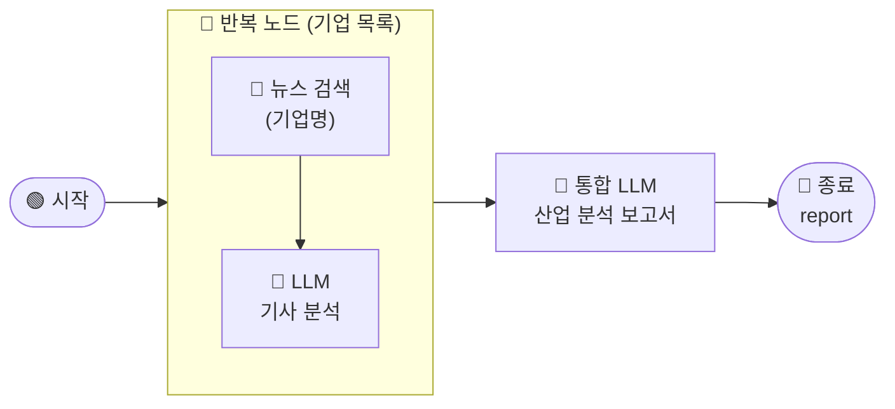

# \[레벨 2] 반복 노드로 5개 기업 동향 분석하기

> _앞에서 기업명 하나를 입력하면 뉴스 기사 1개로 분석 보고서를 작성하는 워크플로우를 완성했습니다._ \
> _이번에는 반복 노드를 활용해서 데이터센터 산업의 주요 기업 5개를 한 번에 분석하고, 산업 전체를 바라보는 보고서를 작성해봅시다._

기업 1개만 가지고 보고서를 쓰니, 내용이 빈약하기도 하고 하나의 기업에 치중되어 있다보니 산업을 넓게 보는 시각이 부족하다는 느낌이 들었습니다.

선우 매니저는 산업군으로 시야를 넓혀서 현재 알아보고 싶은 산업 내에서의 다양한 변화, 주요 플레이어의 동향 등에 관한 심도깊은 분석 보고서를 만들어봐야겠다는 생각이 들었습니다.

데이터 센터가 요즘 중요하니, 산업군으로 설정해보고, 주요 기업을 5개 정도 뽑아서 뉴스를 순서대로 수집한 뒤, 인사이트를 뽑고, 결과물들을 기반으로 하나의 데이터센터 산업 분석 보고서로 통합하는 워크플로우를 만들어봅시다!<br>

***

레벨 2의 핵심은 `반복` 노드입니다. 기업 목록을 입력으로 받아, 각 기업에 대해 동일한 뉴스 수집·분석 작업을 자동으로 반복합니다.



***

#### 반복 노드란?

반복 노드는 목록(배열) 안의 항목 하나하나에 대해, **똑같은 작업을 자동으로 실행**해주는 노드입니다.

즉, 이번 문제에서는 <mark style="color:$primary;">**삼성SDS, LG CNS, SK브로드밴드, KT Cloud, NAVER Cloud**</mark> 각각에 대해 뉴스를 검색하고, 기사를 분석하여 결과를 모읍니다.

기업마다 하는 작업은 똑같습니다. 뉴스를 검색하고, LLM으로 분석하는 것. 바뀌는 것은 기업명뿐입니다. 반복 노드는 바로 이 "대상만 바뀌는 반복 작업"을 자동으로 처리합니다.

그렇다면, 바뀌는 대상(기업 목록)을 반복 노드 외부에서 제공해주는 방법과, 반복 노드 내부에서 반복되는 작업들을 세팅하는 방법을 알아야 합니다.

***

### \[1] 기업 목록 설정 — 대화 변수

따라하기의 3번째 시리즈에서 이 반복 노드를 사용하는 방법을 코드 노드와 템플릿 노드를 통해 설명한 적이 있습니다.

[2.md](../3./2.md "mention")

그래서 이번에는 똑같은 방법으로 하지 않고, 좀 더 간편하게 대화 변수 라는 것을 활용해서 기업 목록을 관리해보려고 합니다.


1. 워크플로우 우상단의 `앱 조건 설정` 을 클릭합니다.
2. 대화 조건 설정 을 들어가보면, 변수 추가 버튼이 있습니다.

<figure><figcaption></figcaption></figure>

3. 대화 변수 세팅은 아래와 같이 해줍니다.
   1. 유형 : `문자열 배열`
   2. 기본값 : **\[+추가]** 를 통해 기업 목록을 입력해줍니다.

<figure><figcaption></figcaption></figure>

이렇게 설정해주면, 당장은 보이지 않지만, 워크플로우 내에 언제든지 사용가능한 변수 `company_list` 가 생긴 상태입니다. 이제 `반복 노드`를 추가해주고, `반복 노드`의 입력값에 이 `company_list` 를 할당해서 사용해보도록 할까요?

***

### \[2] 반복 노드 설정

1. 시작 노드 오른쪽의 **\[+]** 버튼을 클릭합니다.
2. **\[반복]** 노드를 선택합니다.
3. 입력 변수를 선택합니다.
   1. 입력 변수 목록에 아까 만든 대화 변수가 있습니다! 클릭하여 선택해줍니다.

<figure><figcaption></figcaption></figure>

반복 노드가 추가되었습니다.&#x20;

이제 이 노드 내부에 반복적으로 실행할 작업인 **뉴스 검색 노드**와 **기사 인사이트 분석 LLM 노드**를 배치해 봅시다!

> **ℹ️ 반복 노드 내부에 노드를 추가하는 방법**
>
> 반복 노드 내부에서 진행되는 작업은 반복 노드 내부의 **\[+]** 버튼을 클릭해서만 추가할 수 있습니다. 반복 노드 바깥에서 노드를 만든 뒤 내부로 끌고 오는 방식은 지원하지 않으니 유의하시길 바랍니다.

1. **반복 노드** 내부의 반복 시작 지점 오른쪽 **\[+]** 버튼을 클릭합니다.
2. **\[도구]** 중 뉴스 검색 도구를 선택합니다.
3. 아래와 같이 설정합니다.
   1. **제목**: `네이버 뉴스 검색`
   2. **검색어**: `/`를 입력하고 `반복 - item`을 선택합니다.

<figure><figcaption></figcaption></figure>

> **ℹ️ `반복 - item`이란?**
>
> 반복 노드가 현재 처리 중인 배열의 항목을 참조하는 특수 변수입니다. 첫 번째 반복에서는 `삼성SDS`, 두 번째에서는 `LG CNS`, 이런 식으로 기업명이 차례로 대입됩니다.

4. **네이버 뉴스 검색** 노드 오른쪽의 **\[+]** 버튼을 클릭하여 **\[ LLM ]** 노드를 추가해줍니다.
5. **LLM 노드**는 아래와 같이 설정합니다.
   1. **제목**: 개별 기업 인사이트 추출
   2. **모델**: 사용할 LLM 모델을 선택합니다.
   3. **배경지식** 항목에서  `네이버 뉴스 검색 - text`를 선택합니다.
6. **시스템 프롬프트**는 다음과 같이 설정합니다.

```
당신은 데이터센터 산업 동향을 분석하는 리서치 어시스턴트입니다.

주어진 기업의 최신 뉴스 기사를 읽고, 산업 분석에 활용할 수 있는 핵심 인사이트를 bullet point로 추출합니다.

[규칙]
- 기사에 명시된 내용만 작성합니다. 없는 내용을 지어내지 마세요.
- 기사에 해당 기업 관련 내용이 없으면 "관련 기사 없음"으로 표시합니다.
- 단순한 사실 나열보다, 산업·시장 관점에서 의미 있는 내용을 중심으로 작성합니다.
- 각 bullet은 한 문장으로 작성합니다.

[출력 형식]
**{기업명}**
- {핵심 인사이트 1}
- {핵심 인사이트 2}
- {핵심 인사이트 3}
```

7. **사용자 프롬프트**는 다음과 같이 설정합니다.

```
분석 대상 기업: {{#반복_1.item#}}

[뉴스 기사]
{{#context#}}

위 기사를 바탕으로 해당 기업의 핵심 인사이트를 bullet point로 작성해주세요.
```


이때, 배경지식을 꼭 변수로 추가해주는 것을 잊지 마세요!


<div align="left"><figure><figcaption></figcaption></figure></div>


이제 반복 노드의 출력 변수를 설정합니다. 각 반복에서 이 LLM 노드가 생성한 기업별 분석 결과를 배열로 수집합니다.

1. **반복 노드** 설정 패널의 **출력 변수** 항목에서 `개별 기업 인사이트 추출 - text` 를 선택합니다.

<figure><figcaption></figcaption></figure>

> **ℹ️ 반복 노드 출력은 배열로 모입니다**
>
> 출력 변수로 `기사 분석 LLM - text`를 선택하면, 5번의 반복이 끝난 후 각 기업 분석 결과가 배열 형태로 모여서 다음 노드에 전달됩니다. 예: `["삼성SDS 분석 결과", "LG CNS 분석 결과", ..., "NAVER Cloud 분석 결과"]`

5개 기업의 분석 결과가 배열로 수집되었습니다. 이 배열을 통합 LLM에 전달하여 산업 전체를 아우르는 보고서를 작성해봅시다!

***

### \[3] 통합 LLM — 산업 분석 보고서 작성

1. **반복** 노드 오른쪽의 **\[+]** 버튼을 클릭하여, **\[LLM]** 노드를 선택합니다.
2. 아래와 같이 설정합니다.
   1. **제목**: `산업 보고서 작성`
   2. **배경지식(컨텍스트)** 항목에서 **\[+ 추가]** 를 클릭합니다.
      * `/`를 입력하고 `반복 - output`을 선택합니다.
3. **시스템 프롬프트** 영역에 아래 내용을 입력합니다.

```
당신은 데이터센터 산업 전문 리서치 어시스턴트입니다.

여러 기업의 뉴스 분석 결과 배열을 받아, 산업 전체를 아우르는 분석 보고서를 작성합니다.

[규칙]
- 배열 안의 각 항목은 기업 하나의 분석 결과입니다.
- 분석 결과에 명시된 내용만 활용합니다. 없는 내용을 지어내지 마세요.
- "관련 기사 없음"으로 표시된 기업은 보고서 본문에서 제외합니다.

[출력 형식]
## 데이터센터 산업 분석 보고서

### 산업 개요
{산업 전반의 현황과 주요 흐름 — 2~3줄}

### 주요 기업 동향
{기업별 핵심 내용 정리}

### 산업 시사점
{투자·전략 관점에서의 시사점 — 2~3줄}
```

4. **사용자 메시지** 영역에 아래 내용을 입력합니다.

```
[기업별 분석 결과]
{{#context#}}

위 분석 결과를 바탕으로 데이터센터 산업 분석 보고서를 작성해주세요.
```

<figure><figcaption></figcaption></figure>

보고서 작성 준비가 완료되었습니다. 마지막으로 종료 노드를 연결하여 워크플로우를 마무리합니다.

***

### \[4] 테스트하기

이제 산업군을 분석하기 위해 대표 기업을 선정하고 뉴스를 모아 산업 보고서를 작성할 수 있습니다.

테스트하기를 눌러서 결과를 확인해봅시다!

<figure><figcaption></figcaption></figure>

좋습니다! 데이터 센터 산업에 대한 풍부한 보고서가 작성이 되었군요.

***

이번 레벨에서는 반복 노드를 활용해 5개 기업의 뉴스를 차례로 수집·분석하고, 하나의 산업 분석 보고서로 통합하는 워크플로우를 완성했습니다.

그런데 지금 워크플로우에는 **두 가지 한계**가 있습니다. 기업 수가 5개로 고정되어 있고, 기업마다 뉴스 기사를 미리 정해놓은 개수인 10개씩만 수집한다는 것입니다. 기사가 더 필요할지, 너무 많을지 평가할 수 없다는 것이죠.\
<mark style="color:$danger;">그러다보니 보고서 작성 시에 다양한 관점에서의 분석이 부족한 느낌이 듭니다.</mark>

레벨 3에서는 팀장님의 피드백을 받고, 더 고도화된 보고서를 작성하기 위한 워크플로우를 구상해봅시다.
