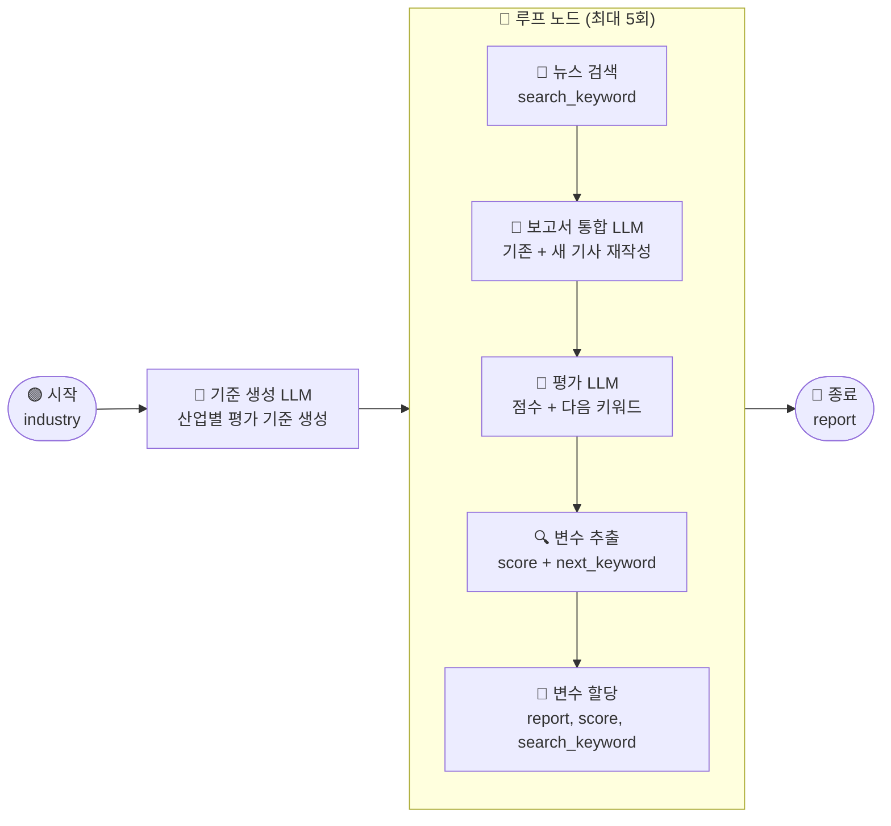

# \[레벨 3] 점수 기반 자동화로 고품질 보고서 작성하기


_앞에서 반복 노드로 여러 기업의 뉴스를 수집해 산업 분석 보고서를 만들었습니다. 이번 레벨에서는 루프 노드를 활용해서 보고서 품질이 기준점에 도달할 때까지 자동으로 보완하는 워크플로우를 완성해 봅시다._


데이터센터 산업 분석 보고서를 회사 게시판에 공유했더니, 사람들의 반응이 뜨거웠습니다. 한번 워크플로우로 만들어두었더니 공수가 많이 들지 않아 선우 매니저는 매주 월요일 아침마다 보고서를 공유했습니다.

그렇게 1달이 지나 4번째 보고서를 업로드 한 월요일 오후, 팀장님께서 선우 매니저를 사무실로 호출했습니다.

"선우 매니저, 회사 게시판에 매주 올리는 보고서 잘 봤어요. 특히 상무님께서 데이터센터 관련 보고서가 마침 필요하다고 하셔서 공유해드렸더니 좋아하시더라고요. 근데 벌써 4개째 올렸길래 저도 재밌게 봤는데, 이상하게 매주 보고서 퀄리티가 조금씩 들쭉날쭉 한 것 같아요. 어느 보고서는 시장 현황, 기업별 사업 분석, 그리고 재무 데이터 분석 같은 내용도 잘 담겨 있는데, 어떤 건 시장 분석만 나와있는 경우도 있더라고?"

> _'아.. 기사를 10개씩만 수집해서 하다보니까 시장에서 뜨거운 관심이었던 주제는 기사가 너무 몰려서 시장성 분석만 이루어졌나보다..'_

"음.. 제가 선우 매니저가 만든 앱? 의 로직은 잘 모르지만, 그래도 산업 보고서는 읽어왔던 경험이 있는데 혹시 괜찮다면 첨언을 조금 해주고 싶어요. 잘 쓴 보고서는 **1) 시장·투자 동향, 2) 기술·인프라 변화, 3) 정책·규제 환경, 4) 경쟁 · 리스크 요인**에 대한 내용이 모두 포함되었을 때 다각적으로 산업을 바라보기 좋았던 것 같더라고요. 혹시 이런 기준에 맞춰서 자동으로 보고서가 생성되도록 업데이트 해볼 수 있을까요? 그게 보장되면 상무님께도 매주 공유드리면서 전략 회의 안건으로 삼아볼까 싶어요."

> _'기준이 있다면, 그 기준을 워크플로우 내에서 직접 평가하게 하면 되지 않을까? 기준을 충족할 때까지 계속 검색하고 보완하면...'_

선우 매니저는 최근 미소 부스터 교육에서 배웠던 루프 노드가 떠올랐습니다. 특정 기준치를 만족할 때까지 같은 작업을 반복한다던 루프 노드라면, 보고서 품질이 기준점을 넘을 때까지 자동으로 보완하는 워크플로우를 만들어 볼 수 있을 것 같았습니다.

***



***

#### 루프 노드란?

**루프 노드**는 특정 조건이 충족될 때까지 작업을 반복 실행하는 노드입니다.

앞에서 사용한 반복 노드는 배열(목록)을 입력으로 받아, 목록의 항목 수만큼 반복했습니다. 반복 횟수가 처음부터 정해져 있는 방식입니다.\
반면 루프 노드는 배열 없이도 동작합니다. "점수가 90점이 넘을 때까지", "충분한 정보가 모일 때까지"처럼 조건이 만족될 때까지 반복하므로, 몇 번 반복해야 할지 미리 알 수 없는 상황에 적합합니다.

즉, 이번 레벨에서 루프 노드는 "평가 점수가 90점 이상이 될 때까지 검색·보완을 반복하다가, 기준을 충족하면 자동으로 멈추는" 역할을 합니다.

***

### \[1] 루프 노드 설정

루프 노드를 캔버스에 추가하고, 반복에 필요한 변수와 중단 조건을 설정합니다.

1. **\[시작]** 노드 오른쪽의 **\[+]** 버튼을 클릭하고 **\[루프]** 노드를 선택합니다.
2. 루프 노드를 클릭하여 설정 패널을 엽니다.
3. **최대 반복 횟수**를 5로 설정합니다.

> **⚠️ 루프 최대 실행 시간**
>
> 루프 노드는 5분이 초과되면 자동으로 중단됩니다.\
> 최대 반복 횟수를 5회 이내로 설정하는 것을 권장합니다.

다음으로, 루프가 돌면서 값이 바뀌어야 하는 변수 3개를 추가합니다. **루프 변수**는 매 반복이 끝날 때마다 업데이트되는 저장소입니다. 처음 루프가 시작될 때 기본값으로 설정되고, 반복이 돌면서 새로운 값으로 덮어씁니다.

4. **\[+ 추가]** 버튼을 클릭하여 루프 변수를 아래와 같이 3개 추가합니다.

| 변수명              | 유형  | 기본값     | 설명        |
| ---------------- | --- | ------- | --------- |
| `report`         | 문자열 | (비워둠)   | 현재 보고서 전문 |
| `search_keyword` | 문자열 | `데이터센터` | 현재 검색어    |
| `score`          | 숫자  | `0`     | 최신 평가 점수  |

마지막으로, 루프를 자동으로 멈출 **중단 조건**을 설정합니다. 매 반복이 끝날 때마다 조건을 확인하고, 충족되면 루프가 즉시 종료됩니다.

5. **중단 조건** 항목에서 **\[+ 추가]** 버튼을 클릭합니다.
6. 아래와 같이 설정합니다.
   1. **비교할 변수**: `루프 - score`
   2. **비교 연산자**: `≥`
   3. **비교 값**: `90`

<figure><figcaption></figcaption></figure>

루프 노드가 준비되었습니다. 이제 루프 내부를 구성해볼까요?

***

### \[2] 뉴스 검색 노드

루프 내부에서 매 반복마다 새로운 뉴스를 검색합니다. 검색어는 루프 변수 `search_keyword`를 사용하므로, 반복될수록 보완이 필요한 방향의 키워드로 자동 갱신됩니다.

1. **루프** 노드 내부에서 **\[+]** 버튼을 클릭하고 **\[도구]** 노드를 선택합니다.
2. 도구 목록에서 **네이버 뉴스 검색**을 선택합니다.
3. 아래와 같이 설정합니다.
   1. **검색어** : `/`를 입력하고 `루프 - search_keyword`를 선택합니다.
   2. 결과 개수 : 100
      1. 네이버 뉴스 기사 결과는 한번에 100개가 나와 LLM이 많은 맥락 기반으로 분석할 수 있도해줍시다.

<figure><figcaption></figcaption></figure>

> **ℹ️ 루프 변수를 검색어로 연결하는 이유**
>
> 첫 반복에서는 기본값 `데이터센터`로 검색합니다.\
> 이후 평가 LLM이 "정책·규제 환경 정보가 부족합니다"라고 판단하면, 다음 반복에서는 `데이터센터 전력 규제` 같은 키워드로 바꿔 검색하게 됩니다.\
> 이처럼 루프 변수를 검색어로 연결하면, 반복할수록 부족한 부분을 메꾸는 방향으로 검색이 진화합니다.

뉴스 검색 결과가 준비되었습니다. 이 결과를 기존 보고서와 합쳐서 전체를 재작성하는 LLM 노드를 연결합니다.

***

### \[3] 보고서 통합 LLM

뉴스 검색 결과와 기존 보고서(루프 변수 `report`)를 합쳐서, 4개 기준 형식에 맞춰 전체 보고서를 재작성합니다.

첫 번째 반복에서 `report`는 빈 문자열입니다. 처음엔 새로 수집된 뉴스 기사만으로 보고서를 작성하고, 이후 반복에서는 이전 보고서에 새 기사 내용을 더해 점점 풍부하게 만드는 방식입니다.

1. **뉴스 검색** 노드 오른쪽의 **\[+]** 버튼을 클릭하고 **\[LLM]** 노드를 선택합니다.
2. 아래와 같이 설정합니다.
   1. **제목**: `보고서 통합`
   2. **배경지식**: `뉴스 검색 - result`를 선택합니다.
3. **시스템 메시지**에 아래 내용을 입력합니다.

```
당신은 데이터센터 산업 분석 전문가입니다.

기존 보고서와 새로 수집된 뉴스 기사를 통합하여, 아래 4개 항목 형식으로 전체 보고서를 재작성합니다.

[출력 형식]
## 데이터센터 산업 분석 보고서

### 1. 시장·투자 동향
{내용}

### 2. 기술·인프라 변화
{내용}

### 3. 정책·규제 환경
{내용}

### 4. 경쟁·리스크 요인
{내용}

[규칙]
- 기존 보고서와 새 기사의 내용을 통합하여 더 완성도 높은 보고서를 작성합니다.
- 근거 없는 내용을 지어내지 않습니다. 정보가 부족한 항목은 "정보 부족"으로 표시합니다.
- 각 항목은 구체적인 수치, 기업명, 사례를 포함할수록 좋습니다.
```

4. **사용자 메시지**에 아래 내용을 입력합니다.

> **ℹ️ 루프 변수 삽입 방법**
>
> 사용자 메시지 입력란에서 `/`를 입력하면 루프 변수를 포함한 변수 목록이 나타납니다. `루프 - report`를 선택하면 `{{#루프.report#}}` 형태로 자동 삽입됩니다.

```
[기존 보고서]
{{#루프.report#}}

[뉴스 기사]
{{#context#}}

위 기존 보고서와 제공된 뉴스 기사를 통합하여, 4개 항목 형식으로 전체 보고서를 재작성해주세요.
```

< 보고서 통합 LLM 노드 설정 — 시스템 메시지, 사용자 메시지, 배경지식 연결 >

> **ℹ️ 기존 보고서가 비어 있는 첫 반복은 어떻게 동작하나요?**
>
> 첫 반복에서 `루프 - report`는 빈 문자열입니다.\
> LLM은 기존 보고서 없이 새로 수집된 뉴스 기사만으로 보고서를 작성합니다.\
> 이후 반복에서는 이전 반복에서 작성된 보고서가 `report`에 담겨 전달되므로, 매 반복마다 보고서가 쌓이고 보완됩니다.

보고서 초안이 완성되었습니다. 이제 팀장님의 기준으로 이 보고서를 평가하고 다음 검색 키워드를 제안하는 평가 LLM을 연결합니다.

***

### \[4] 평가 LLM

팀장님 페르소나로 보고서를 4개 항목별로 채점하고, 부족한 부분을 보완할 다음 검색 키워드 1개를 제안합니다. 이 출력값은 다음 섹션의 변수 추출 노드가 파싱합니다.

1. **보고서 통합** 노드 오른쪽의 **\[+]** 버튼을 클릭하고 **\[LLM]** 노드를 선택합니다.
2. 아래와 같이 설정합니다.
   1. **제목**: `평가`
   2. **배경지식**: `보고서 통합 - text`를 선택합니다.
3. **시스템 메시지**에 아래 내용을 입력합니다.

```
당신은 데이터센터 산업에 정통한 전략팀 팀장입니다.
아래 4개 기준으로 보고서를 채점하고, 각 항목에 점수와 한 줄 근거를 작성합니다.

[평가 기준]
- 시장·투자 동향 (25점): 시장 규모, 성장률, 투자 유치 현황이 포함되어 있는가
- 기술·인프라 변화 (25점): AI 인프라 수요, 클라우드, 하이퍼스케일 동향이 포함되어 있는가
- 정책·규제 환경 (25점): 전력 규제, 탄소 중립 정책, 정부 지원이 포함되어 있는가
- 경쟁·리스크 요인 (25점): 주요 플레이어 동향, 전력 부족, 비용 리스크가 포함되어 있는가

[평가 규칙]
- 구체적인 수치, 기업명, 사례가 포함된 항목은 20~25점을 부여합니다.
- 내용이 있지만 근거가 부족한 항목은 10~15점을 부여합니다.
- 근거 없이 "정보 부족"으로 표시된 항목은 0~5점을 부여합니다.
- 마지막에 총점과, 가장 점수가 낮은 항목을 보완할 다음 검색 키워드 1개를 제시합니다.

[출력 형식 — 이 형식을 반드시 지킵니다]
시장·투자 동향: N점 — {근거 한 줄}
기술·인프라 변화: N점 — {근거 한 줄}
정책·규제 환경: N점 — {근거 한 줄}
경쟁·리스크 요인: N점 — {근거 한 줄}
총점: N점
다음 검색 키워드: {키워드}
```

4. **사용자 메시지**에 아래 내용을 입력합니다.

```
제공된 보고서를 4개 기준으로 채점하고, 지정된 출력 형식에 맞게 결과를 작성해주세요.
```

< 평가 LLM 노드 설정 — 시스템 메시지, 배경지식 연결 >

평가 결과가 `text` 하나에 문자열로 출력됩니다. 다음 단계에서 변수 추출 노드로 `score`와 `next_keyword`를 분리합니다.

***

### \[5] 변수 추출 노드

평가 LLM이 출력한 텍스트에서 총점(`score`)과 다음 검색 키워드(`next_keyword`)를 별도 변수로 추출합니다. 이 두 값은 다음 섹션의 변수 할당 노드에서 루프 변수를 업데이트하는 데 사용됩니다.

**변수 추출 노드**는 LLM이 출력한 텍스트를 읽고, 지정한 변수들을 자동으로 분리해주는 노드입니다. 평가 LLM의 출력은 `text` 하나의 문자열이지만, 루프 중단 조건에서 `score`를 숫자로 비교하려면 별도 변수로 분리되어 있어야 합니다. 코드 없이 지시사항만으로 설정할 수 있습니다.

1. **평가** 노드 오른쪽의 **\[+]** 버튼을 클릭하고 **\[변수 추출]** 노드를 선택합니다.
2. 아래와 같이 설정합니다.
   1. **제목**: `점수·키워드 추출`
   2. **입력 변수**: `평가 - text`를 선택합니다.
3. **\[+ 추가]** 버튼을 클릭하여 추출 변수를 아래와 같이 2개 추가합니다.

| 변수명            | 타입  | 설명                        |
| -------------- | --- | ------------------------- |
| `score`        | 숫자  | 평가 총점 (0에서 100 사이의 정수)    |
| `next_keyword` | 문자열 | 다음 검색 추천 키워드 (한국어 키워드 1개) |

4. **지시사항**에 아래 내용을 입력합니다.

```
평가 결과에서 총점 숫자와 다음 검색 키워드를 추출합니다.

- score: "총점: N점" 형식에서 숫자 N만 추출합니다. 0에서 100 사이의 정수입니다.
- next_keyword: "다음 검색 키워드: {키워드}" 형식에서 키워드 텍스트만 추출합니다. 한국어 키워드 1개입니다.
```

< 변수 추출 노드 설정 — score, next\_keyword 추출 변수 정의 >

> **ℹ️ 왜 변수 추출 노드를 사용하나요?**
>
> LLM 노드의 출력은 항상 `text` 하나의 문자열로 나옵니다.\
> 변수 할당 노드에서 루프 변수를 업데이트하려면, `score`와 `next_keyword`가 각각 별도 변수로 분리되어 있어야 합니다.\
> 변수 추출 노드는 코드 없이 LLM이 출력한 텍스트를 여러 변수로 자동 분리해줍니다.

`score`와 `next_keyword`가 분리되었습니다. 이제 이 값들로 루프 변수를 업데이트하는 변수 할당 노드를 추가합니다.

***

### \[6] 변수 할당 노드

매 반복이 끝날 때 루프 변수 3개를 최신 값으로 업데이트합니다. 다음 반복은 업데이트된 변수를 기반으로 시작합니다.

**변수 할당 노드**는 루프 변수나 대화 변수의 값을 덮어쓰는 노드입니다. 루프 변수는 루프 노드에서 초기값으로 시작하지만, 매 반복에서 생성된 결과를 루프 변수에 반영하려면 이 노드가 필요합니다. 변수 할당 노드 없이는 루프 변수가 갱신되지 않아, 다음 반복에서도 초기값이 그대로 사용됩니다.

1. **점수·키워드 추출** 노드 오른쪽의 **\[+]** 버튼을 클릭하고 **\[변수 할당]** 노드를 선택합니다.
2. **제목**: `루프 변수 업데이트`
3. **\[+ 추가]** 버튼을 클릭하여 아래 항목을 3개 추가합니다.

**첫 번째 항목 — 보고서 업데이트**

| 항목    | 설정              |
| ----- | --------------- |
| 대상 변수 | `루프 - report`   |
| 연산 방식 | 덮어쓰기            |
| 값     | `보고서 통합 - text` |

**두 번째 항목 — 평가 점수 업데이트**

| 항목    | 설정                  |
| ----- | ------------------- |
| 대상 변수 | `루프 - score`        |
| 연산 방식 | 덮어쓰기                |
| 값     | `점수·키워드 추출 - score` |

**세 번째 항목 — 다음 검색어 업데이트**

| 항목    | 설정                         |
| ----- | -------------------------- |
| 대상 변수 | `루프 - search_keyword`      |
| 연산 방식 | 덮어쓰기                       |
| 값     | `점수·키워드 추출 - next_keyword` |

< 변수 할당 노드 설정 — 3개 루프 변수 덮어쓰기 설정 >

> **ℹ️ 변수 할당 노드는 루프 변수만 변경할 수 있습니다**
>
> 변수 할당 노드로 변경할 수 있는 변수는 **루프 변수**와 **대화 변수** 두 가지입니다.\
> 일반 노드의 출력 변수는 변경할 수 없습니다.\
> 대상 변수 드롭다운에서 `루프 - report`, `루프 - score`, `루프 - search_keyword`를 각각 선택합니다.

이로써 루프 내부의 4개 노드가 모두 완성되었습니다.\
매 반복마다 새 뉴스를 검색하고 → 보고서를 통합 재작성하고 → 평가하고 → 점수와 키워드를 추출하여 루프 변수를 업데이트합니다.\
점수가 90점 이상이 되면 루프가 자동으로 종료되고, 최종 보고서 정제 단계로 넘어갑니다.

***

#### 테스트하기

**\[테스트하기]** 버튼을 클릭합니다. 시작 노드에 입력값이 없다면 그대로 실행됩니다. (기본 검색어 `데이터센터`로 시작합니다.)

워크플로우가 실행되면 루프 노드 내부에서 뉴스 검색 → 보고서 통합 → 평가 → 변수 추출 → 변수 할당 순으로 반복이 진행됩니다.\
종료 노드의 출력 탭에서 최종 완성된 보고서를 확인합니다.

**상세 로그에서 점수 변화 확인하기**

각 반복의 진행 상황은 **상세 로그**에서 확인할 수 있습니다.

1. 루프 노드를 클릭하고 **\[상세 로그]** 탭을 엽니다.
2. 반복 횟수별로 `평가 - text` 출력에서 총점이 어떻게 변하는지 확인합니다.
3. `점수·키워드 추출 - score` 출력에서 추출된 점수 숫자를 확인합니다.
4. `루프 - score`가 90 이상이 되는 반복에서 루프가 자동 종료되는지 확인합니다.

< 상세 로그 — 반복 횟수별 score 변화 및 루프 종료 시점 >

> **⚠️ 루프가 5회를 채우고도 종료되지 않는 경우**
>
> 최대 반복 횟수(5회)에 도달하면 중단 조건과 관계없이 루프가 자동으로 종료됩니다.\
> 이 경우 마지막 반복까지의 보고서가 출력됩니다.\
> 보고서 품질을 높이려면 뉴스 검색 도구 또는 시스템 프롬프트를 조정해보세요.

***

이번 챕터에서는 루프 노드, 변수 추출 노드, 변수 할당 노드를 조합해서 "기준점에 도달할 때까지 자동으로 보완하는" 보고서 워크플로우를 완성했습니다.

* 평가 기준을 바꾸려면 **평가** LLM 노드의 시스템 메시지에서 항목과 배점만 수정하면 됩니다.
* 다른 산업 분석에 활용하려면 루프 변수 `search_keyword`의 기본값을 원하는 키워드로 바꾸기만 하면 됩니다.
* 기준 점수를 올리거나 낮추려면 루프 노드의 중단 조건에서 `score ≥ N` 값만 조정하면 됩니다.

고생하셨습니다\~!
