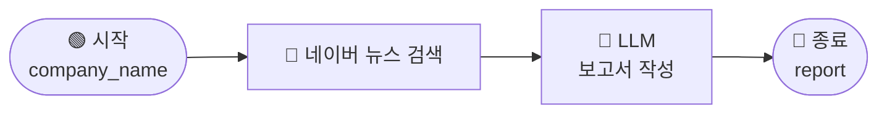
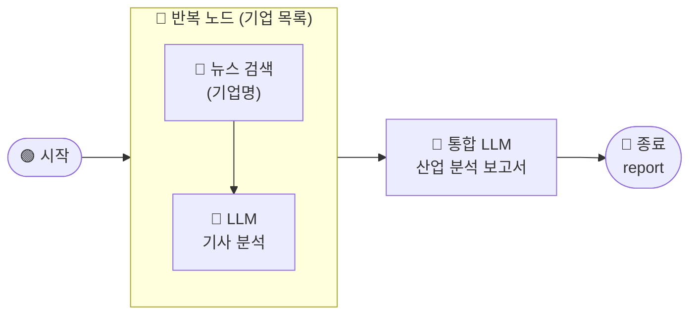
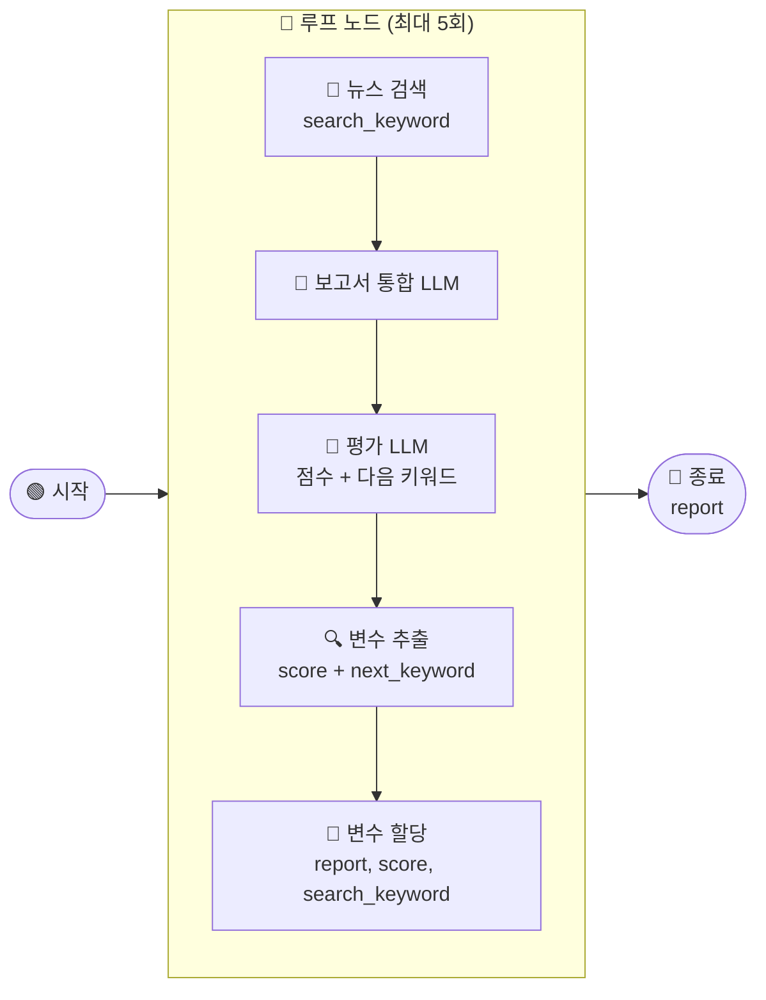

# 4. 뉴스 기사로 산업 분석 보고서 작성하기

## 선우 매니저의 고민

GS퓨처스 전략팀의 선우 매니저는 매주 데이터센터 관련 기업들의 동향을 파악해서 팀에 공유하는 역할을 맡고 있습니다.

매주 월요일 아침, 포털 뉴스를 열고 기업명을 하나씩 검색해서 주요 기사를 읽고, 팀 채팅방에 요약을 붙여넣는 것이 루틴이었습니다. 기업이 5개가 넘어가면 한 시간을 훌쩍 넘기기 일쑤였습니다. 기사 자체보다 찾고, 복사하고, 정리하는 시간이 더 긴 것 같다는 생각이 들었습니다.

어느 날 MISO 워크플로우를 알게 된 선우 매니저는 기업명을 입력하면 뉴스를 자동으로 검색하고, AI가 분석 보고서까지 써주는 워크플로우를 만들어보기로 했습니다. 처음에는 기업 하나에 기사 하나. 일단 되는지만 확인해보자는 마음이었습니다.

그런데 막상 써보니 문제가 보이기 시작했습니다. 기사 1건만으로는 특정 날의 보도 하나에 편향된 보고서가 나왔습니다. 기업을 5개로 늘렸더니 매주 워크플로우를 직접 수정해야 했습니다. 보고서가 나오긴 했지만, 품질이 매번 달랐습니다. 전략팀 팀장님으로부터 "어떤 주는 좋은데, 어떤 주는 내용이 너무 빈약하다"는 피드백을 받았습니다.

> _'기준이 있다면, 그 기준을 워크플로우가 직접 평가하게 하면 되지 않을까? 기준을 충족할 때까지 계속 검색하고 보완하면…'_

이번 장에서는 선우 매니저가 이 문제를 단계적으로 해결해나가는 과정을 따라갑니다. 기본 워크플로우를 만들고, 반복 노드로 확장하고, 루프 노드로 품질을 자동화하는 세 단계를 완성합니다.

< 완성된 레벨 3 워크플로우 전체 구조 이미지 >

***

### 레벨 구성

#### \[레벨 1] 1개 기사로 기업 분석 보고서 작성하기

기업명을 입력하면 네이버 뉴스를 검색하고, LLM이 분석 보고서를 작성하는 기본 워크플로우를 완성합니다. 네이버 뉴스 검색 도구 연결부터 LLM 노드 프롬프트 작성까지, 워크플로우의 핵심 흐름을 처음부터 만들어봅니다.

***

#### \[레벨 2] 반복 노드로 5개 기업 동향 분석하기

대화 변수로 기업 목록을 관리하고, 반복 노드로 5개 기업의 뉴스를 순서대로 수집·분석합니다. 각 기업의 분석 결과를 하나로 모아 데이터센터 산업 전체를 아우르는 통합 보고서를 작성합니다.

***

#### \[레벨 3] 루프 노드 + 점수 기반 자동화로 고품질 보고서 작성하기

팀장님의 평가 기준 4개를 워크플로우에 직접 반영합니다. 루프 노드가 보고서 품질을 자동으로 채점하고, 총점 90점 이상이 될 때까지 검색과 보완을 반복합니다. 변수 추출 노드와 변수 할당 노드를 활용해 점수와 검색 키워드를 매 반복마다 자동으로 갱신합니다.

