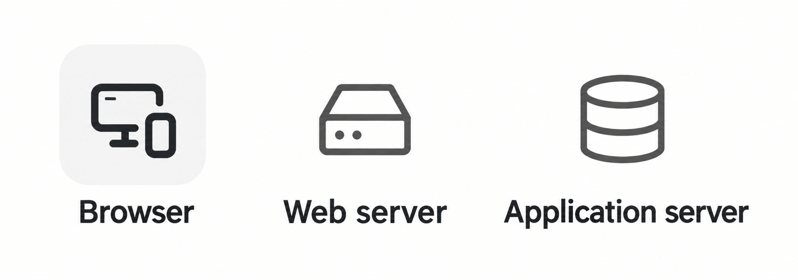

# \[레벨 0] 기상청 API 연동 준비하기

> **ℹ️ 이 페이지의 목표**&#x20;
>
> 이번 레벨 0의 목표는 **API 요청 노드 활용법**을 익히는 것입니다.\
> 동시에, MISO를 활용할 때 모르는 노드가 있더라도 어떻게 알아나갈 수 있는지 그 방식을 함께 살펴보겠습니다.

***

### 1단계. 필요한 데이터 파악하고 키워드 잡기

가장 먼저, 현재 내가 필요한 데이터가 무엇인지 생각해보고 검색 키워드를 설정해야 합니다.

이번 문제에서 필요한 것은 **다음 주 7일간의 날씨 예보**입니다. 조건을 구체화해보면 다음과 같습니다.

* 지역별로 구분되어야 합니다.
* 강수 확률과 날씨 정보가 포함되어야 합니다.

이를 바탕으로 검색 키워드를 잡아봅니다.

> **`지역별`** + **`날씨 예보`** + **`API`**

***

### 2단계. 활용할 API 찾아보기

키워드를 Google에 검색합니다. (마지막에 `API`를 꼭 붙여줍니다.)

<figure><figcaption></figcaption></figure>

검색 결과를 훑어보며 어떤 API를 사용할지 선택합니다.

이때 **공공데이터포털**(`data.go.kr`)이 2번째 검색 결과로 나왔습니다.

공공데이터포털이 활용 빈도가 높고 사용 방법도 잘 정리되어 있으므로 최우선으로 활용하는 편입니다.

<figure><figcaption></figcaption></figure>

> **⚠️ 사이트 회원가입은 필수입니다!**&#x20;
>
> 공공데이터포털은 앞으로도 자주 활용할 일이 많습니다. 미리 가입해두면 편리합니다.

로그인 후 상세 페이지를 확인하며 내가 활용하고자 하는 정보가 맞는지 확인해봅니다.

<figure><figcaption></figcaption></figure>

1. 향후 11일 예보를 조회할 수 있습니다. 금요일에 실행하면 다음 주 월\~일 기상정보를 가져올 수 있어 목적에 부합합니다.&#x20;
2. 세부 대상구역도 지역별로 나뉘어 있어 지역별 날씨 예보를 얻을 수 있습니다.

제가 원하는 모든 내용을 충족하네요. 좋습니다.

그럼 이제 활용 신청 버튼을 클릭해서 API 신청을 해보도록 하겠습니다.

***

### 3단계. 활용 신청하기

<figure><figcaption></figcaption></figure>

먼저 심의 여부를 확인하여, 신청 즉시 사용 가능한지 확인합니다.

> **ℹ️ 심의 여부를 꼭 확인해야 하는 이유**&#x20;
>
> 공공데이터포털은 자동승인인 경우가 많지만, 일부 기관은 신청자 확인 후 수동으로 승인하는 경우도 있습니다.\
> 승인 전에 API를 호출하면 오류 응답이 오게 되는데, 이 사실을 모르면 원인을 찾느라 시간을 낭비할 수 있으니, 신청 전 한 번씩 확인하시길 권장드립니다!

<figure><figcaption></figcaption></figure>

이후, 활용 목적을 간단히 입력하고, 상세기능정보에서 필요한 항목을 선택합니다. 다른 항목을 신청하지 않을 이유도 없으니 일단 전부 선택하는 편입니다.

이용약관에 동의한 뒤 **\[활용 신청]** 버튼을 클릭합니다.

<figure><figcaption></figcaption></figure>

신청이 완료되면 **마이페이지 → 개발계정**에서 해당 서비스가 활성화된 것을 확인할 수 있습니다.

<figure><figcaption></figcaption></figure>

클릭해서 들어가면 **일반 인증키**를 확인할 수 있습니다.

API 사용 승인이 이루어졌다는 것은, 해당 서버가 내 접근을 허용해줬다는 뜻입니다.&#x20;

인증키는 그 허가증에 해당하는 값으로, 추후에 활용해야 하니 이 페이지에서 확인할 수 있다는 점을 기억해둡니다.

***

### 4단계. API 활용 방법 파악하기

인증키 발급까지 완료되었다면, 이제 API를 실제로 어떻게 호출해야 하는지 파악해야 합니다.]

이때, 우리가 상세페이지에서 꼭 알아내야 할 정보는 다음의 **3가지**입니다.

<strong>1. 접속 주소 (URL)</strong>

API는 인터넷을 활용한 소통 방식입니다.\
날씨 데이터를 가진 상대방에게 찾아가서 "이 데이터가 필요합니다"라고 요청하면, 상대방이 데이터를 응답으로 돌려주는 구조입니다.

그렇기에, 제가 원하는 정보를 가지고 있는 올바른 상대방을 찾아가 질문해야 합니다.\
인터넷 상에서 올바른 상대란 결국 정확한 주소 (URL)을 찾아간다는 뜻이 됩니다.

<strong>2. 입력 변수 (Parameter)</strong>

올바른 상대방을 찾아가 정보를 요청했더라도, 상대방이 가진 정보는 매우 방대합니다.

현재 우리가 찾은 API만 하더라도, 조건 없이 요청하면 전국 모든 지역의 날씨 예보를 시간대별로 전부 돌려줍니다.

우리가 필요한 건 특정 지역의 특정 날짜 예보이므로, 요청 단계에서 어떤 데이터만 필요한지 필터 조건을 알려줘야 합니다.

그 조건을 정의하는 것이 바로 **파라미터(Parameter)** 입니다.

<strong>3. 결과 양식 (Output)</strong>

API 응답은 사람이 보기 편한 형태가 아닌, 컴퓨터 간 소통에 효율적인 구조로 전달됩니다.

.png>)

그렇기에 미리 각 필드가 무엇을 의미하는지 파악해두지 않으면 결과를 해석하기 어렵습니다.

뒷 단에서 데이터 해석을 원활히 진행할 수 있도록, _'어떤 필드가 어떤 값을 나타내는지'_ 를 API 문서에서 찾아두어야 합니다.

그렇다면, 이 정보를 어떻게 확인할 수 있을까요?

크게 2가지 방법이 있습니다.

**방법 1 | 가이드 문서가 따로 없는 경우**

공공데이터포털의 API 상세 페이지에서 바로 확인할 수 있습니다.&#x20;

<figure><figcaption></figcaption></figure>

URL, 입력변수, 결과 항목이 한 페이지에 정리되어 있습니다.

**방법 2 | 가이드 문서가 있는 경우**

참고 문서 탭에 활용 가이드(PDF)가 있는 경우도 있습니다.&#x20;

<figure><figcaption></figcaption></figure>

하지만 이 경우, 상세한 설명이 담겨 있지만 내용이 길고 직관적이지 않은 경우도 많습니다.

<figure><figcaption></figcaption></figure>

그치만, 이 경우에도 현재 제게 필요한 3가지 정보만 찾으면 됩니다.

1\) 접속 주소, 2) 입력 변수, 3) 결과 형식 정보 만을 유의하면서 문서를 읽어보도록 합니다.

***

### (+) 5단계. MISO AI와 함께 가이드 이해하기

4단계에서 API 가이드 중 우리에게 필요한 정보를 확인해봤으나, 공공데이터포털의 UI가 직관적으로 정리된 편이라 쉽게 알아볼 수 있었던 편입니다.

가이드 문서가 길거나 낯선 경우, 문서를 통째로 **MISO AI**에 첨부하고 질문하면 됩니다.

<figure><figcaption></figcaption></figure>

답변에서 어떤 URL과 파라미터를 설정해야 하는지 확인할 수 있습니다.

***

### 6단계. 워크플로우에 API 요청 노드 세팅하기

이제 실제로 워크플로우에 **API 요청 노드**를 추가하여 날씨 예보 정보를 가져오는 가장 간단한 방식을 구현해봅시다.

API 요청 노드에서 설정해야 하는 항목은 3가지입니다.

<figure><figcaption></figcaption></figure>

우선 첫번째 세팅값인 API를 찾아봅니다.

미소 AI의 답변에서 '중기육상예보조회'를 활용한다고 했으니, 가이드 문서의 해당 내용을 찾아보도록 하겠습니다.

<figure><figcaption></figcaption></figure>

Call Back URL에서 주소값을 찾았습니다.

이때, GET을 눌렀을 때 다양한 선택지가 나옵니다. 이는 `메소드` 라는 옵션인데,

API 가이드 문서 초반부를 보면 어떤 방식을 사용하라고 명시되어 있습니다.&#x20;

자세한 설명은 아래의 API 노드 매뉴얼을 참고해주세요

[#http](../../../manual/workflow/node-definition/http-request.md#http "mention")

이제 header, parameter 값도 가이드 문서를 읽어보면서 비슷한 방법으로 찾아볼 수 있습니다.

하지만 매번 가이드를 통해서 필요한 정보를 찾아보려니 생각보다 귀찮습니다.

간단하게, MISO AI에게 물어보고 세팅해야 하는 값들에 대해서 쉽게 알아보겠습니다.

### 7단계. (+) MISO AI와 함께 API 노드 세팅 진행하기

<figure><figcaption></figcaption></figure>

미소 AI는 기본적으로 미소 내의 노드에 대한 지식을 가지고 있습니다.

그래서 Claude나 GPT 에게 물어볼 때보다 더 미소 친화적인 대답을 해줍니다.

답변을 쭉 읽어보니 API와 Parameter 설정을 어떻게 해야 할지 알려줍니다.

순서대로 진행해봅니다.

#### 7-1단계. 환경변수로 인증키 안전하게 관리하기

파라미터 중 `serviceKey` 항목에 인증키를 입력해야 합니다.\
그런데 인증키는 개인 비밀번호와 같은 것이라, 노드 설정 화면에 그대로 붙여넣으면 워크플로우를 공유할 때 다른 사람에게 노출될 수 있습니다.

따라서 인증키는 반드시 **환경변수**로 등록해서 사용합니다.

<figure><figcaption></figcaption></figure>

1. 워크플로우 편집 화면 상단 오른쪽의 **\[앱 조건 설정]** 버튼을 클릭합니다.
2. **\[실행 조건 설정]** 탭으로 들어가 **\[+ 변수 추가]** 를 클릭합니다.
3.
4. **이름**: `authKey`, **값**: 마이페이지에서 확인한 일반 인증키를 붙여넣습니다.
5.

이제 파라미터에서 직접 인증키를 쓰는 대신 `/`를 입력하고 `env.authKey`를 선택하면 됩니다.

***

### 9단계. 파라미터 채워넣기

MISO AI가 안내한 내용을 참고해 파라미터를 설정합니다.\
기상청 중기예보 조회서비스의 파라미터는 다음과 같습니다.

| 파라미터         | 설명       | 설정값                   |
| ------------ | -------- | --------------------- |
| `serviceKey` | API 인증키  | `{{#env.authKey#}}`   |
| `dataType`   | 결과 형식    | `JSON`                |
| `regId`      | 지역 코드    | `11B00000` (서울·인천·경기) |
| `tmFc`       | 예보 발표 시간 | `202606190600` 형식     |
| `numOfRows`  | 결과 수     | 기본값 사용 (입력 생략 가능)     |
| `pageNo`     | 페이지 번호   | 기본값 사용 (입력 생략 가능)     |

> **ℹ️ numOfRows, pageNo는 꼭 입력해야 하나요?** 가이드 문서를 보면 두 항목 모두 \*\*기본값(Default)\*\*이 설정되어 있습니다.\
> 따로 입력하지 않아도 기본값이 자동 적용되므로, 결과 수를 제한할 필요가 없다면 생략해도 됩니다.

> **ℹ️ tmFc는 어떤 값을 넣어야 하나요?** 기상청 중기예보 API는 오전 6시(`0600`)와 오후 6시(`1800`)에 발표됩니다.\
> `tmFc` 형식은 `YYYYMMDD0600` 또는 `YYYYMMDD1800`으로 입력합니다.\
> 조회 가능한 기간은 오늘로부터 1일 이전까지입니다. 지나치게 오래된 날짜를 입력하면 오류가 발생합니다.\
> 지금 당장 테스트할 때는 오늘 날짜를 기준으로 입력합니다. 워크플로우를 완성한 후에는 코드 노드로 날짜를 자동 계산하도록 설정합니다.

***

### 10단계. 디버깅 — 오류가 생겼을 때 원인 찾기

파라미터 설정 후 테스트를 실행했을 때 오류가 발생할 수 있습니다.\
이럴 때 활용하는 것이 **상세 로그**입니다.

디버깅의 본질은 **앞에서부터 하나씩 확인하며 어디서 틀렸는지 찾는 것**입니다.

1. 테스트 결과 화면에서 오류가 표시된 노드를 클릭합니다.
2. **\[상세 로그]** 탭에서 해당 노드의 **입력값**과 **출력값**을 확인합니다.
3. 입력값이 예상과 다르거나, 출력에 에러 메시지가 있는지 찾습니다.

가장 흔한 원인 중 하나는 `tmFc`에 오래된 날짜를 입력한 경우입니다. 기상청 API는 조회 가능한 기간이 지난 날짜를 요청하면 `NO_DATA` 또는 `INVALID_REQUEST_PARAMETER_ERROR` 오류를 반환합니다.

> **⚠️ 자주 발생하는 오류 메시지**
>
> * `NO_DATA`
>   * 해당 조건으로 조회할 수 있는 데이터가 없는 경우입니다. `tmFc` 날짜를 오늘 날짜로 바꿔보세요.
> * `SERVICE_KEY_IS_NOT_REGISTERED_ERROR`
>   * 환경변수 `authKey` 값이 잘못되었거나 아직 승인되지 않은 경우입니다. 마이페이지에서 인증키 상태를 확인해주세요.

정상적으로 API 응답이 돌아오면 아래와 같이 날씨 데이터가 JSON 형태로 출력됩니다.

API 연동이 확인되었다면 준비가 완료된 것입니다.\
이제 **\[레벨 1] 단일 지역 날씨 리포트 만들기**로 넘어갑니다.
