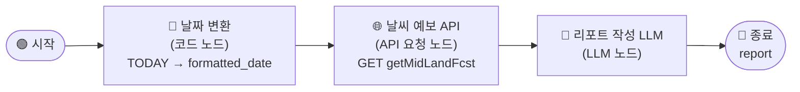

# \[레벨 1] 단일 지역 날씨 리포트 만들기

서울·인천·경기 권역의 중기예보를 받아 발주 참고 리포트를 생성해봅니다.\
이번 레벨에서는 **코드 노드**로 날짜를 가공하고, **API 요청 노드**로 기상청 데이터를 가져온 후, **LLM 노드**로 리포트를 작성하는 3단계 흐름을 완성합니다.



***

#### 환경변수 설정

**API 요청 노드**에서 기상청 API를 호출하려면 인증키(`serviceKey`)가 필요합니다. 이 키는 코드에 직접 입력하는 대신, MISO의 **환경변수**로 등록해서 사용합니다.

> **ℹ️ 환경변수란?** \
> API 키·비밀번호처럼 외부에 노출되어서는 안 되는 값을 워크플로우 내부에서 안전하게 관리하는 기능입니다.\
> `{{#env.변수명#}}` 형식으로 노드 어디에서든 참조할 수 있습니다.

기상청 API 키는 **공공데이터포털**에서 "기상청 중기예보 조회서비스"를 신청하면 발급받을 수 있습니다.

**STEP 0. 환경변수 등록**

1. 워크플로우 편집 화면 상단 오른쪽의 **\[환경변수]** 버튼을 클릭합니다.
2. **\[+ 추가]** 버튼을 클릭하고 아래와 같이 입력합니다.
   1. **이름**: `authKey`
   2. **값**: 발급받은 기상청 API 인증키를 붙여넣습니다.
3. **\[저장]** 버튼을 클릭합니다.

> **⚠️ 자주 발생하는 오류 메시지**
>
> * `SERVICE_KEY_IS_NOT_REGISTERED_ERROR`
>   * 환경변수 `authKey`에 입력한 API 키가 아직 활성화되지 않았거나 잘못된 경우입니다.
>   * 공공데이터포털에서 발급 상태를 확인해주세요. 신규 발급 키는 승인까지 최대 1일이 소요될 수 있습니다.

***

#### 코드 노드

**코드 노드**는 Python 또는 JavaScript 코드를 실행하는 노드입니다.

이 노드는 워크플로우 안에서 다른 노드가 처리하기 어려운 데이터 변환·계산·가공 작업을 직접 수행합니다.

즉, "이 값을 이 형식으로 바꿔줘"라는 로직을 코드로 정의하면, 노드가 실행될 때마다 자동으로 처리합니다.

예를 들어, `sys.datetime`이 반환하는 `"2026.06.19 09:00:00 KST"` 같은 날짜 문자열을 기상청 API가 요구하는 `"202606190600"` 형식으로 바꾸는 작업이 코드 노드에 딱 맞는 사용 사례입니다.

**이번 레벨 1 예제에서는 Python 코드로 날짜 형식을 변환하는 코드 노드를 사용해 보겠습니다.**

**STEP 1. 날짜 변환 코드 노드 추가**

1. **시작 노드** 오른쪽의 **\[+]** 버튼을 클릭합니다.
2. 노드 선택 패널에서 **\[코드]** 노드를 선택합니다.
3. 코드 노드 설정 패널에서 아래와 같이 설정합니다.
   1. **제목**: `날짜 변환`
   2. **언어**: `Python3` 선택
   3. **입력 변수** 항목에서 **\[+ 추가]** 를 클릭한 뒤 아래와 같이 입력합니다.
      * **변수명**: `TODAY`
      * **값**: `/`를 입력하고 변수 목록에서 `sys - datetime`을 선택합니다.
   4. **코드** 영역에 아래 코드를 입력합니다.

```python
def main(TODAY: str):
    date_only = TODAY.split(' ')[0].replace('.', '')
    formatted_date = f"{date_only}0600"
    return {"formatted_date": formatted_date}
```

4. 출력 변수에 `formatted_date`가 자동으로 등록되어 있는지 확인합니다.
5. **\[저장]** 버튼을 클릭합니다.

> **ℹ️ 날짜 형식이 왜 이렇게 변환되나요?** 기상청 중기예보 API의 `tmFc` 파라미터는 `YYYYMMDD0600` 또는 `YYYYMMDD1800` 형식을 요구합니다.\
> 오전 6시·오후 6시 두 차례 예보가 발표되기 때문입니다.\
> 이번 예제에서는 항상 당일 오전 6시 예보(`0600`)를 기준으로 조회합니다.

***

#### API 요청 노드

**API 요청 노드**는 외부 서버에 HTTP 요청을 보내고 응답을 받는 노드입니다.

이 노드는 기상청·네이버·카카오처럼 외부 서비스가 제공하는 API를 워크플로우 안에서 직접 호출할 때 사용합니다. GET·POST·PUT·DELETE 방식을 모두 지원하며, 헤더·파라미터·요청 본문을 자유롭게 설정할 수 있습니다.

**이번 레벨 1 예제에서는 기상청 중기육상예보 API를 GET 방식으로 호출해 보겠습니다.**

**STEP 2. 날씨 예보 API 요청 노드 추가**

1. **날짜 변환** 노드 오른쪽의 **\[+]** 버튼을 클릭합니다.
2. 노드 선택 패널에서 **\[API 요청]** 노드를 선택합니다.
3. 아래와 같이 설정합니다.
   1. **제목**: `날씨 예보 API`
   2. **메서드**: `GET`
   3. **URL**: `http://apis.data.go.kr/1360000/MidFcstInfoService/getMidLandFcst`
   4. **파라미터** 항목에 아래 내용을 입력합니다.

```
regId:11B00000
tmFc:{{#날짜 변환.formatted_date#}}
dataType:JSON
serviceKey:{{#env.authKey#}}
```

4. **\[저장]** 버튼을 클릭합니다.

> **ℹ️ 지역 코드(regId) 주요 목록** 기상청 중기육상예보는 권역별 코드로 지역을 구분합니다.

| 코드         | 지역       |
| ---------- | -------- |
| `11B00000` | 서울·인천·경기 |
| `11C00000` | 충청도      |
| `11F00000` | 전라도      |
| `11G00000` | 제주도      |
| `11H10000` | 경상북도     |
| `11H20000` | 경상남도     |

***

#### LLM 노드

**LLM 노드**는 GPT, Claude, Gemini 같은 실제 AI 모델을 활용하는 노드입니다.

이 노드는 워크플로우에서 정해진 입력값을 바탕으로 LLM 모델에 요청을 보내고, 모델이 생성한 응답을 다시 돌려받는 역할을 합니다.

즉, "이 API 응답을 분석해서 리포트를 써줘"라는 프롬프트와 실제 데이터를 함께 전달하면, 모델이 내용을 해석해 발주 참고 리포트를 작성합니다.

**이번 레벨 1 예제에서는 API 응답 JSON을 배경지식으로 넣고, 단일 지역 발주 리포트를 작성하는 LLM 노드를 설정합니다.**

**STEP 3. LLM 노드 추가 및 프롬프트 설정**

1. **날씨 예보 API** 노드 오른쪽의 **\[+]** 버튼을 클릭합니다.
2. **\[LLM]** 노드를 선택합니다.
3. 아래와 같이 설정합니다.
   1. **제목**: `리포트 작성 LLM`
   2. **모델**: 사용할 LLM 모델을 선택합니다.
   3. **배경지식(컨텍스트)** 항목에서 **\[+ 추가]** 를 클릭합니다.
      * `/`를 입력하고 `날씨 예보 API - body`를 선택합니다.
   4. **시스템 프롬프트** 영역에 아래 내용을 입력합니다.

```
당신은 GS25 점포운영팀의 주간 발주 참고 리포트를 작성하는 어시스턴트입니다.
기상청 중기예보 API 응답을 받아, 날씨와 강수 확률에 따른 품목별 발주 조정 내용을 작성합니다.

[날씨 필드 해석 규칙]
- wfNAm / wfNPm : N일 후 오전/오후 날씨
- rnStNAm / rnStNPm : N일 후 오전/오후 강수확률 (%)
- 날짜 대응 (금요일 실행 기준): 4=월, 5=화, 6=수, 7=목, 8=금, 9=토, 10=일

[리포트 형식]
📊 GS25 서울·인천·경기 권역 주간 발주 참고 리포트
🗓️ {다음주 월요일(MM/DD)} ~ {다음주 일요일(MM/DD)}

📋 날씨 요약: {한 문장}
☂️ 우산·우비 :
🧊 아이스음료·빙과류 :
🍺 야간 음료·맥주 :
☕ 따뜻한 음료·간편식 :
⚡ 핵심 액션: {한 줄}
```

5. **사용자 메시지** 영역에 아래 내용을 입력합니다.

```
오늘 날짜: {{#날짜 변환.formatted_date#}}

[API 응답]
{{#context#}}

위 예보를 바탕으로 발주 참고 리포트를 작성해주세요.
```

4. **\[저장]** 버튼을 클릭합니다.

***

**STEP 4. 종료 노드 설정**

1. **리포트 작성 LLM** 노드 오른쪽의 **\[+]** 버튼을 클릭합니다.
2. **\[종료]** 노드를 선택합니다.
3. **출력 변수** 항목에서 **\[+ 추가]** 를 클릭합니다.
   1. **변수명**: `report`
   2. **값**: `/`를 입력하고 `리포트 작성 LLM - text`를 선택합니다.
4. **\[저장]** 버튼을 클릭합니다.

***

#### 테스트하기

**\[테스트하기]** 버튼을 클릭합니다. 이 워크플로우는 입력 변수가 없으므로 바로 실행됩니다.

잠시 후 **종료 노드**의 출력 탭에서 아래와 같은 형식의 리포트가 생성되었는지 확인합니다.

```
📊 GS25 서울·인천·경기 권역 주간 발주 참고 리포트
🗓️ 06/22 ~ 06/28

📋 날씨 요약: 주 초반 맑고 더운 날씨, 주 후반 비 예보
☂️ 우산·우비 : 목~일 강수확률 60% 이상, 발주량 +20% 권장
🧊 아이스음료·빙과류 : 월~수 최고기온 33°C 예보, 발주량 +30% 권장
🍺 야간 음료·맥주 : 주 초반 야외 활동 증가 예상, 유지
☕ 따뜻한 음료·간편식 : 비 예보일 실내 소비 증가 고려
⚡ 핵심 액션: 목요일 이후 우산·우비 전면 배치, 아이스 음료 주초 선발주 권장
```

> **⚠️ 자주 발생하는 오류 메시지**
>
> * API 응답은 정상이지만 리포트 내용이 비어있는 경우
>   * LLM 노드의 **배경지식(컨텍스트)** 설정에서 `날씨 예보 API - body`가 제대로 선택되어 있는지 확인합니다.
> * LLM이 날짜를 잘못 계산하는 경우
>   * 사용자 메시지에 `오늘 날짜: {{#날짜 변환.formatted_date#}}` 가 포함되어 있는지 확인합니다.

다음 레벨 2 예제에서는 지역을 1개에서 3개로 확장하고, **반복 노드**로 API를 병렬 호출하는 방법을 알아보겠습니다.
