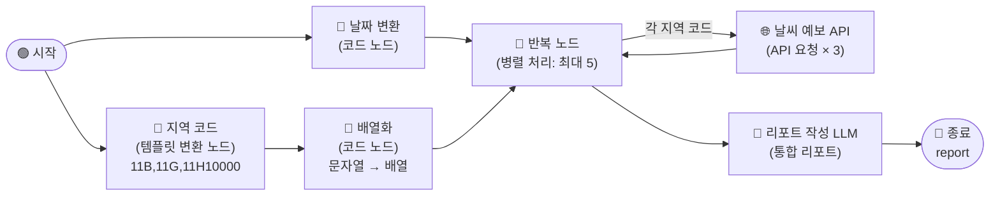

# \[레벨 2] 3개 권역 병렬 확장

서울 한 곳만 처리하는 리포트가 완성되었습니다. 이제 권역을 전국 3개로 늘려볼 차례겠죠.

단순히 API 노드를 3개 붙이면 될까요? 그렇게 할 수도 있지만, 권역이 5개·10개로 늘어날 때마다 노드를 일일이 추가해야 합니다. 관리하기 어렵고, 순서대로 실행되면 느리기도 합니다.

> **✅ 아이디어 구체화하기**
>
> 1. **지역 목록을 어디에 보관하면 좋을까요?**
>    * 코드 안에 직접 쓰면 나중에 수정하기 번거롭습니다. 한 곳에서만 바꾸면 되는 방법이 있을까요?
> 2. **여러 API 요청을 동시에 실행하려면 어떤 노드가 필요할까요?**
>    * 목록의 각 항목마다 같은 처리를 반복하는 노드를 떠올려보세요.
> 3. **반복 노드에 입력하려면 데이터 형식이 어떠해야 할까요?**
>    * "배열(array)"이라는 형식을 기억해두세요.

이번 레벨에서는 **템플릿 변환 노드**로 지역 코드를 관리하고, **코드 노드**로 배열 형식으로 변환한 뒤, **반복 노드**로 API를 병렬 호출합니다.



***

#### 템플릿 변환 노드

**템플릿 변환 노드**는 Jinja2 템플릿 문법을 활용해 텍스트를 생성하는 노드입니다.

이 노드는 고정된 텍스트나 변수를 조합해 다음 노드에 전달할 문자열을 만들 때 사용합니다.

즉, 코드를 작성하지 않고도 "이 변수를 이 형식으로 조합해줘"를 처리할 수 있습니다.

예를 들어, 지역 코드 목록 `11B00000,11G00000,11H10000`처럼 자주 수정하는 설정값을 코드 노드 안에 하드코딩하는 대신 템플릿 변환 노드에 두면, 나중에 권역을 추가하거나 변경할 때 이 노드 하나만 수정하면 됩니다.

**이번 레벨 2 예제에서는 템플릿 변환 노드에 3개 권역 코드를 쉼표로 구분해 저장해 보겠습니다.**

**STEP 1. 지역 코드 템플릿 변환 노드 추가**

레벨 1 워크플로우에서 **시작 노드** 아래쪽 빈 공간에 새 노드를 추가합니다.

1. 캔버스 빈 공간에서 마우스 오른쪽 버튼을 클릭하거나, 기존 노드의 **\[+]** 버튼을 클릭합니다.
2. **\[템플릿 변환]** 노드를 선택합니다.
3. 아래와 같이 설정합니다.
   1. **제목**: `지역 코드`
   2. **템플릿** 영역에 아래 내용을 입력합니다.

```
11B00000,11G00000,11H10000
```

4. **\[저장]** 버튼을 클릭합니다.
5. **시작 노드**에서 **지역 코드** 노드로 연결선을 이어줍니다.

> **ℹ️ 지역 코드 변경 방법** 권역을 추가하거나 변경할 때는 이 템플릿 변환 노드의 내용만 수정하면 됩니다.\
> 쉼표(`,`)로 구분해 원하는 코드를 나열하세요. 순서는 리포트에 지역이 나타나는 순서가 됩니다.

***

#### 반복 노드

**반복 노드**는 배열(목록) 안의 각 항목에 동일한 처리를 반복 실행하는 노드입니다.

이 노드는 여러 건의 데이터를 하나씩 처리해야 할 때 사용합니다. 반복 노드 안에 처리 흐름(내부 노드)을 설계하면, 배열의 각 항목이 그 흐름을 한 번씩 통과합니다.

즉, 지역 코드 3개가 담긴 배열을 반복 노드에 연결하면, 각 지역 코드로 API를 3번 자동 호출합니다.

다만, 반복 노드는 **배열(array)** 형식의 입력만 받습니다. 템플릿 변환 노드가 출력하는 쉼표 구분 문자열은 아직 배열이 아니므로, 코드 노드로 변환하는 과정이 필요합니다.

> **ℹ️ 병렬 처리란?**&#x20;
>
> 반복 노드는 기본적으로 순서대로 실행되지만, **병렬 처리** 옵션을 활성화하면 여러 항목을 동시에 실행합니다.\
> 지역이 3개라면 API를 동시에 3번 호출해 처리 시간을 크게 줄일 수 있습니다.

**이번 레벨 2 예제에서는 배열화 코드 노드와 반복 노드를 차례로 추가해 3개 권역 API를 병렬로 호출해 보겠습니다.**

**STEP 2. 배열화 코드 노드 추가**

1. **지역 코드** 노드 오른쪽의 **\[+]** 버튼을 클릭합니다.
2. **\[코드]** 노드를 선택합니다.
3. 아래와 같이 설정합니다.
   1. **제목**: `배열화`
   2. **언어**: `Python3`
   3. **입력 변수** 항목에서 **\[+ 추가]** 를 클릭합니다.
      * **변수명**: `regions`
      * **값**: `/`를 입력하고 `지역 코드 - output`을 선택합니다.
   4. **코드** 영역에 아래 코드를 입력합니다.

```python
def main(regions):
    keyword_array = [item.strip() for item in regions.split(',')]
    return {'result': keyword_array}
```

4. 출력 변수에 `result` (`array[string]`)가 등록되어 있는지 확인합니다.
5. **\[저장]** 버튼을 클릭합니다.

***

**STEP 3. 반복 노드 추가 및 설정**

1. **배열화** 노드 오른쪽의 **\[+]** 버튼을 클릭합니다.
2. **\[반복]** 노드를 선택합니다.
3. 아래와 같이 설정합니다.
   1. **반복 입력**: `/`를 입력하고 `배열화 - result`를 선택합니다.
   2. **병렬 처리**: 활성화합니다.
   3. **최대 병렬 수**: `5`로 설정합니다.
4. **\[저장]** 버튼을 클릭합니다.
5. **날짜 변환** 노드에서 **반복** 노드로도 연결선을 이어줍니다.

> **⚠️ 자주 발생하는 오류 메시지**
>
> * `iterator input must be an array`
>   * 반복 노드의 입력 변수로 배열이 아닌 문자열이 연결된 경우입니다.
>   * **배열화** 코드 노드의 출력 변수 타입이 `array[string]`으로 설정되어 있는지 확인합니다.

***

**STEP 4. 반복 노드 내부에 API 요청 노드 추가**

반복 노드 안에는 각 항목에 실행할 처리 흐름을 설계합니다.

1. **반복 노드** 내부의 반복 시작 노드 오른쪽 **\[+]** 버튼을 클릭합니다.
2. **\[API 요청]** 노드를 선택합니다.
3. 아래와 같이 설정합니다.
   1. **제목**: `날씨 예보 API [반복]`
   2. **메서드**: `GET`
   3. **URL**: `http://apis.data.go.kr/1360000/MidFcstInfoService/getMidLandFcst`
   4. **파라미터** 항목에 아래 내용을 입력합니다.

```
regId:{{#반복.item#}}
tmFc:{{#날짜 변환.formatted_date#}}
dataType:JSON
serviceKey:{{#env.authKey#}}
```

4. **\[저장]** 버튼을 클릭합니다.

> **ℹ️ `{{#반복.item#}}` 이란?**&#x20;
>
> 반복 노드가 실행될 때 현재 처리 중인 배열 항목을 참조하는 변수입니다.\
> 첫 번째 반복에서는 `11B00000`, 두 번째에서는 `11G00000`처럼 배열 항목을 차례로 대입합니다.

***

**STEP 5. LLM 노드 수정 — 다지역 통합 리포트**

레벨 1의 LLM 노드는 단일 지역 API 응답을 처리했습니다. 이제 반복 노드가 수집한 3개 지역 응답 배열을 한꺼번에 받아 통합 리포트를 작성하도록 수정합니다.

1. **리포트 작성 LLM** 노드를 클릭합니다.
2. **배경지식(컨텍스트)** 항목에서 기존 `날씨 예보 API - body` 항목을 **삭제**합니다.
3. **\[+ 추가]** 를 클릭하고 `반복 - output`을 선택합니다.
4. **시스템 프롬프트**를 아래 내용으로 교체합니다.

```
당신은 GS25 점포운영팀의 주간 발주 참고 리포트를 작성하는 어시스턴트입니다.
여러 지역의 기상청 중기예보 API 응답 배열을 받아, 하나의 통합 리포트를 작성합니다.

[regId → 지역명 대응표]
11B00000 = 서울·인천·경기
11C00000 = 충청도
11F00000 = 전라도
11G00000 = 제주도
11H10000 = 경상북도
11H20000 = 경상남도

[날씨 필드 해석 규칙]
- wfNAm / wfNPm : N일 후 오전/오후 날씨
- rnStNAm / rnStNPm : N일 후 오전/오후 강수확률 (%)
- 날짜 대응 (금요일 실행 기준): 4=월, 5=화, 6=수, 7=목, 8=금, 9=토, 10=일

[리포트 형식 — 반드시 이 구조로 출력]

📊 GS25 전국 권역 주간 발주 참고 리포트
🗓️ {다음주 월요일(MM/DD)} ~ {다음주 일요일(MM/DD)}

배열로 전달된 각 지역 데이터를 순서대로 처리하여 아래 형식의 섹션을 반복 작성합니다.

━━━━━━━━━━━━━━━━━━━━━━━━
📍 {지역명} 권역
📋 날씨 요약: {한 문장}
☂️ 우산·우비 :
🧊 아이스음료·빙과류 :
🍺 야간 음료·맥주 :
☕ 따뜻한 음료·간편식 :
⚡ 핵심 액션: {한 줄}

(지역 수만큼 위 섹션 반복)
```

5. **사용자 메시지**를 아래 내용으로 교체합니다.

```
오늘 날짜: {{#날짜 변환.formatted_date#}}

[전체 지역 API 응답 배열]
{{#context#}}

배열 안의 각 항목이 지역 하나의 API 응답입니다.
모든 지역의 섹션을 포함한 통합 리포트를 작성해주세요.
```

6. **\[저장]** 버튼을 클릭합니다.

***

#### 테스트하기

**\[테스트하기]** 버튼을 클릭합니다.

반복 노드가 3개 API를 병렬로 호출하므로, 단일 지역보다 처리 시간이 크게 단축됩니다. 종료 노드의 출력 탭에서 3개 권역의 발주 리포트가 모두 포함된 결과를 확인합니다.

```
📊 GS25 전국 권역 주간 발주 참고 리포트
🗓️ 06/22 ~ 06/28

━━━━━━━━━━━━━━━━━━━━━━━━
📍 서울·인천·경기 권역
📋 날씨 요약: 주 초반 맑고 더운 날씨, 주 후반 비 예보
☂️ 우산·우비 : 목~일 강수확률 60% 이상, 발주량 +20% 권장
🧊 아이스음료·빙과류 : 월~수 폭염, 발주량 +30% 권장
🍺 야간 음료·맥주 : 주 초반 야간 활동 예상, 유지
☕ 따뜻한 음료·간편식 : 비 예보일 실내 소비 고려
⚡ 핵심 액션: 목요일 이후 우산·우비 전면 배치 권장

━━━━━━━━━━━━━━━━━━━━━━━━
📍 제주도 권역
📋 날씨 요약: 주 전체 흐리고 비 예보
...

━━━━━━━━━━━━━━━━━━━━━━━━
📍 경상북도 권역
...
```

> **⚠️ 자주 발생하는 오류 메시지**
>
> * 반복 노드 실행 후 LLM 출력이 일부 지역만 포함된 경우
>   * 반복 노드의 **출력 변수** 설정을 확인합니다. `날씨 예보 API [반복] - body`가 반복 노드의 출력으로 선택되어 있어야 합니다.
> * LLM 노드에서 지역명이 코드(`11B00000`)로 표시되는 경우
>   * 시스템 프롬프트의 `[regId → 지역명 대응표]` 섹션이 올바르게 입력되었는지 확인합니다.

이번 장에서는 날씨 API 연동, 코드 노드를 이용한 데이터 가공, 반복 노드를 이용한 병렬 처리까지 단계별로 완성했습니다.\
권역을 추가하고 싶다면 **지역 코드** 템플릿 변환 노드의 내용에 코드를 추가하는 것만으로 손쉽게 확장할 수 있습니다.
