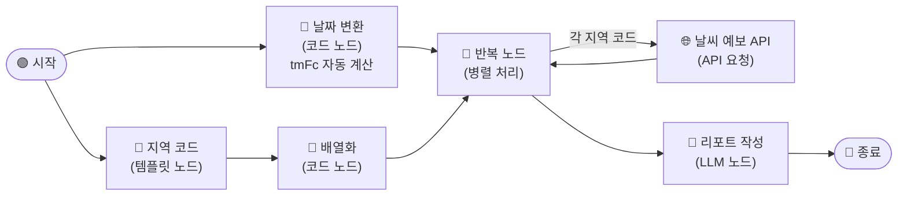

# \[레벨 3] 매주 정해진 시간에 자동으로 실행하기

레벨 1의 워크플로우는 완성되었지만, 매주 쓰려면 두 가지를 직접 해야 합니다. `tmFc` 날짜를 수동으로 수정하는 것, 그리고 실행 버튼을 직접 클릭하는 것. 레벨 2에서는 이 두 가지를 자동화합니다.

먼저 `tmFc`를 자동으로 계산하는 **날짜 변환 코드 노드**를 추가합니다. 그런 다음 MISO **앱 설정**에서 매주 금요일에 자동으로 실행되도록 스케줄을 설정합니다.



레벨 1 워크플로우에서 이어서 진행합니다. 새로운 노드를 하나 추가하고, 기존 API 요청 노드의 파라미터 하나를 수정하면 됩니다.

***

#### 코드 노드 — 날짜 변환

기상청 API의 `tmFc` 파라미터는 `YYYYMMDD0600` 형식의 날짜 문자열을 요구합니다. MISO 시스템 변수 `sys.datetime`은 현재 날짜와 시간을 `"2026.06.20 09:00:00 KST"` 형식으로 제공합니다. 이 두 형식이 달라서, 중간에 형식을 변환해주는 코드 노드가 필요합니다.

**코드 노드**가 `sys.datetime`을 받아 `202606200600` 형태로 변환하면, 이후 API 요청 노드가 이 값을 그대로 사용합니다. 실행되는 날짜에 따라 `tmFc`가 자동으로 달라지므로, 더 이상 날짜를 손으로 입력할 필요가 없습니다.

이번 레벨 2 예제에서는 날짜 변환 코드 노드를 추가하고, 반복 노드에 연결하겠습니다.

**STEP 1. 날짜 변환 코드 노드 추가**

레벨 1 워크플로우 캔버스에서 **시작 노드** 아래쪽 빈 공간에 새 노드를 추가합니다.

1. 캔버스 빈 공간에서 마우스 오른쪽 버튼을 클릭하거나, **시작 노드**의 **\[+]** 버튼을 클릭합니다.
2. **\[코드]** 노드를 선택합니다.
3. 아래와 같이 설정합니다.
   1. **제목**: `날짜 변환`
   2. **언어**: `Python3` 선택
   3. **입력 변수** 항목에서 **\[+ 추가]** 를 클릭합니다.
      * **변수명**: `TODAY`
      * **값**: `/`를 입력하고 `sys - datetime`을 선택합니다.
   4. **코드** 영역에 아래 코드를 입력합니다.

```python
def main(TODAY: str):
    date_only = TODAY.split(' ')[0].replace('.', '')
    formatted_date = f"{date_only}0600"
    return {"formatted_date": formatted_date}
```

4. 출력 변수에 `formatted_date`가 자동으로 등록되어 있는지 확인합니다.
5. **\[저장]** 버튼을 클릭합니다.
6. **날짜 변환** 노드에서 **반복** 노드로 연결선을 이어줍니다.

> **ℹ️ 날짜 형식이 왜 이렇게 변환되나요?** `sys.datetime`은 `"2026.06.20 09:00:00 KST"` 형태로 값을 제공합니다.\
> 코드는 먼저 공백으로 날짜 부분만 추출(`2026.06.20`)한 뒤, 점(`.`)을 제거해 `20260620`으로 만들고, 기상청 예보 발표 시각인 `0600`을 붙입니다.\
> 기상청 중기예보는 매일 오전 6시와 오후 6시에 발표됩니다. 이번 예제에서는 항상 당일 오전 6시 예보(`0600`)를 기준으로 조회합니다.

날짜 변환 코드 노드가 `formatted_date`를 출력할 준비가 되었습니다. 이제 반복 노드 내부의 API 요청 노드에서 하드코딩된 날짜를 이 변수로 교체합니다.

***

#### API 요청 노드 수정

레벨 1에서는 API 요청 노드의 `tmFc` 파라미터에 날짜를 직접 입력해두었습니다. 이제 날짜 변환 코드 노드가 매 실행 시마다 현재 날짜를 계산해주므로, 그 값을 참조하도록 교체합니다.

**STEP 2. 반복 노드 내부 API 요청 노드의 tmFc 수정**

1. **반복** 노드 내부의 **날씨 예보 API** 노드를 클릭합니다.
2. **파라미터** 항목에서 `tmFc` 값을 아래와 같이 수정합니다.

```
regId:{{#반복.item#}}
tmFc:{{#날짜 변환.formatted_date#}}
dataType:JSON
serviceKey:{{#env.authKey#}}
```

3. **\[저장]** 버튼을 클릭합니다.

> **ℹ️ 반복 노드 내부에서 외부 노드 변수를 참조할 수 있나요?** 가능합니다. 반복 노드 내부의 노드는 외부 노드(예: 날짜 변환)의 출력 변수를 참조할 수 있습니다.\
> `/`를 입력하면 외부 노드의 변수 목록이 함께 표시됩니다. `날짜 변환 - formatted_date`를 선택하면 됩니다.

이제 워크플로우가 실행될 때마다 당일 날짜로 `tmFc`가 자동 계산됩니다. 마지막으로, 매주 금요일 오전에 이 워크플로우가 알아서 실행되도록 예약 설정을 추가합니다.

***

#### 앱 설정 — 자동 실행

MISO는 워크플로우를 정해진 일정에 자동으로 실행하는 **자동 실행** 기능을 제공합니다. 앱 설정에서 주기와 실행 시각을 지정하면, 지정한 시각마다 워크플로우가 자동으로 시작됩니다.

지금까지 만든 워크플로우는 사람이 실행 버튼을 누르지 않아도 되도록 설계되었습니다. `tmFc`는 자동 계산되고, 입력 변수도 없습니다. 자동 실행 설정만 하면 매주 금요일 아침 리포트가 자동으로 생성됩니다.

이번 레벨 2 예제에서는 매주 금요일 오전 7시에 자동 실행되도록 설정합니다.

**STEP 3. 자동 실행 설정**

1. 워크플로우 편집 화면 상단의 **\[앱 설정]** 버튼을 클릭합니다.
2. 좌측 메뉴에서 **\[설정]** → **\[자동 실행]** 을 선택합니다.
3. **자동 실행 활성화** 토글을 켭니다.
4. 아래와 같이 설정합니다.
   1. **반복 주기**: `매주`
   2. **요일**: `금요일`
   3. **실행 시각**: `07:00`
5. **\[저장]** 버튼을 클릭합니다.

> **ℹ️ 자동 실행 결과는 어디서 확인하나요?** 자동 실행된 워크플로우의 결과는 **\[실행 로그]** 탭에서 확인할 수 있습니다.\
> 각 실행 시각과 출력 결과가 기록되므로, 리포트가 정상 생성되었는지 언제든 확인할 수 있습니다.

***

#### 테스트하기

자동 실행 설정 전에 워크플로우가 정상 동작하는지 먼저 테스트합니다.

**\[테스트하기]** 버튼을 클릭합니다. `tmFc`가 오늘 날짜로 자동 계산되어 API가 호출되는지 확인합니다.

종료 노드의 출력 탭에서 3개 권역 리포트가 생성되었는지 확인합니다. 날짜 변환 노드를 클릭하고 **\[상세 로그]** 탭을 열면 `formatted_date` 출력값이 오늘 날짜로 설정되었는지 확인할 수 있습니다.

> **⚠️ tmFc 날짜 관련 오류**
>
> * `NO_DATA`
>   * `formatted_date` 값이 오늘 날짜인지 확인합니다. 오전 6시 이전에 실행하면 당일 예보가 아직 발표되지 않아 데이터가 없을 수 있습니다.
> * `INVALID_REQUEST_PARAMETER_ERROR`
>   * `formatted_date` 형식이 `YYYYMMDD0600`인지 확인합니다. 날짜 변환 코드 노드의 상세 로그에서 출력값을 직접 확인해보세요.

이번 장에서는 반복 노드로 여러 지역 API를 효율적으로 호출하고, 날짜 자동 계산과 예약 실행으로 완전 자동화된 발주 리포트 시스템을 완성했습니다.\
권역을 추가하려면 **지역 코드** 템플릿 노드에 코드를 하나 더 추가하기만 하면 됩니다. 실행 주기를 바꾸려면 앱 설정의 자동 실행 일정만 수정하면 됩니다.
