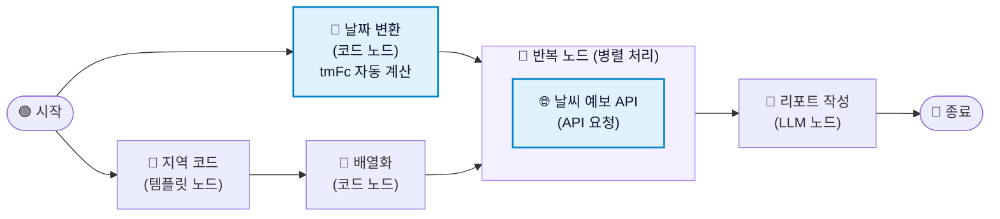

# \[레벨 3] 매주 정해진 시간에 자동으로 실행하기

현재까지의 워크플로우는 장매니저가 매주 금요일마다 워크플로우를 켜서 tmFC 날짜를 수정하고, 테스트하기를 눌러야 리포트가 생성되는 귀찮음이 있었습니다.

이에 금요일마다 날짜를 알아서 변동해주고, 오전9시에 리포트를 자동으로 생성해주도록 워크플로우를 고도화해봅시다.



***

### \[1] 코드 노드 — 날짜 변환

그날의 날짜를 변수로써 자동으로 입력하고자 한다면, 파이썬 코드나, MISO의 시스템 변수를 활용해야 합니다.

하지만 주로 이 기본적인 날짜 변수의 형태는 획일화되어 있지 않습니다. 예를 들어 MISO는 날짜 정보를 `"2026.06.08 09:00:00 KST"` 형식으로 제공합니다. \
고로, 이 변수를 `tmFc` 형식에 맞춰주어 자동으로 API를 호출하기 위해 중간에 형식을 변환해주는 코드 노드를 설정해 봅시다.

이번에도 코드는 직접 짜지 않고 미소 AI를 활용해서 코드를 받아와 봅니다. 앞에서와 같이 현재 원하는 작업과, 사용하고자 하는 노드, 목표를 명시하여 작업을 요청해봅니다.

<figure><figcaption></figcaption></figure>

아, 파이썬 문법을 활용해서 시스템 변수 없이도 현재 시간을 자동으로 계산한 뒤, tmFc 형식에 맞는 결과물을 반환하는 방법을 알려주네요. 이것도 좋은 것 같습니다.


물론, 코드를 몰라도 괜찮습니다. 목표를 명확히 지정해서 요청했다면 알맞은 코드를 짜줬을 것이고, 혹여나 테스트단계에서 에러가 난다면 레벨1 - 번외 섹션에서 배웠듯이 디버깅을 통해 고쳐보면 됩니다.


이제 이 내용을 기반으로 워크플로우에 코드 노드를 추가해볼까요?

1. 캔버스 빈 공간에서 마우스 오른쪽 버튼을 클릭하여 **\[코드]** 노드를 선택합니다.
2. **\[코드]** 노드를 **\[시작]** 노드와 **\[반복]** 노드 사이에 넣고 시작과 끝을 연결해줍니다.
3. 아래와 같이 설정합니다.
   1. **제목**: `날짜 변경`
   2. **입력 변수** 항목에서 **\[+ 추가]** 를 클릭합니다.
      * **변수명**: `TODAY`
      * **값**: `/`를 입력하고 `sys - datetime`을 선택합니다.
   3. **코드** 영역에 아래 코드를 입력합니다.

```python
from datetime import datetime, timedelta

def main():
    # 서버 시간을 기준으로 한국 표준시(KST, UTC+9) 계산
    now = datetime.utcnow() + timedelta(hours=9)
    
    # 실행 시점(금요일 09:00) 기준, 가장 최신 발표 시각인 06:00으로 설정
    # 형식: YYYYMMDD0600
    tm_fc = now.strftime('%Y%m%d') + "0600"
    
    return {
        "tmFc": tm_fc
    }
```

4. 출력 변수에 "tmFc"를 변수명으로 설정해주고, type은 `String`으로 설정해줍니다.

<figure><figcaption></figcaption></figure>


사진의 오른쪽 코드 내부 설정처럼 꼭 코드의 return에 나와있는 변수명과 출력 변수에 적는 변수명이 일치해야 합니다!

그렇지 않으면 출력 값이 제대로 할당되지 않는 위험이 있습니다.



***

### \[2] API 요청 노드 수정

이제 날짜 정보는 당일 날짜가 tmFc 형식에 맞춰서 전달될 수 있게 되었습니다. API 요청 노드에서 해당 값을 받을 수 있게 수정해보겠습니다.


1. **반복** 노드 내부의 **날씨 예보 API** 노드를 클릭합니다.
2. **파라미터** 항목에서 `tmFc` 값을 아래와 같이 수정합니다.

<figure><figcaption></figcaption></figure>

이제 워크플로우가 실행될 때마다 당일 날짜로 `tmFc`가 자동 계산됩니다. 마지막으로, 매주 금요일 오전 09시에 이 워크플로우가 알아서 실행되도록 예약 설정을 추가합니다.

***

### \[3] 앱 설정 — 자동 실행

MISO는 워크플로우를 정해진 일정에 자동으로 실행하는 **자동 실행** 기능을 제공합니다. 앱 설정에서 주기와 실행 시각을 지정하면, 지정한 시각마다 워크플로우가 자동으로 시작됩니다.

지금까지 만든 워크플로우는 사람이 실행 버튼을 누르지 않아도 되도록 설계되었습니다. `tmFc`는 자동 계산되고, 입력 변수도 없습니다.&#x20;

자동 실행 설정만 마무리하여 매주 금요일 아침 리포트가 자동으로 생성되도록 해보겠습니다.


1. 워크플로우 편집 화면 상단의 **\[앱 설정]** 버튼을 클릭합니다.
2. 앱 설정 화면에서 하단의 자동 실행을 찾고, 활성화 토글을 켜줍니다.
3. **\[설정]**&#xC744; 누르고 아래와 같이 설정합니다.
   1. **반복 주기**: `매주`
   2. **요일**: `금요일`
   3. **실행 시각**: `09:00`
4. **\[저장]** 버튼을 클릭합니다.

<figure><figcaption></figcaption></figure>

> **ℹ️ 자동 실행 결과는 어디서 확인하나요?**&#x20;
>
> 자동 실행된 워크플로우의 결과는 **\[사용 현황] -** **\[실행 로그]** 탭에서 확인할 수 있습니다.\
> 각 실행 시각과 출력 결과가 기록되므로, 리포트가 정상 생성되었는지 언제든 확인할 수 있습니다.

***

#### 테스트하기

자동 실행 설정 전에 워크플로우가 정상 동작하는지 먼저 테스트합니다.

**\[테스트하기]** 버튼을 클릭하고, `tmFc`가 오늘 날짜로 자동 계산되어 API가 호출되는지 확인합니다.

종료 노드의 출력 탭에서 3개 권역 리포트가 생성되었는지 확인합니다.&#x20;

날짜 변환 노드를 클릭하고 **\[상세 로그]** 탭을 열면 `tmFc` 출력값이 오늘 날짜로 설정되었는지 확인할 수 있습니다.

<figure><figcaption><p>제가 목요일 밤에 돌려서 날짜는 조금 다르지만, 결과는 제대로 나오는 것을 확인할 수 있습니다!</p></figcaption></figure>

***

이번 장에서는 반복 노드로 여러 지역 API를 효율적으로 호출하고, 날짜 자동 계산과 예약 실행으로 완전 자동화된 발주 리포트 시스템을 완성해보았습니다!

* 권역을 추가하려면 **지역 코드** 템플릿 노드에 코드를 하나 더 추가하기만 하면 됩니다.&#x20;
* 실행 주기를 바꾸려면 앱 설정의 자동 실행 일정만 수정하면 됩니다.

고생하셨습니다\~!
