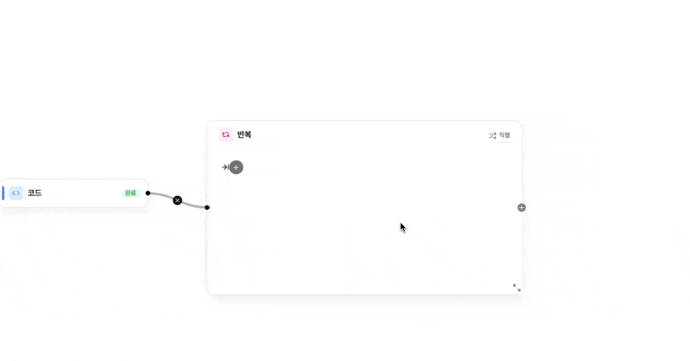
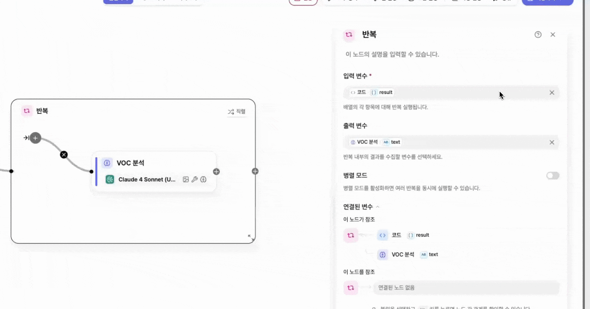

# \[레벨 3] 대량의 데이터 처리하기

\[레벨 2] 예제에서는 40행의 샘플 데이터를 사용했지만, 실제 설문 데이터는 수백 행 이상이 되는 경우가 많습니다.

이번 예제에서는 설문 데이터의 양이 많을 때 더 효율적이고 빠르게 분석하는 방법에 대해 알아보겠습니다.

***

## 생각해보기

같은 속도로 여러 개의 데이터를 처리하려면 어떻게 해야 할까요? 그 전에 **직렬 처리**와 **병렬 처리**의 개념에 대해 먼저 알아보겠습니다.

### 직렬 처리와 병렬 처리

<figure><figcaption></figcaption></figure>

**직렬 처리(Sequential Processing)는 작업을 순서대로 하나씩 처리하는 방식**입니다. 워크플로우에서 앞 단계의 결과가 다음 단계에 반드시 필요할 때 사용합니다.

예를 들어 VOC 분석 워크플로우에서는 **Google Sheet 노드로 설문 데이터를 먼저 가져와야 LLM이 분석을 할 수 있습니다.** LLM 노드는 입력 데이터가 없으면 실행될 수 없기 때문에, **Google Sheet → LLM 분석**처럼 앞 단계가 끝난 뒤 다음 단계가 실행되는 **직렬 구조**로 구성해야 합니다.

반면 **병렬 처리(Parallel Processing)는 서로 영향을 주지 않는 작업을 동시에 처리하는 방식**입니다.

예를 들어 설문 데이터가 100행 있다고 가정해 보겠습니다. 각 행의 VOC 분석은 **다른 행의 결과에 영향을 주지 않기 때문에 서로 독립적인 작업**입니다. 이 경우 한 행씩 순서대로 분석할 수도 있지만, 여러 행을 나누어 **동시에 분석하도록 병렬 처리**를 하면 전체 처리 시간을 크게 줄일 수 있습니다.

예를 들어 100개의 데이터를 10개씩 나누어 동시에 처리하면, 이론적으로 전체 분석 시간은 **약 1/10 수준으로 줄어들 수 있습니다.** 이렇게 독립적인 데이터를 동시에 처리할 때 병렬 처리가 효과적입니다.

<figure><figcaption></figcaption></figure>

### 좀 더 생각해보기

병렬 처리를 활용하면 **여러 데이터를 동시에 처리할 수 있다**는 것을 살펴보았습니다. 그렇다면 현재 우리가 다루는 **설문 데이터는 단순한 병렬 배치만으로 충분히 해결할 수 있는 수준일까요?**

문제는 **설문 데이터의 행 수가 고정되어 있지 않다는 점**입니다. 데이터는 계속 누적될 수 있고, 설문지마다 행 수도 달라질 수 있습니다.

만약 병렬 처리를 **고정된 개수 기준으로 구성한다면**, 최대 행 수가 정해져 있을 때만 의미가 있습니다. 예를 들어 워크플로우를 **80개 행까지 처리하도록 설계했다면**, 80개를 넘는 데이터가 들어왔을 때는 추가 수정이 필요합니다. 반대로 어떤 설문지는 **20행, 어떤 설문지는 150행처럼 매번 규모가 다를 수 있기 때문에**, 설문지마다 워크플로우를 다시 수정해야 하는 비효율이 생깁니다.

즉, **행 수가 계속 달라지는 실제 업무 환경에서는**, 고정된 병렬 처리 구조보다 **데이터 개수에 따라 유연하게 반복 실행할 수 있는 방식**이 더 적합합니다.

미소에는 이러한 문제를 해결할 수 있는 **반복(Iteration) 노드**가 있습니다. 이제 예제를 통해 어떻게 동작하는지 살펴보겠습니다.

***

## Goole Sheet 도구 노드

### STEP 1. range 변경하기

* values.get 노드의 range를 전체 범위를 져올 수 있도록 아래와 같이 수정합니다.
  * range : data!A:AH

<figure><figcaption></figcaption></figure>

***

## 반복(iteration) 노드

### 반복 노드 이해하기

반복 노드는 워크플로우 안에 작은 워크플로우를 구성하여 동일한 작업을 여러 번 반복 실행할 수 있게 해주는 노드입니다.

반복 노드는 입력 변수로 **array(string)** 형식만 받을 수 있습니다. 이는 반복 노드가 데이터를 **하나씩 꺼내어 처리하는 방식**으로 동작하기 때문입니다.

이를 이해하려면 먼저 **string**과 **array(string)**&#xC758; 차이를 알아야 합니다.


#### string? array(string)?

먼저 **string**은 하나의 문자열 데이터를 의미합니다.\
예를 들어 하나의 과일 이름도 string 데이터가 될 수 있습니다.

* “사과”

이처럼 하나의 단어 또는 문장이 바로 **string**입니다.

반면 **array(string)**&#xC740; 이러한 string들이 여러 개 모여 있는 구조입니다.\
쉽게 말해 문자열들을 담아놓은 바구니라고 생각하면 이해하기 쉽습니다.

예를 들어 과일 이름이 여러 개 있다고 가정해 보겠습니다.

* “사과”
* “바나나”
* “포도”

이 값들이 하나의 배열로 묶이면 다음과 같은 **array(string)** 형태가 됩니다.

* \[“사과”, “바나나”, “포도”]

이처럼 여러 개의 문자열을 하나의 묶음으로 담아 놓은 것이 **array(string)** 입니다.


앞서 반복 노드는 배열(array)에 들어 있는 데이터를 **하나씩 꺼내서 같은 작업을 반복 실행하는 방식**으로 동작한다고 설명 드렸습니다.

예를 들어 입력 변수가 다음과 같은 array(string)이라고 가정해 보겠습니다.

```
["사과", "바나나", "포도"]
```

이 배열에는 총 3개의 문자열이 들어 있습니다.\
반복 노드는 이 데이터를 **한 번에 하나씩 꺼내어 처리**합니다. 이때 꺼내진 하나의 값을 **item**이라고 부릅니다.

즉 위 예제에서는 item이 3개이기 때문에 반복 노드는 **총 3번 실행**됩니다.

동작 과정은 다음과 같습니다.

1번째 실행 → item = “사과”\
2번째 실행 → item = “바나나”\
3번째 실행 → item = “포도”

이처럼 반복 노드는 배열에 들어 있는 데이터를 **순서대로 하나씩 item으로 꺼내어 동일한 작업을 반복 수행**합니다.

### 반복 노드 준비 사항

우리는 **Google Sheet에서 가져온 string 형태의 text 변수**를 가지고 있습니다. 이 데이터는 실제로는 여러 행으로 구성된 설문 데이터이지만, 현재 워크플로우에서는 **줄 단위로 분리되지 않은 하나의 문자열(string)** 형태로 전달됩니다.

즉, 사람의 눈으로 보면 여러 행의 데이터처럼 보이지만 시스템 입장에서는 **하나의 긴 문자열**일 뿐입니다. 따라서 이 상태로는 **반복 노드가 각 행을 개별 데이터로 인식할 수 없습니다.**

반복(iteration) 노드를 사용하려면 **입력 데이터가 array(string) 형태**여야 합니다. 즉, 하나의 문자열이 아니라 **여러 개의 문자열이 배열로 묶여 있는 구조**여야 합니다.

따라서 먼저 **Google Sheet에서 가져온 string 데이터를 행 기준으로 분리하여 array(string) 형태로 변환**해야 합니다. 이렇게 변환하면 배열에 들어 있는 각 행이 하나의 **item**이 되고, 반복 노드는 이 item들을 하나씩 꺼내 **동일한 작업을 반복 수행**할 수 있습니다.

그럼 어떤 도구를 사용해야할까요?

이런 **특수한 경우에는 미소에서 코드 노드를 사용하여 python**으로 처리할 수 있습니다.

<figure><figcaption></figcaption></figure>

**괜찮습니다. 우리에게는 Python 코드를 뚝딱 작성할 수 있는 미소AI가 있습니다 :)**

### STEP 2. 코드노드로 형식 변환하기

1. **`values.get`** 노드 우측의 \[+] 버튼을 클릭하여 코드 노드를 추가합니다.

<figure><figcaption></figcaption></figure>

2. 코드 노드는 생성 시 아래 이미지와 같이 구성되어 있습니다. 기본적으로 샘플 예제가 포함되어 있으나, 해당 예제는 무시해도 됩니다.

<figure><figcaption></figcaption></figure>

3. 미소 AI를 활용하여 노드에 사용될 코드를 작성하기 위해 아래 프롬프트를 복사하여 미소AI에 입력합니다.


```
- 입력 데이터 : "[[\"경기일\", \"대진\", \"결과\", \"날씨\", \"요일\", \"추천점수\", \"가장불만족\", \"상세불만족\", \"시설용품\", \"편의점\", \"푸드트럭\", \"이벤트\", \"관람안내\", \"티켓\", \"개선방법\", \"성별\", \"나이\", \"거주지\", \"동반인원\", \"동반자\", \"좌석\", \"좌석 선택 이유\", \"지난해 관람수\", \"올해 관람수\", \"티켓구매 방법\", \"친선경기 관람여부\", \"친선경기 직관 영향\", \"친선전 이후 직관 계기\", \"재방문 의사\", \"재방문 이유\", \"일정 취득 경로\", \"SNS, APP이름\", \"직관 결정 요인\", \"의견\"], [\"2025-07-05\", \"스톰브레이커\", \"승\", \"맑음\", \"일\", \"8\", \"푸드트럭\", \"대기 시간\", \"\", \"\", \"\", \"\", \"\", \"\", \"대형 스크린 추가\", \"남\", \"40~44\", \"인천 부평구\", \"5명\", \"가족\", \"프리미엄 서측센터지정석\", \"가족이 원해서\", \"10회 이상\", \"2회\", \"친구가 예매\", \"아니오\", \"보통\", \"시즌이 기대되어서\", \"꼭 다시 오고 싶어요\", \"경기장 응원 분위기\", \"인터넷 포털(네이버, 다음, 구글)\", \"\", \"경기일정과 스케쥴이 맞아서\", \"경기장 스태프분들이 친절해서 좋았어요\"], [\"2025-05-03\", \"썬더볼트\", \"패\", \"맑음\", \"금\", \"10\", \"푸드트럭\", \"위치\", \"\", \"메뉴 다양화\", \"\", \"\", \"\", \"\", \"\", \"남\", \"50~54\", \"이천시\", \"2명\", \"친구\", \"동측지정석\", \"응원하기 좋아서\", \"1회\", \"6회~10회\", \"회사에서 제공\", \"예\", \"\", \"\", \"꼭 다시 오고 싶어요\", \"선수들의 경기력\", \"신문, 방송(잡지 등 인쇄물 , 중계/뉴스/하이라이트 프로그램), 구단 홈페이지\", \"\", \"구단의 소통, 관람경험개선, 홍보 등\", \"첫 직관인데 분위기에 완전 반했어요!\"], [\"2025-10-04\", \"실버울프\", \"무\", \"비\", \"금\", \"5\", \"편의점\", \"메뉴 단조로움\", \"\", \"\", \"\", \"\", \"\", \"\", \"\", \"여\", \"15~19\", \"관악구\", \"혼자 왔어요\", \"\", \"프리미엄 서측지정석\", \"항상 앉던 자리라서\", \"1회\", \"6회~10회\", \"친구가 예매\", \"예\", \"영향 없음\", \"SNS에서 보고\", \"다시 방문하지 않을 것 같아요\", \"선수들의 경기력\", \"구단 홈페이지, 구단 문자 메세지\", \"유튜브\", \"경기일정과 스케쥴이 맞아서, 많은 관중이 만들어 내는 웅장한 응원, 홈경기 이벤트(시축, 초대손님 등)\", \"직관의 감동은 역시 다릅니다\"], [\"2025-07-05\", \"썬더볼트\", \"무\", \"구름많음\", \"금\", \"5\", \"관람안내\", \"표지판 부족\", \"컵홀더 설치\", \"\", \"\", \"\", \"\", \"\", \"굿즈 재고 확대\", \"여\", \"15~19\", \"구리시\", \"6명 이상\", \"직장동료\", \"신한카드 동측지정석\", \"햇빛을 피할 수 있어서\", \"3~5회\", \"3~5회\", \"회사에서 제공\", \"예\", \"\", \"SNS에서 보고\", \"꼭 다시 오고 싶어요\", \"경기장 응원 분위기\", \"가족 or 지인(친구, 직장동료), 구단 문자 메세지\", \"\", \"리그 순위가 좋을때, 경기일정과 스케쥴이 맞아서, 가족 or 지인의 추천\", \"키오스크가 좀 더 있으면 대기 시간 줄일 수 있을 것 같아요\"], [\"2025-10-18\", \"화이트타이거즈\", \"승\", \"비\", \"금\", \"10\", \"없음\", \"없음\", \"충전소 설치\", \"\", \"\", \"\", \"\", \"\", \"푸드트럭 메뉴 다양화\", \"남\", \"60세 이상\", \"광진구\", \"6명 이상\", \"동호회\", \"신한카드 동측지정석\", \"그냥\", \"2회\", \"6회~10회\", \"직접 예매\", \"예\", \"보통\", \"선수들의 활약을 보고\", \"기회가 되면 다시 방문하고 싶어요\", \"경기 외 이벤트 및 팬서비스\", \"신문, 방송(잡지 등 인쇄물 , 중계/뉴스/하이라이트 프로그램)\", \"\", \"리그 관심도가 증대 될때, 경기일정과 스케쥴이 맞아서\", \"다음 홈경기도 꼭 올게요!\"], [\"2025-07-19\", \"그린가디언즈\", \"패\", \"맑음\", \"수\", \"8\", \"경기장 시설(좌석, 화장실 등)\", \"좌석 간격\", \"\", \"메뉴 다양화\", \"\", \"\", \"\", \"\", \"포토존 확대\", \"여\", \"25~29\", \"천안시\", \"혼자 왔어요\", \"\", \"VIP테이블석\", \"항상 앉던 자리라서\", \"2회\", \"6회~10회\", \"가족이 예매\", \"예\", \"보통\", \"SNS에서 보고\", \"다시 방문하지 않을 것 같아요\", \"티켓 가격이 합리적이라서\", \"인터넷 포털(네이버, 다음, 구글), 신문, 방송(잡지 등 인쇄물 , 중계/뉴스/하이라이트 프로그램)\", \"\", \"거주지와 경기장이 가까워서\", \"맥주 마시면서 축구 보니 천국이네요\"], [\"2025-07-19\", \"화이트타이거즈\", \"무\", \"흐림\", \"금\", \"10\", \"없음\", \"없음\", \"\", \"\", \"\", \"\", \"\", \"온라인 발권 강화\", \"컵홀더 설치\", \"여\", \"60세 이상\", \"인천 부평구\", \"혼자 왔어요\", \"\", \"북측지정석\", \"여기밖에 안 남아서\", \"3~5회\", \"3~5회\", \"친구가 예매\", \"예\", \"긍정적\", \"SNS에서 보고\", \"꼭 다시 오고 싶어요\", \"경기장 응원 분위기\", \"신문, 방송(잡지 등 인쇄물 , 중계/뉴스/하이라이트 프로그램), 구단 SNS 및 APP\", \"카카오톡\", \"상대팀\", \"다음 홈경기도 꼭 올게요!\"], [\"2025-05-10\", \"실버울프\", \"승\", \"구름많음\", \"일\", \"8\", \"이벤트\", \"안내 부족\", \"와이파이 강화\", \"\", \"위치 개선\", \"\", \"\", \"\", \"경기장 내 와이파이 개선\", \"남\", \"20~24\", \"노원구\", \"5명\", \"친구\", \"북측지정석\", \"가족이 원해서\", \"1회\", \"3~5회\", \"친구가 예매\", \"\", \"보통\", \"친구가 같이 가자고 해서\", \"다시 방문하지 않을 것 같아요\", \"경기장 응원 분위기\", \"k리그 홈페이지, 가족 or 지인(친구, 직장동료)\", \"\", \"리그 순위가 좋을때, 스타 선수\", \"가성비 최고의 여가활동이에요\"], [\"2025-11-01\", \"블루드래곤즈\", \"승\", \"구름많음\", \"토\", \"6\", \"푸드트럭\", \"위치\", \"\", \"\", \"\", \"경품 확대\", \"\", \"\", \"온라인 발권 개선\", \"여\", \"30~34\", \"구로구\", \"5명\", \"친구\", \"VIP테이블석\", \"응원하기 좋아서\", \"2회\", \"2회\", \"친구가 예매\", \"예\", \"영향 없음\", \"시즌이 기대되어서\", \"꼭 다시 오고 싶어요\", \"경기 외 이벤트 및 팬서비스\", \"인터넷 포털(네이버, 다음, 구글)\", \"\", \"많은 관중이 만들어 내는 웅장한 응원\", \"응원단 분들 정말 대단하세요 감사합니다\"], [\"2025-10-18\", \"썬더볼트\", \"승\", \"맑음\", \"수\", \"6\", \"경기장 시설(좌석, 화장실 등)\", \"컵홀더 없음\", \"\", \"\", \"\", \"\", \"앱 내 좌석 안내\", \"\", \"매장 가격 인하\", \"남\", \"20~24\", \"평택시\", \"4명\", \"친구\", \"신한카드 동측지정석\", \"햇빛을 피할 수 있어서\", \"10회 이상\", \"3~5회\", \"친구가 예매\", \"\", \"긍정적\", \"SNS에서 보고\", \"꼭 다시 오고 싶어요\", \"가족과 함께하기 좋아서\", \"k리그 홈페이지\", \"트위터(X)\", \"경기일정과 스케쥴이 맞아서, 많은 관중이 만들어 내는 웅장한 응원, 티켓 가격이 적절해서\", \"경기장 스태프분들이 친절해서 좋았어요\"], [\"2025-04-12\", \"블루드래곤즈\", \"승\", \"맑음\", \"금\", \"9\", \"구단용품판매\", \"품절\", \"\", \"\", \"\", \"경품 확대\", \"\", \"\", \"푸드트럭 메뉴 다양화\", \"남\", \"40~44\", \"하남시\", \"2명\", \"연인\", \"서측지정석\", \"응원단 가까이\", \"10회 이상\", \"2회\", \"친구가 예매\", \"\", \"영향 없음\", \"분위기가 좋아서\", \"기회가 되면 다시 방문하고 싶어요\", \"가족과 함께하기 좋아서\", \"구단 SNS 및 APP\", \"네이버카페\", \"리그 관심도가 증대 될때, 가족 or 지인의 추천, 홈경기 이벤트(시축, 초대손님 등)\", \"매번 올 때마다 만족스럽습니다\"], [\"2025-05-10\", \"스카이호크스\", \"승\", \"맑음\", \"수\", \"9\", \"푸드트럭\", \"대기 시간\", \"\", \"메뉴 다양화\", \"\", \"\", \"\", \"\", \"주차장 확대\", \"여\", \"60세 이상\", \"광진구\", \"혼자 왔어요\", \"\", \"신한카드 동측지정석\", \"음료 서비스 때문에\", \"없습니다.\", \"2회\", \"가족이 예매\", \"아니오\", \"보통\", \"\", \"꼭 다시 오고 싶어요\", \"가족과 함께하기 좋아서\", \"구단 SNS 및 APP, 인터넷 포털(네이버, 다음, 구글)\", \"인스타그램\", \"거주지와 경기장이 가까워서\", \"응원단 분들 정말 대단하세요 감사합니다\"], [\"2025-03-22\", \"스톰브레이커\", \"승\", \"비\", \"수\", \"9\", \"푸드트럭\", \"위치\", \"컵홀더 설치\", \"메뉴 다양화\", \"\", \"\", \"\", \"\", \"좌석 간격 확대\", \"여\", \"15~19\", \"이천시\", \"4명\", \"친구\", \"프리미엄 서측센터지정석\", \"응원단 가까이\", \"3~5회\", \"10회 이상\", \"회사에서 제공\", \"\", \"영향 없음\", \"친구가 같이 가자고 해서\", \"기회가 되면 다시 방문하고 싶어요\", \"경기 외 이벤트 및 팬서비스\", \"구단 문자 메세지\", \"\", \"많은 관중이 만들어 내는 웅장한 응원\", \"시즌권 끊을지 진지하게 고민 중이에요\"], [\"2025-09-20\", \"레드피닉스\", \"승\", \"비\", \"일\", \"8\", \"주차장\", \"주차장 거리\", \"\", \"\", \"\", \"\", \"안내 표지판 확대\", \"\", \"온라인 발권 개선\", \"여\", \"35~39\", \"안양시\", \"2명\", \"친구\", \"프리미엄 서측지정석\", \"가족이 원해서\", \"1회\", \"1회\", \"초대권\", \"아니오\", \"\", \"\", \"꼭 다시 오고 싶어요\", \"경기 외 이벤트 및 팬서비스\", \"가족 or 지인(친구, 직장동료)\", \"유튜브\", \"리그 순위가 좋을때, 가족 or 지인의 추천, 리그 관심도가 증대 될때\", \"야간 경기 조명 아래 분위기가 환상적이에요\"], [\"2025-09-06\", \"블루드래곤즈\", \"승\", \"맑음\", \"수\", \"8\", \"푸드트럭\", \"위치\", \"\", \"재고 관리\", \"\", \"\", \"\", \"\", \"안내 표지판 확대\", \"남\", \"40~44\", \"관악구\", \"3명\", \"친구\", \"VIP테이블석\", \"가족이 원해서\", \"10회 이상\", \"1회\", \"직접 예매\", \"아니오\", \"영향 없음\", \"친구가 같이 가자고 해서\", \"다시 방문하지 않을 것 같아요\", \"티켓 가격이 합리적이라서\", \"k리그 홈페이지\", \"유튜브\", \"홈경기 이벤트(시축, 초대손님 등)\", \"주차가 좀 불편했지만 경기 자체는 너무 좋았어요\"], [\"2025-08-02\", \"스톰브레이커\", \"승\", \"비\", \"금\", \"8\", \"없음\", \"없음\", \"\", \"\", \"\", \"사전 안내 강화\", \"앱 내 좌석 안내\", \"\", \"퇴장 동선 개선\", \"남\", \"55~59\", \"도봉구\", \"5명\", \"친구\", \"신한카드 동측지정석\", \"그냥\", \"1회\", \"10회 이상\", \"직접 예매\", \"아니오\", \"\", \"시즌이 기대되어서\", \"다시 방문하지 않을 것 같아요\", \"경기장 응원 분위기\", \"인터넷 포털(네이버, 다음, 구글)\", \"\", \"스타 선수\", \"이벤트도 재밌고 경기도 재밌고 완벽한 하루였어요\"], [\"2025-11-08\", \"실버울프\", \"승\", \"흐림\", \"토\", \"8\", \"이벤트\", \"안내 부족\", \"와이파이 강화\", \"메뉴 다양화\", \"\", \"\", \"\", \"\", \"퇴장 동선 개선\", \"남\", \"45~49\", \"오산시\", \"3명\", \"가족\", \"남측원정석\", \"음료 서비스 때문에\", \"1회\", \"3~5회\", \"친구가 예매\", \"예\", \"영향 없음\", \"\", \"기회가 되면 다시 방문하고 싶어요\", \"티켓 가격이 합리적이라서\", \"k리그 홈페이지\", \"페이스북\", \"상대팀, 리그 순위가 좋을때, 거주지와 경기장이 가까워서\", \"가성비 최고의 여가활동이에요\"], [\"2025-08-23\", \"스카이호크스\", \"승\", \"맑음\", \"수\", \"8\", \"편의점\", \"메뉴 단조로움\", \"충전소 설치\", \"\", \"\", \"\", \"\", \"\", \"경기장 내 와이파이 개선\", \"여\", \"10~14\", \"이천시\", \"3명\", \"가족\", \"신한카드 동측지정석\", \"항상 앉던 자리라서\", \"없습니다.\", \"2회\", \"직접 예매\", \"아니오\", \"\", \"SNS에서 보고\", \"다시 방문하지 않을 것 같아요\", \"가족과 함께하기 좋아서\", \"구단 문자 메세지, 신문, 방송(잡지 등 인쇄물 , 중계/뉴스/하이라이트 프로그램)\", \"\", \"경기일정과 스케쥴이 맞아서, 스타 선수\", \"좌석 쿠션이 있으면 장시간 관람에 더 좋을 것 같습니다\"], [\"2025-06-21\", \"골든이글스\", \"승\", \"비\", \"토\", \"7\", \"관람안내\", \"안내원 부족\", \"\", \"\", \"\", \"\", \"\", \"\", \"충전소 설치\", \"남\", \"60세 이상\", \"세종시\", \"2명\", \"가족\", \"북측지정석\", \"좌석이 넓어서\", \"1회\", \"2회\", \"회사에서 제공\", \"\", \"보통\", \"친구가 같이 가자고 해서\", \"꼭 다시 오고 싶어요\", \"경기장 접근성\", \"구단 홈페이지, 구단 문자 메세지\", \"\", \"상대팀\", \"포토존에서 사진 많이 찍었어요 굿!\"], [\"2025-05-31\", \"실버울프\", \"패\", \"맑음\", \"일\", \"9\", \"구단용품판매\", \"가격\", \"\", \"\", \"\", \"\", \"\", \"\", \"컵홀더 설치\", \"남\", \"25~29\", \"인천 부평구\", \"6명 이상\", \"친구\", \"KRUSH테이블석\", \"친구가 골라서\", \"10회 이상\", \"10회 이상\", \"회사에서 제공\", \"아니오\", \"긍정적\", \"분위기가 좋아서\", \"기회가 되면 다시 방문하고 싶어요\", \"경기장 응원 분위기\", \"구단 SNS 및 APP\", \"페이스북\", \"리그 순위가 좋을때\", \"경기 후 퇴장 동선만 개선되면 정말 완벽한 경기장이에요\"], [\"2025-08-23\", \"다크나이츠\", \"승\", \"맑음\", \"토\", \"6\", \"경기장 시설(좌석, 화장실 등)\", \"좌석 등받이\", \"컵홀더 설치\", \"\", \"\", \"\", \"\", \"\", \"충전소 설치\", \"여\", \"55~59\", \"도봉구\", \"6명 이상\", \"가족\", \"북측지정석\", \"여기밖에 안 남아서\", \"6회~10회\", \"3~5회\", \"초대권\", \"예\", \"\", \"\", \"꼭 다시 오고 싶어요\", \"선수들의 경기력\", \"인터넷 포털(네이버, 다음, 구글), 구단 홈페이지\", \"\", \"경기일정과 스케쥴이 맞아서, 홈경기 이벤트(시축, 초대손님 등)\", \"응원 분위기가 정말 최고였어요! 다음에도 꼭 올게요\"], [\"2025-08-23\", \"골든이글스\", \"승\", \"맑음\", \"수\", \"8\", \"편의점\", \"줄이 김\", \"\", \"\", \"\", \"\", \"\", \"\", \"경품 확대\", \"여\", \"20~24\", \"광진구\", \"3명\", \"친구\", \"북측지정석\", \"편하게 볼 수 있어서\", \"6회~10회\", \"6회~10회\", \"회사에서 제공\", \"아니오\", \"\", \"\", \"꼭 다시 오고 싶어요\", \"티켓 가격이 합리적이라서\", \"구단 문자 메세지\", \"\", \"홈경기 이벤트(시축, 초대손님 등), 많은 관중이 만들어 내는 웅장한 응원, 구단의 소통, 관람경험개선, 홍보 등\", \"야간 경기 조명 아래 분위기가 환상적이에요\"], [\"2025-04-12\", \"다크나이츠\", \"승\", \"맑음\", \"토\", \"6\", \"현장티켓 구매 및 발권\", \"대기 시간\", \"\", \"\", \"\", \"\", \"안내 표지판 확대\", \"\", \"굿즈 재고 확대\", \"여\", \"20~24\", \"성동구\", \"6명 이상\", \"동호회\", \"신한카드 동측지정석\", \"여기밖에 안 남아서\", \"없습니다.\", \"2회\", \"직접 예매\", \"\", \"긍정적\", \"선수들의 활약을 보고\", \"기회가 되면 다시 방문하고 싶어요\", \"경기장 접근성\", \"구단 SNS 및 APP, 가족 or 지인(친구, 직장동료)\", \"카카오톡\", \"거주지와 경기장이 가까워서, 구단의 소통, 관람경험개선, 홍보 등\", \"하프타임 이벤트가 정말 알차서 좋았어요\"], [\"2025-10-04\", \"그린가디언즈\", \"무\", \"맑음\", \"금\", \"9\", \"이벤트\", \"경품 부족\", \"\", \"\", \"\", \"\", \"\", \"\", \"온라인 발권 개선\", \"남\", \"45~49\", \"양주시\", \"5명\", \"동호회\", \"프리미엄 서측지정석\", \"경기장 전체가 보여서\", \"6회~10회\", \"6회~10회\", \"직접 예매\", \"아니오\", \"긍정적\", \"\", \"꼭 다시 오고 싶어요\", \"선수들의 경기력\", \"구단 문자 메세지\", \"\", \"가족 or 지인의 추천, 거주지와 경기장이 가까워서\", \"외국어 안내가 좀 더 있으면 외국인 친구도 데려오기 좋을 것 같아요\"], [\"2025-05-03\", \"골든이글스\", \"승\", \"맑음\", \"금\", \"10\", \"경기장 시설(좌석, 화장실 등)\", \"좌석 간격\", \"와이파이 강화\", \"메뉴 다양화\", \"\", \"\", \"\", \"\", \"화장실 증설 및 청결 관리\", \"남\", \"10~14\", \"양천구\", \"2명\", \"연인\", \"신한카드 동측지정석\", \"응원하기 좋아서\", \"1회\", \"6회~10회\", \"가족이 예매\", \"아니오\", \"영향 없음\", \"친구가 같이 가자고 해서\", \"꼭 다시 오고 싶어요\", \"경기 외 이벤트 및 팬서비스\", \"구단 문자 메세지\", \"\", \"리그 순위가 좋을때\", \"선수들이 정말 열심히 뛰어서 감동받았어요\"], [\"2025-05-03\", \"스톰브레이커\", \"승\", \"비\", \"수\", \"8\", \"없음\", \"없음\", \"\", \"\", \"\", \"\", \"안내 표지판 확대\", \"\", \"\", \"남\", \"35~39\", \"관악구\", \"혼자 왔어요\", \"\", \"프리미엄 서측센터지정석\", \"응원하기 좋아서\", \"1회\", \"3~5회\", \"가족이 예매\", \"아니오\", \"영향 없음\", \"\", \"꼭 다시 오고 싶어요\", \"경기 외 이벤트 및 팬서비스\", \"인터넷 포털(네이버, 다음, 구글), 구단 SNS 및 APP\", \"네이버카페\", \"경기일정과 스케쥴이 맞아서, 구단의 소통, 관람경험개선, 홍보 등, 스타 선수\", \"경기장 음향이 좋아서 응원 분위기가 살았어요\"], [\"2025-03-22\", \"레드피닉스\", \"승\", \"맑음\", \"수\", \"9\", \"관람안내\", \"좌석 찾기 어려움\", \"\", \"메뉴 다양화\", \"\", \"\", \"\", \"\", \"좌석 간격 확대\", \"여\", \"35~39\", \"양천구\", \"4명\", \"직장동료\", \"KRUSH테이블석\", \"항상 앉던 자리라서\", \"1회\", \"10회 이상\", \"직접 예매\", \"\", \"긍정적\", \"분위기가 좋아서\", \"꼭 다시 오고 싶어요\", \"경기 외 이벤트 및 팬서비스\", \"인터넷 포털(네이버, 다음, 구글), 구단 SNS 및 APP\", \"인스타그램\", \"경기일정과 스케쥴이 맞아서\", \"야간 경기 조명 아래 분위기가 환상적이에요\"], [\"2025-05-17\", \"실버울프\", \"승\", \"흐림\", \"토\", \"8\", \"이벤트\", \"다양성\", \"\", \"\", \"\", \"경품 확대\", \"\", \"\", \"충전소 설치\", \"남\", \"25~29\", \"용인특례시\", \"5명\", \"동호회\", \"프리미엄 서측지정석\", \"그냥\", \"1회\", \"6회~10회\", \"친구가 예매\", \"아니오\", \"긍정적\", \"\", \"꼭 다시 오고 싶어요\", \"경기 외 이벤트 및 팬서비스\", \"k리그 홈페이지, 가족 or 지인(친구, 직장동료)\", \"인스타그램\", \"많은 관중이 만들어 내는 웅장한 응원\", \"주차가 좀 불편했지만 경기 자체는 너무 좋았어요\"], [\"2025-07-12\", \"블루드래곤즈\", \"승\", \"맑음\", \"일\", \"7\", \"푸드트럭\", \"대기 시간\", \"컵홀더 설치\", \"\", \"\", \"\", \"\", \"\", \"경품 확대\", \"남\", \"45~49\", \"수원시\", \"5명\", \"친구\", \"VIP테이블석\", \"항상 앉던 자리라서\", \"3~5회\", \"2회\", \"초대권\", \"아니오\", \"영향 없음\", \"선수들의 활약을 보고\", \"꼭 다시 오고 싶어요\", \"선수들의 경기력\", \"가족 or 지인(친구, 직장동료), 구단 문자 메세지\", \"\", \"리그 관심도가 증대 될때, 티켓 가격이 적절해서, 많은 관중이 만들어 내는 웅장한 응원\", \"시즌권 끊을지 진지하게 고민 중이에요\"]]"
- 출력 형식 : 1개의 행씩 나눠진 array(string)

[요구 조건]
- 입력 데이터는 google sheet에서 가져온 설문 데이터입니다.
- 첫 행은 헤더입니다. 모든 array에 포함해주세요.
- 코드 노드를 통해서 string인 입력 데이터를 array(string)형식으로 변환하여 result 변수로 출력하는 코드를 작성하세요.
```


4. 미소AI가 생성한 코드(혹은 아래의 코드를 복사)를 코드 노드의 코드 작성 영역에 붙여넣기하고 입력 변수를 `input_data`로 `values_get` 노드의 출력 변수를 할당합니다.


```
import json

def main(input_data):
    """
    Google Sheet 데이터를 행 단위로 분할하여 array(string) 형식으로 변환
    첫 행을 헤더로 사용하여 각 행을 JSON 객체로 변환
    
    Args:
        input_data (str): 2차원 배열 형태의 문자열 데이터
    
    Returns:
        dict: {'result': array(string)} 형태의 결과
    """
    data = json.loads(input_data)
    
    if len(data) < 2:
        return {"result": []}
    
    headers = data[0]
    result = []
    
    for row in data[1:]:
        row_dict = {headers[i]: row[i] if i < len(row) else "" for i in range(len(headers))}
        result.append(json.dumps(row_dict, ensure_ascii=False))
    
    return {"result": result}
```


<figure><figcaption></figcaption></figure>

5. 코드 노드의 출력 변수의 서식을 `array(string)`으로 변경합니다.

<figure><figcaption></figcaption></figure>

***

### STEP 3. 반복 노드 구성하기

1. 코드노드의 우측 \[+] 버튼을 클릭하여 반복 노드를 배치합니다.

<figure><figcaption></figcaption></figure>

2. 반복 노드의 입력 변수를 코드 노드의 출력변수 `result`로 설정합니다.

<figure><figcaption></figcaption></figure>

3. 이제 반복 노드 안에 한 행씩 나눠진 VOC를 처리하는 LLM을 배치해야합니다. 반복 노드 내부에 있는 \[+] 버튼을 클릭하여 LLM 노드를 추가합니다.

<figure><figcaption></figcaption></figure>

4. &#x20;LLM 노드의 시스템 프롬프트를 입력합니다.


```
<role>
당신은 스포츠 경기장 관람객 VOC를 의미론적으로 분석하는 전문 애널리스트입니다.
관람객이 무엇에 만족했고, 무엇이 불편했으며, 어떤 니즈를 갖고 있는지를 텍스트의 맥락과 뉘앙스를 통해 파악합니다.
</role>

<task>
CSV 형태의 VOC 설문 데이터가 입력됩니다.
각 행의 텍스트 필드들을 종합적으로 읽고, 관람객의 만족 요인과 페인포인트를 해석하여 분석 컬럼을 채운 CSV를 출력하세요.
</task>

<input_fields>
분석 시 주로 참고할 필드:
- "의견": 관람객이 자유롭게 작성한 핵심 텍스트
- "상세불만족": 구체적 불만 내용
- "개선방법": 관람객이 제안한 개선 아이디어
- "가장불만족": 불만족 대분류 (구조화 응답)
- "시설용품"~"티켓": 영역별 세부 불만 (구조화 응답)
- "추천점수": 1~10 정량 만족도 (보조 참고용)
- "재방문 의사": 재방문 의향 텍스트 (보조 참고용)
</input_fields>

<output_columns>

1. 만족도(satisfaction)
관람객의 전반적 경험 만족도를 텍스트 톤과 맥락으로 판단합니다.

  - 매우만족: 감탄·추천·재방문 열망 등 적극적 표현 ("소름돋았어요", "천국이네요", "꼭 또 올게요")
  - 만족: 호감·가벼운 칭찬 ("좋았어요", "만족합니다", "재밌었어요")
  - 보통: 감정 표현 없음, 사실 나열, "없습니다"류
  - 불만: 아쉬움·불편 표현, 구체적 문제 지적 ("좁아요", "불편했어요")
  - 매우불만: 분노·강한 실망·거부감 ("다시는 안 올 것 같아요", "최악")

  ※ 추천점수는 보조 참고만 합니다. 점수와 텍스트 감정이 모순되면 텍스트를 우선합니다.
  ※ "의견"이 비어있으면 "상세불만족", "개선방법", "재방문 의사" 등 다른 필드로 보완 판단합니다.


2. 만족요인(satisfaction_factor)
관람객이 긍정적으로 평가한 요소를 텍스트에서 추출합니다.
해당 없으면 비워둡니다.

  - 응원분위기: 응원·관중·분위기·음향·조명 관련 만족
  - 선수경기력: 선수 활약·경기 내용·감동 관련 만족
  - 이벤트팬서비스: 이벤트·경품·팬서비스·체험 관련 만족
  - 스태프서비스: 스태프 친절·안내 서비스 관련 만족
  - 시설접근성: 경기장 접근성·교통·시야·좌석 편의 관련 만족
  - 가격가성비: 티켓·음식 등의 가격 만족
  - 동반경험: 가족·연인·친구와 함께한 경험 관련 만족

  ※ 복수 선택 가능. "|"로 구분합니다.


3. 페인포인트(pain_point)
관람객이 불편하거나 아쉬워한 요소를 텍스트에서 추출합니다.
해당 없으면 비워둡니다.

  - 좌석시설: 좌석 간격·크기·컵홀더·쿠션·등받이
  - 화장실: 청결·수량·위치·대기
  - 편의시설: 주차장·와이파이·충전소·짐보관·지붕·엘리베이터
  - 식음료: 푸드트럭·편의점·매점의 메뉴·가격·대기·위치
  - 굿즈용품: 유니폼·굿즈 재고·가격·대기줄·디자인
  - 이벤트부족: 이벤트 다양성·경품·참여기회·안내
  - 안내티켓: 좌석안내·키오스크·발권·표지판·안내원
  - 퇴장동선: 퇴장 시 혼잡·동선 문제

  ※ 복수 선택 가능. "|"로 구분합니다.


4. 고객니즈(customer_need)
관람객이 암묵적으로든 명시적으로든 원하고 있는 것을 해석합니다.
텍스트에 드러난 요구뿐 아니라, 불만 이면에 깔린 기대도 읽어냅니다.
30자 이내로 자연어 서술합니다.

  예시:
  - "컵홀더 설치로 음료 보관 편의 향상"
  - "푸드트럭 대기시간 단축"
  - "더 다양한 굿즈 라인업"
  - "가족 단위 관람 편의 강화"
  - "특별한 니즈 없음"


5. 핵심키워드(keywords)
해당 VOC의 핵심 주제를 대표하는 명사 키워드를 1~3개 추출합니다.
"|"로 구분합니다.


6. 요약(summary)
해당 VOC를 한 줄(40자 이내)로 요약합니다.
만족과 불만이 섞여 있으면 둘 다 반영합니다.

</output_columns>

<output_rules>
- CSV 텍스트만 출력하세요. 설명·머리말·코드블록 없이 순수 CSV만 반환합니다.
- 첫 줄 헤더: row_id,만족도,만족요인,페인포인트,고객니즈,핵심키워드,요약
- row_id는 입력 데이터 행 순서입니다. 헤더 제외, 1부터 시작합니다.
- 복수값은 "|"로 구분합니다. 필드 내 쉼표 사용을 금지합니다.
- 필드에 쉼표가 포함될 수 있다면 큰따옴표로 감쌉니다.
- 입력 N행이면 출력도 정확히 N행입니다.
</output_rules>

<analysis_guide>

만족도를 판단할 때:
- "좋았어요", "감동", "최고" → 만족 이상
- "~하면 좋겠어요"는 부정이 아닙니다. 전체 톤이 긍정이면 만족을 유지하세요.
- "없습니다", 빈칸 → 보통
- 의견은 긍정이나 불만족 항목이 있으면 → 텍스트 전체 톤 기준으로 판단하세요.

만족요인을 판단할 때:
- "의견"에서 직접 칭찬하는 대상을 추출하세요.
- "재방문 이유" 컬럼도 참고하면 만족 요인의 힌트가 됩니다.

페인포인트를 판단할 때:
- "의견"뿐 아니라 "가장불만족", "상세불만족", "시설용품"~"티켓", "개선방법" 컬럼을 모두 참조하세요.
- "가장불만족"이 "없음"이어도 "개선방법"에 제안이 있으면 잠재적 페인포인트입니다.

고객니즈를 판단할 때:
- 명시적 요구("~해주세요")는 그대로 반영하세요.
- 불만 표현에서 반대급부를 추론하세요. ("좁아요" → "좌석 공간 확대 희망")
- 긍정만 있으면 "특별한 니즈 없음" 또는 현재 경험 유지를 니즈로 서술하세요.

</analysis_guide>

<examples>

<example>
<input>
경기일,대진,결과,날씨,요일,추천점수,가장불만족,상세불만족,시설용품,편의점,푸드트럭,이벤트,관람안내,티켓,개선방법,성별,나이,거주지,동반인원,동반자,좌석,좌석 선택 이유,지난해 관람수,올해 관람수,티켓구매 방법,친선경기 관람여부,친선경기 직관 영향,친선전 이후 직관 계기,재방문 의사,재방문 이유,일정 취득 경로,SNS/APP이름,직관 결정 요인,의견
2025-07-05,스톰브레이커,승,맑음,일,8,푸드트럭,대기 시간,,,,,,,대형 스크린 추가,남,40~44,인천 부평구,5명,가족,프리미엄 서측센터지정석,가족이 원해서,10회 이상,2회,친구가 예매,아니오,보통,시즌이 기대되어서,꼭 다시 오고 싶어요,경기장 응원 분위기,인터넷 포털,,경기일정과 스케쥴이 맞아서,경기장 스태프분들이 친절해서 좋았어요
</input>
<output>
row_id,만족도,만족요인,페인포인트,고객니즈,핵심키워드,요약
1,만족,스태프서비스|응원분위기,식음료,푸드트럭 대기시간 단축 희망,스태프|친절|푸드트럭,스태프 친절에 만족하나 푸드트럭 대기시간 불만
</output>
</example>

<example>
<input>
경기일,대진,결과,날씨,요일,추천점수,가장불만족,상세불만족,시설용품,편의점,푸드트럭,이벤트,관람안내,티켓,개선방법,성별,나이,거주지,동반인원,동반자,좌석,좌석 선택 이유,지난해 관람수,올해 관람수,티켓구매 방법,친선경기 관람여부,친선경기 직관 영향,친선전 이후 직관 계기,재방문 의사,재방문 이유,일정 취득 경로,SNS/APP이름,직관 결정 요인,의견
2025-10-04,실버울프,무,비,금,5,편의점,메뉴 단조로움,,,,,,,,,여,15~19,관악구,혼자 왔어요,,프리미엄 서측지정석,항상 앉던 자리라서,1회,6회~10회,친구가 예매,예,영향 없음,SNS에서 보고,다시 방문하지 않을 것 같아요,선수들의 경기력,구단 홈페이지,유튜브,경기일정이 맞아서,직관의 감동은 역시 다릅니다
</input>
<output>
row_id,만족도,만족요인,페인포인트,고객니즈,핵심키워드,요약
1,보통,응원분위기,식음료,편의점 메뉴 다양화 희망,직관|감동|메뉴단조,직관 감동은 느꼈으나 편의점 메뉴와 재방문 의사 부정적
</output>
</example>

<example>
<input>
경기일,대진,결과,날씨,요일,추천점수,가장불만족,상세불만족,시설용품,편의점,푸드트럭,이벤트,관람안내,티켓,개선방법,성별,나이,거주지,동반인원,동반자,좌석,좌석 선택 이유,지난해 관람수,올해 관람수,티켓구매 방법,친선경기 관람여부,친선경기 직관 영향,친선전 이후 직관 계기,재방문 의사,재방문 이유,일정 취득 경로,SNS/APP이름,직관 결정 요인,의견
2025-05-03,골든이글스,승,맑음,금,10,경기장 시설(좌석 화장실 등),좌석 간격,와이파이 강화,메뉴 다양화,,,,,,남,10~14,양천구,2명,연인,신한카드 동측지정석,응원하기 좋아서,1회,6회~10회,가족이 예매,아니오,영향 없음,친구가 같이 가자고 해서,꼭 다시 오고 싶어요,경기 외 이벤트,구단 문자 메세지,,리그 순위가 좋을때,선수들이 정말 열심히 뛰어서 감동받았어요
</input>
<output>
row_id,만족도,만족요인,페인포인트,고객니즈,핵심키워드,요약
1,매우만족,선수경기력|이벤트팬서비스,좌석시설|편의시설,좌석 간격 확대와 와이파이 개선 희망,선수|감동|좌석간격,선수 경기력에 크게 감동했으나 좌석 간격과 와이파이 개선 희망
</output>
</example>

<example>
<input>
경기일,대진,결과,날씨,요일,추천점수,가장불만족,상세불만족,시설용품,편의점,푸드트럭,이벤트,관람안내,티켓,개선방법,성별,나이,거주지,동반인원,동반자,좌석,좌석 선택 이유,지난해 관람수,올해 관람수,티켓구매 방법,친선경기 관람여부,친선경기 직관 영향,친선전 이후 직관 계기,재방문 의사,재방문 이유,일정 취득 경로,SNS/APP이름,직관 결정 요인,의견
2025-08-02,스톰브레이커,승,비,금,8,없음,없음,,,,,앱 내 좌석 안내,,퇴장 동선 개선,남,55~59,도봉구,5명,친구,신한카드 동측지정석,그냥,1회,10회 이상,직접 예매,아니오,,시즌이 기대되어서,다시 방문하지 않을 것 같아요,경기장 응원 분위기,인터넷 포털,,스타 선수,이벤트도 재밌고 경기도 재밌고 완벽한 하루였어요
</input>
<output>
row_id,만족도,만족요인,페인포인트,고객니즈,핵심키워드,요약
1,만족,이벤트팬서비스|응원분위기,안내티켓|퇴장동선,앱 좌석안내 개선과 퇴장 동선 정비,이벤트|완벽한하루|퇴장동선,이벤트와 경기 모두 만족하나 안내·퇴장 동선 개선 필요
</output>
</example>

</examples>
```


5. **사용자 프롬프트에 `반복 item` 변수를 할당합니다. 앞서 array(string)의 입력변수의 item이 각 반복마다 할당됩니다.**

<figure><figcaption></figcaption></figure>

6. 출력 변수에는 LLM 노드의 `text` 변수를 할당합니다. 이렇게 설정하면 각 반복에서 생성된 LLM의 `text` 결과가 배열 형태로 묶여 출력됩니다.

<figure><figcaption></figcaption></figure>

7. 병렬 모드를 **On**으로 설정하고 값을 **10**으로 입력합니다.&#x20;

<figure><figcaption></figcaption></figure>


#### 반복 노드의 병렬 모드

병렬 모드가 꺼져 있는 경우에는 각 item이 **순차적으로 처리**됩니다.&#x20;

즉, LLM이 첫 번째 결과 생성을 완료한 뒤에야 두 번째 처리를 시작하기 때문에 전체 처리 시간이 오래 걸립니다.&#x20;

하지만 이번 예제는 동시에 처리가 가능한 구조이므로 병렬 모드를 활성화하면 여러 작업을 동시에 실행할 수 있습니다.&#x20;

현재 미소는 **최대 10개까지 병렬 처리**를 지원하므로, 이론적으로는 처리 시간이 **최대 약 1/10 수준까지 단축**될 수 있습니다.


***

## 종료 노드

종료 노드에 반복 노드의 output 출력을 할당합니다.

<figure><figcaption></figcaption></figure>

이번 예제에서는 대량 데이터 처리까지만 진행하며, 다음 예제에서 이 처리된 데이터를 Google Sheet에 입력하는 과정을 이어서 진행합니다.

***

## 테스트하기

상단 중앙의 **테스트하기** 버튼을 누르면 시작 단계에서 입력해야 할 변수가 없기 때문에 워크플로우가 자동으로 실행됩니다.\
워크플로우 실행이 완료되면 아래 화면과 같이 대량의 데이터가 모두 처리된 결과를 확인할 수 있습니다.

<figure><figcaption></figcaption></figure>


