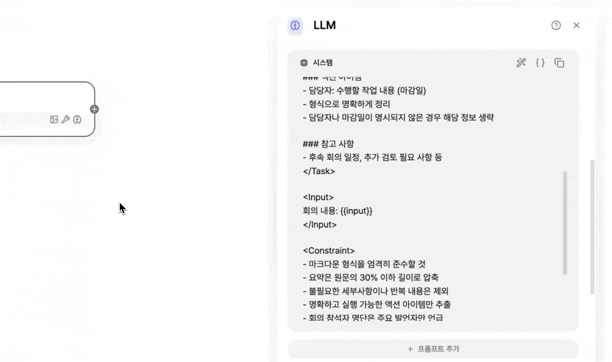
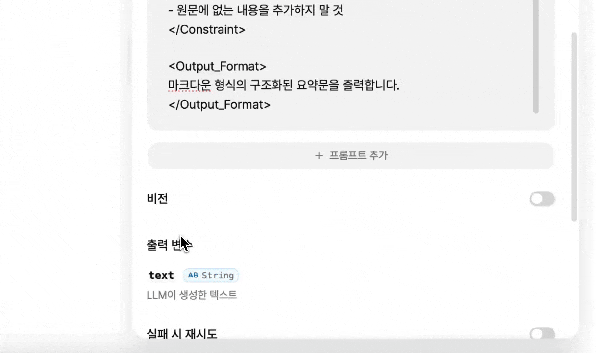

# \[레벨 1] 회의록 요약하기

## 시작 노드

**시작 노드는 워크플로우에 기본으로 포함되는 단계로, 어떤 정보를 입력값으로 받을지 설정**하는 곳입니다. 이 단계에서는 어떤 형태의 데이터를 어떤 변수에 담아 받을지 정합니다.

예를 들어 회의록은 텍스트를 직접 입력받을 수도 있고, 음성 파일을 업로드하는 방식으로 받을 수도 있습니다. 시작 노드는 이처럼 전달된 입력값이 무엇을 의미하는 데이터인지 정의하는 역할을 합니다.

**이번 레벨 1 예제에서는 가장 간단한 방식으로, 텍스트 형태의 회의록을 복사해 붙여넣는 방법으로 진행해 보겠습니다.**

### STEP 1. 시작 노드 구성하기

1. 시작 노드를 클릭한 후 **\[+ 변수 추가]** 버튼을 클릭합니다.
2. 아래 예시와 같이 변수를 설정한 뒤 **\[확인]** 버튼을 클릭합니다.

<figure><figcaption></figcaption></figure>

3. 설정이 완료되면 생성된 **input 변수**가 정상적으로 추가되었는지 확인합니다.

<figure><figcaption></figcaption></figure>


#### 자주 발생하는 오류 메세지

* _**input in input form must be less than 1 characters**_
  * 입력 내용의 길이가 설정된 최대 길이보다 길다면 오류가 발생합니다. 최대 길이 설정을 확인해주세요.
* _**input is required in input form**_
  * 입력 변수를 필수로 설정했지만 값이 입력되지 않은 경우에 발생하는 오류입니다. 매번 입력되지 않는 변수라면 필수 입력 설정을 해제하세요.


## LLM 노드

LLM 노드는 GPT, Claude, Gemini 같은 실제 AI 모델을 활용하는 노드입니다.

이 노드는 워크플로우에서 정해진 입력값을 바탕으로 LLM 모델에 요청을 보내고, 모델이 생성한 응답을 다시 돌려받는 역할을 합니다.

즉, “이 내용을 이렇게 처리해 달라”는 지시(프롬프트)를 모델에 전달하면, 모델이 이해하고 생성한 결과를 반환합니다. 회의록 요약, 문장 정리, 내용 변환처럼 생성형 AI가 결과를 만들어야 하는 작업은 모두 LLM 노드에서 이루어집니다.

### STEP 2. 모델 설정하기

1. 시작 노드 오른쪽의 **+ 버튼**을 클릭하여 LLM 노드를 추가합니다. (또는 마우스 오른쪽 버튼을 클릭해 LLM 노드를 추가한 후 시작 노드를 연결)
2. LLM 노드를 클릭한 뒤 모델을 **GPT 5.2**로 설정합니다. 해당 모델이 없다면 다른 LLM 모델을 사용해도 괜찮습니다.
3. LLM 노드를 클릭한 뒤, 모델의 파라미터를 아래와 같이 설정합니다.

<figure><figcaption></figcaption></figure>


#### 모델의 파라미터 설정

모델의 파라미터 옵션은 사용하고 있는 **모델마다 다를 수 있습니다**.\
하지만 실제로 워크플로우를 사용하는 데에는 아래 4가지 항목만 이해해도 큰 불편 없이 활용할 수 있습니다.

* **Max Tokens**
  * 모델이 한 번에 생성할 수 있는 **최대 글자 분량**을 의미합니다.
  * 값이 클수록 긴 답변을 받을 수 있지만, 너무 작게 설정하면 의도한 답변이 중간에 끊길 수 있습니다.
* **Temperature**
  * 모델의 **답변이 얼마나 창의적인지**를 조절하는 값입니다.
    * 값이 낮을수록 정해진 규칙에 맞게 차분하고 안정적인 답변을 생성하고, 값이 높을수록 더 자유롭고 다양한 표현을 사용합니다.
    * 회의록 요약처럼 정확성이 중요한 작업에는 낮은 값이 적합합니다.
  * 여러 차례 테스트를 진행하며 상황에 맞는 값을 조정한 뒤 최종 확정하는 것을 권장합니다.
* **Reasoning Effort**
  * 모델이 답변을 만들기까지의 **추론 과정을 내부적으로 얼마나 활용할지를 조절하는 옵션**입니다.
  * High로 설정할수록 처리 시간과 비용은 증가하지만, 응답의 퀄리티는 더 높아질 수 있습니다.
* **Response Format**
  * **모델의 출력 결과 형식을 지정하는 옵션**입니다.
  * LLM의 출력이 항상 **고정된 포맷**을 따라야 하는 경우에 사용하는 옵션입니다.
    * 주로 대시보드에 미소를 연동할 때 활용되며, 출력 결과가 매번 동일한 구조여야 UI에서 안정적으로 사용할 수 있습니다. 해당 내용은 추후 강의에서 자세히 다룰 예정입니다.


### STEP 3. 프롬프트 작성하기

많은 분들이 프롬프트를 작성하기 전에 이런 고민을 합니다.\
“어떻게 공부해야 하지?”, “어떤 기법을 써야 하지?”

프롬프트 엔지니어링은 원래 LLM이 지시를 잘 이해하지 못하던 시절, 원하는 결과를 얻기 위해 발전해 온 방법입니다. 하지만 요즘 모델들은 성능이 크게 향상되어, 예전처럼 복잡한 기법을 쓰지 않아도 충분히 좋은 결과를 얻을 수 있는 경우가 많습니다.

가장 중요한 것은 **내가 원하는 동작을 얼마나 정확하게 지시하느냐**입니다. `<xml>` 태그로 감싸거나, 마크다운 형식으로 구조화하는 등 다양한 작성 방식들이 알려져 있지만, 최근의 모델들은 이런 형식 없이도 지시사항을 잘 이해합니다.

다만 저가형 모델(gpt-mini, claude-haiku 등)을 사용하는 경우나 의도한 동작이 복잡한 경우에는 의도한 대로 동작하지 않는 상황이 종종 발생합니다. 이런 경우에는 프롬프트 엔지니어링 기법을 활용해 지시를 더 명확하게 전달하는 것이 도움이 될 수 있습니다.

**이번에 개편된 미소 AI(상단 메뉴 가장 좌측)에는 미소에서 권장하는 프롬프트 작성 지침이 기본으로 내장되어 있어, 직접 사용해보는 것을 추천드립니다.**

<figure><figcaption></figcaption></figure>

1. **미소 AI에 아래와 같이 요청사항을 입력합니다.**

```
회의록 요약을 위해 `<input>` 변수로 회의 내용을 전달받아, 
요약 결과를 마크다운 형식으로 주요 내용과 액션 아이템을 구분해 간결하고 명확하게 출력하는 프롬프트를 작성해줘
```

2.  **생성된 프롬프트를 복사합니다.**

    1. 생성 프롬프트 예시

    <pre data-expandable="true"><code>&#x3C;Role>
    당신은 회의록을 분석하고 요약하는 전문가입니다. 회의 내용을 체계적으로 정리하여 핵심 정보를 추출합니다.
    &#x3C;/Role>

    &#x3C;Task>
    회의록을 분석하여 다음 형식으로 요약하세요:

    ## 회의 요약

    ### 주요 내용
    - 논의된 핵심 주제와 결정 사항을 간결하게 정리
    - 중요한 의견이나 논의 포인트를 요약
    - 각 항목은 bullet point로 구성

    ### 액션 아이템
    - 담당자: 수행할 작업 내용 (마감일)
    - 형식으로 명확하게 정리
    - 담당자나 마감일이 명시되지 않은 경우 해당 정보 생략

    ### 참고 사항
    - 후속 회의 일정, 추가 검토 필요 사항 등
    &#x3C;/Task>

    &#x3C;Input>
    회의 내용: {{input}}
    &#x3C;/Input>

    &#x3C;Constraint>
    - 마크다운 형식을 엄격히 준수할 것
    - 요약은 원문의 30% 이하 길이로 압축
    - 불필요한 세부사항이나 반복 내용은 제외
    - 명확하고 실행 가능한 액션 아이템만 추출
    - 회의 참석자 명단은 주요 발언자만 언급
    - 애매하거나 불확실한 내용은 "추가 확인 필요"로 표시
    - 원문에 없는 내용을 추가하지 말 것
    &#x3C;/Constraint>

    &#x3C;Output_Format>
    마크다운 형식의 구조화된 요약문을 출력합니다.
    &#x3C;/Output_Format>
    </code></pre>
3. **앱 편집 화면의 LLM 노드로 돌아가, 앞에서 복사한 프롬프트를 `시스템` 영역에 붙여넣습니다.**
4.  **복사한 프롬프트에서 `<Input>` 영역에 있는 `{{input}}`는 현재 단순 텍스트로 입력되어 있습니다. 이 부분을 미소에서 인식할 수 있도록, 시작 노드에서 생성한 입력 변수를 참조하는 변수 형태로 변경해야 합니다.**

    1. 붙여넣은 프롬프트에서 `{{input}}` 부분을 제거합니다.
    2. `/` 를 입력하여 변수 목록을 조회합니다.
    3. 변수 목록에서 `시작-input` 변수를 선택합니다.


    <figure><figcaption></figcaption></figure>
5. 시스템 프롬프트 영역 하단의 **\[+ 프롬프트 추가]** 버튼을 클릭한 뒤, 아래와 같이 사용자 프롬프트를 추가합니다.

```
<input>의 회의 내용을 분석하여 요약 결과를 반환하세요.
```

<figure><figcaption></figcaption></figure>


#### 사용자 프롬프트는 반드시 추가해야 하나요?

* **권장 사항이지만 필수는 아닙니다.**
  * SYSTEM과 USER 프롬프트를 분리해서 사용하는 것을 권장합니다.
  * 분리하게 되면 LLM 모델이 “이건 반드시 지켜야 할 지침(SYSTEM)이구나”, “이건 방금 들어온 사용자의 요청(USER)이구나” 하고 맥락을 구분해 인식하게 됩니다.
* ⚠️ **Claude, Gemini와 같은 일부 모델은 USER 메시지가 하나도 없으면 오류가 발생합니다.**
  * 모델 연동 구조 상 일부 모델에 User 메세지가 없을 경우 오류가 발생합니다.
  * _'이 모델은 최소 1개 이상의 사용자 메시지가 필요합니다.'_  라는 오류가 발생하면 USER 메시지를 반드시 추가해야 합니다.


## 종료 노드

워크플로우는 항상 **시작 노드와 함께 1개 이상의 종료 노드가 필요**합니다.

**그렇다면 종료 노드의 출력 변수는 항상 설정해야 할까요?**

반드시 그렇지는 않습니다.\
**종료 노드의 출력 변수를 설정하는 이유는, 미소 앱 화면에서 결과를 확인하거나 해당 워크플로우를 API로 외부 UI나 다른 시스템과 연동할 때 데이터를 전달**하기 위함입니다.

예를 들어, 워크플로우의 결과를 미소 내 메일 전송 도구를 통해 바로 전달하는 경우라면 종료 노드의 출력 변수에는 아무 값도 설정하지 않아도 문제없이 사용할 수 있습니다.

### STEP 4. 종료 노드 설정하기

이번 예제에서는 이해를 돕기 위해, **LLM 노드의 출력 결과를 종료 노드의 출력 변수로 설정**해보겠습니다.

1. LLM 노드 우측에 종료 노드를 추가합니다.
2. 종료 노드를 클릭한 후, 출력 변수 오른쪽의 **\[+]** 버튼을 클릭합니다.
3. 연결 변수에서 LLM의 출력 변수인 **`text`**&#xB97C; 선택하고, 변수 이름을 **`result`**&#xB85C; 설정합니다.



## 테스트하기

미소의 편집 화면에는 실행과 관련된 두 가지 기능인 **테스트하기**와 **미리보기**가 있습니다.

**테스트**에기서는 각 노드에서 입력과 출력이 어떻게 처리되는지 로그를 통해 확인할 수 있습니다.

반면 **미리보기**는 종료 노드에 출력 변수가 설정되어 있어야만 결과가 화면에 표시되며, 종료 변수에 변수를 설정하지 않으면 출력이 나타나지 않습니다.

이번 예제에서는 전체 흐름을 확인하기 위해 **테스트하기**를 사용해 보겠습니다.


1. 아래에 제공된 샘플 회의 기록 파일을 다운로드한 후 열어, 내용을 텍스트로 복사합니다.



2. 상단 중앙의 **\[테스트하기]** 버튼을 클릭합니다.
3. 우측 테스트 창에서 입력 변수를 클릭한 뒤, 복사한 내용을 붙여넣고 **\[실행 버튼]**&#xC744; 클릭합니다.

<figure><figcaption></figcaption></figure>


**LLM에 설정한 지침에 따라 회의 내용이 요약되어 출력되는 것을 확인할 수 있습니다.**

다음 레벨 2 예제에서는 이번 예제를 한 단계 더 발전시켜, 음성 파일뿐만 아니라 텍스트 파일도 함께 첨부하여 음성·텍스트 등 다양한 유형의 회의록을 자동으로 처리하고 요약하는 기능을 추가해 보겠습니다.
