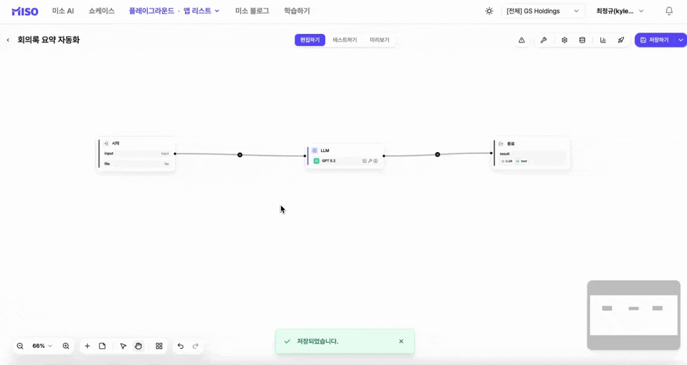
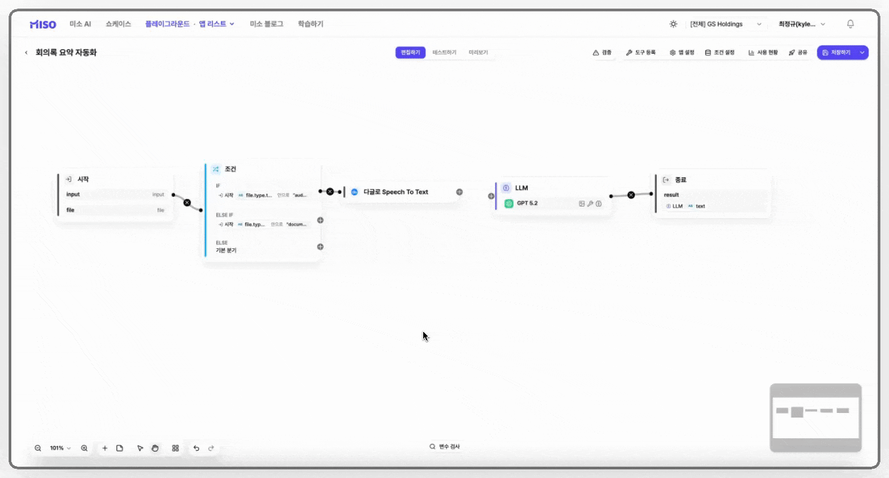
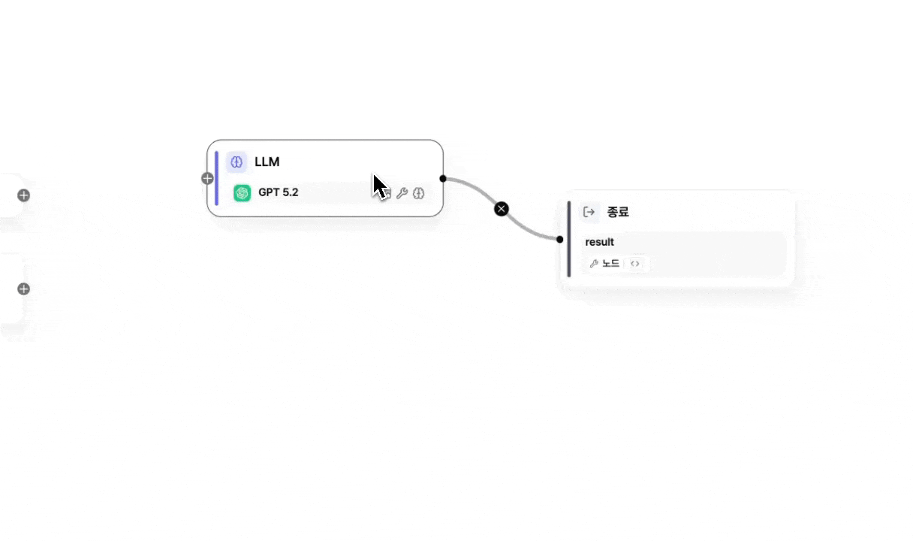

# \[레벨 2] 다양한 유형의 파일 처리하기

매번 회의록을 텍스트로 복사해 입력해야 한다면 번거롭겠죠. 이번 단계에서는 음성 파일이나 문서 등 다양한 형식의 파일을 바로 처리할 수 있도록 워크플로우를 고도화해보겠습니다.

워크플로우를 구성하기 전에 먼저 어떤 요구 조건이 있는지 정리해보면 좋습니다. 이 과정을 거치면 어떤 노드를 사용해야 할지, 또 어떤 순서와 배치가 적절한지 자연스럽게 떠올리며 아이디어를 점진적으로 구체화할 수 있습니다.


#### 아이디어 구체화하기

1. **이전의 워크플로우에 파일입력을 추가하려면 어떻게 해야할까?**

* 파일을 첨부할 수 있는 입력이 설정되어야한다.

2. **파일은 어떤 종류가 있을까?**

* 회의록의 경우 음성, 텍스트 파일이면 충분할 것이다.
  * 음성과 텍스트 파일에 적합한 처리 방식을 거친 후 LLM에게 회의록 내용을 전달해야한다.
* 파일의 종류를 자동으로 감지하고 해당 파일의 처리 플로우로 전환될 수 있다면 좋겠다.


## 시작 노드

파일을 입력받기 위해 입력 변수를 추가해야 합니다.&#x20;

워크플로우에서는 시작 노드에 **‘단일 파일’** 또는 **‘다중 파일’** 변수를 설정할 수 있습니다.&#x20;

말 그대로 파일을 하나만 받을지, 여러 개를 받을지 선택하는 옵션입니다. 이번 예제에서는 하나의 회의록 파일만 처리하면 되므로 **단일 파일**을 선택하겠습니다.

### STEP 1. 단일 파일 변수 추가하기

1. 시작 노드를 클릭한 후 **\[+ 변수 추가]** 버튼을 클릭합니다.
2. 아래 예시와 같이 **단일 파일** 변수를 설정한 뒤 **\[확인]** 버튼을 클릭합니다.

<figure><figcaption></figcaption></figure>

## 조건 노드

회의록은 상황에 따라 음성 파일일 수도 있고, 문서 파일일 수도 있습니다.\
각 파일 유형에 맞는 전처리 과정이 필요하다면, 워크플로우 앱을 각각 따로 만들어야 할까요?

그럴 필요는 없습니다.\
하나의 워크플로우 안에서 **조건에 따라 실행 경로를 분기**하면 됩니다.\
여러 갈래 중 **하나의 경로만 선택하여 동작하도록 만드는 노드**가 바로 **조건 노드**입니다.

조건 노드는 `IF / ELSE IF / ELSE` 개념을 기반으로 동작합니다.

* **IF** : 특정 조건이 참일 경우 해당 경로로 이동합니다.
* **ELSE IF** : 앞선 조건이 거짓일 때, 다음 조건을 확인합니다.
* **ELSE** : 위 조건이 모두 해당하지 않을 경우 기본 경로로 이동합니다.

조건은 위에서부터 순서대로 평가되며, **처음으로 참이 되는 하나의 경로만 실행됩니다.**

예를 들어,

* 파일이 **음성 파일**이라면 → 음성 인식(STT) 처리 경로로 이동
* 파일이 **문서 파일**이라면 → 문서 텍스트 추출 경로로 이동
* 그 외의 파일이라면 → 지원 형식 안내 또는 재첨부 요청

이처럼 조건 노드를 활용하면, 하나의 워크플로우 안에서 다양한 입력 유형을 유연하게 처리할 수 있습니다.

<figure><figcaption></figcaption></figure>

### STEP 2. 조건 노드 구성하기

1. 기존의 시작 노드와 LLM 노드를 연결하던 선을 제거한 뒤, 시작 노드 바로 다음에 **조건 노드**를 추가합니다.

<figure><figcaption></figcaption></figure>

2. 앞에서 정리한 **파일 유형(음성 파일, 문서 파일)에 따라 서로 다른 처리 경로로 분기**하도록 조건을 설정해보겠습니다.
   1. IF 아래있는 **`선택한 변수를 조건 대상으로 지정합니다`** 버튼을 클릭합니다.
   2. **`시작 - file - type`** 변수를 설정합니다.
   3. 유형을 **`오디오`** 로 설정합니다.
   4. **`+ ELSE IF 추가`** 버튼을 클릭합니다.
   5. **`시작 - file - type`** 변수를 설정합니다.
   6. 유형을 **`문서`** 로 설정합니다.

<figure><figcaption></figcaption></figure>

이제 조건 노드의 각 분기(조건) 오른쪽에 있는 **\[+] 버튼**에 해당 워크플로우(처리 경로)를 연결하면, **조건을 만족하는 경로만 실행**됩니다. 예를 들어 첨부파일 유형이 **오디오**라면 가장 위의 오디오 처리 경로만 동작하고, 다른 경로(문서/기타)는 실행되지 않습니다.

<figure><figcaption></figcaption></figure>

## 음성 변환 도구

STT와 TTS라는 용어를 한 번쯤 들어보셨을 것입니다.

* **STT (Speech To Text)** : 음성을 텍스트로 변환하는 기술
* **TTS (Text To Speech)** : 텍스트를 음성으로 변환하는 기술

미소에서는 이 두 가지 기능을 모두 지원하고 있습니다.

이번 예제에서는 **음성 회의록 파일을 텍스트로 변환**해야 하므로, 음성을 글자로 바꿔주는 **STT 기능**을 활용해보겠습니다. 이제 음성 파일을 텍스트로 변환하는 과정을 함께 살펴보겠습니다.

### 음성 변환 도구 선택하기



미소에서 음성 파일을 텍스트로 변환하는 방법은 두 가지가 있습니다.

1. **오디오 도구**\
   OpenAI의 음성 인식 모델(예: Whisper)을 사용합니다.\
   사용하려면 해당 음성 모델이 미소에 등록되어 있어야 합니다.
2. **다글로 도구**\
   외부 음성 인식 서비스입니다.\
   다글로 API 키만 등록하면 바로 사용할 수 있습니다. 초기 가입 시, `12,000원(10시간 상당)` 의 무료 크레딧을 제공합니다.&#x20;

두 도구는 역할이 동일하므로, 환경에 맞는 도구를 선택하여 사용하시면 됩니다.



<figure><figcaption></figcaption></figure>




음성 모델이 등록되어 있지 않은 경우도 있을 수 있으므로, 이번 예제에서는 외부 서비스인 **다글로**를 연동해보겠습니다.

### 다글로 API 키 발급받기

1. [developers.daglo.ai](https://developers.daglo.ai)에 접속합니다.
2. 우측 상단에서 **API 사용하기** 버튼을 클릭합니다.
3. 계정이 없다면 가입을 진행합니다.
4. 좌측 메뉴에서 **토큰**을 클릭 후 **새로 등록** 버튼을 클릭하여 토큰을 생성합니다.
5. 생성된 토큰을 복사합니다.

<figure><figcaption></figcaption></figure>

### 미소 도구 등록하기

1. 상단 메뉴에서 **플레이그라운드 - 도구 모음**을 클릭합니다.
2. 우측 상단 검색창에 **다글로**를 입력합니다.
3. **다글로 도구**를 클릭한 후, API 토큰을 입력합니다.
4. **저장** 버튼을 클릭하고, 도구가 활성화되었는지 확인합니다.

<figure><figcaption></figcaption></figure>

### STEP 3. 음성 변환 노드 구성하기

1. 조건 노드에서 **첫 번째 조건**의 + 버튼을 클릭합니다.
2. 도구 메뉴에서 "**다글로 Speech to Text**"를 선택합니다.

<figure><figcaption></figcaption></figure>

3. 입력 변수의 오디오 파일을 시작 노드의 `file`로 설정한 뒤, 화자 분리 활성화를 **On**으로 변경합니다.

<figure><figcaption></figcaption></figure>

<strong>(참고) Daglo STT 부가기능 설정</strong>

| 설정               | 입력 형식       | 기본값           | 설명                                                                                                                                                                           |
| ---------------- | ----------- | ------------- | ---------------------------------------------------------------------------------------------------------------------------------------------------------------------------- |
| **키워드 부스트 활성화**  | On/Off 토글   | Off           | 특정 단어를 더 정확하게 인식하고 싶을 때 활성화합니다. 브랜드명, 프로젝트명, 전문 용어가 많은 경우에 적합합니다.                                                                                                            |
| **키워드**          | 텍스트 (쉼표 구분) | 없음            | 키워드 부스트 활성화 시, 강조할 단어를 입력합니다. 여러 개 입력할 경우 쉼표(`,`)로 구분합니다. 예: `MISO, 가드레일, 워크플로우`                                                                                             |
| **부스트 레벨**       | 숫자 (1\~15)  | `7`           | 키워드 인식 가중치를 설정합니다. 값이 클수록 해당 키워드를 더 강하게 인식합니다. 일반적으로 기본값(`7`) 유지가 권장되며, 특정 단어 인식이 잘 되지 않을 때만 높여 조정합니다.                                                                       |
| **언어**           | 드롭다운 선택     | `ko-KR` (한국어) | 업로드한 음성 파일의 실제 언어에 맞게 선택합니다. 한국어와 영어가 섞인 경우 `mixed`를 선택합니다.                                                                                                                  |
| **멀티 채널 수**      | 숫자 (1\~2)   | 없음            | 좌·우 채널이 분리된 녹음 파일(예: 콜센터 통화 녹취)에만 `2`를 입력합니다. 일반 녹음 파일은 비워두어도 됩니다.                                                                                                           |
| **화자 분리 활성화**    | On/Off 토글   | Off           | 여러 사람이 대화하는 음성 파일에서 발화자를 구분해 텍스트로 변환합니다. 회의, 인터뷰, 통화 녹취와 같이 화자가 2명 이상인 경우에 활성화합니다.                                                                                           |
| **화자 수 힌트**      | 숫자 (2 이상)   | 없음            | 예상되는 화자 수를 숫자로 입력합니다. 보다 정확한 분리를 위해 입력 변수에 숫자형 변수를 생성한 뒤 해당 변수를 연결하는 것을 권장합니다. 예: 회의 참여자가 3명이라면 → 숫자 변수(`speaker_count = 3`) 설정 후 해당 변수 지정. ※ 화자 수를 정확히 입력할수록 분리 정확도가 향상됩니다. |
| **키워드 추출 활성화**   | On/Off 토글   | Off           | 변환된 텍스트에서 핵심 단어를 자동으로 추출합니다. 회의 요약이나 태그 자동 생성이 필요한 경우에 활성화합니다.                                                                                                               |
| **키워드 추출 최대 개수** | 숫자          | `10`          | 추출할 키워드의 최대 개수를 설정합니다. 특별한 제한이 필요하지 않다면 기본값(`10`)을 유지합니다.                                                                                                                    |

## 문서 추출기 노드

문서 추출기 노드는 업로드한 문서 파일에서 **텍스트만 뽑아주는 역할**을 합니다.

LLM은 PDF나 Word 파일 자체를 그대로 이해하는 것이 아니라, 그 안에 들어 있는 **텍스트 내용을 기반으로** 작업을 수행합니다.

그래서 문서를 그대로 전달하는 것이 아니라, 먼저 텍스트로 변환해주는 과정이 꼭 필요합니다. 이때 사용하는 노드가 바로 문서 추출기 노드입니다.

즉, 문서 파일을 LLM이 이해할 수 있는 형태로 바꿔주는 중간 단계라고 생각하시면 됩니다.


#### 표나 사진도 추출이 되나요?

회의록처럼 **텍스트 중심 문서**는 단순 추출만으로도 충분히 처리할 수 있습니다.

다만 **이미지나 표가 포함된 복잡한 레이아웃 문서**는 어떤 영역이 표/이미지인지 먼저 구분한 뒤, **요소별로 알맞은 방식으로 처리**해야 합니다. 이 내용은 이후 예제에서 다뤄보겠습니다.


### STEP 4. 문서 추출기 노드 구성하기

1. 조건 노드에서 **두번째 조건**의 + 버튼을 클릭합니다.
2. 기본 노드에서 변환 - **문서 추출기**를 클릭합니다.

<figure><figcaption></figcaption></figure>

3. 문서 추출기 - 입력 변수의 문서 파일을 시작 노드의 `file`로 지정합니다.

<figure><figcaption></figcaption></figure>


## 원본 형식 유지 설정이란?

**원본 형식 유지** 옵션은 파일에서 내용을 추출할 때,\
문서에 포함된 **HTML 구조까지 함께 가져올지** 결정하는 설정입니다.

* **OFF (기본값)**\
  글자만 깔끔하게 추출합니다.\
  → 안녕하세요 회의 안건
* **ON**\
  파일에 포함되어 있던 **HTML 코드까지 그대로 함께 추출합니다.**\
  → `

안녕하세요
<b>회의 안건</b>
`

✔️ **내용 텍스트만 필요하다면 OFF, 원래 구조나 서식까지 분석해야 한다면 ON**으로 설정하시면 됩니다.


## LLM 노드

이제 텍스트로 변환된 회의록을 처리할 LLM 노드를 각 분기 경로에 추가해줍니다.

전체 흐름은 \[레벨 1]과 크게 다르지 않습니다. 이전 단계에서는 회의록이 문자열(string) 형태로 입력되었기 때문에 바로 LLM에 전달할 수 있었습니다. 하지만 이번 단계처럼 텍스트 파일이나 음성 파일로 업로드되는 경우에는, LLM이 이해할 수 있도록 먼저 텍스트로 변환하는 과정이 필요합니다.

그래서 위에서 음성 파일은 **음성 변환(STT) 노드**, 문서 파일은 **문서 추출기 노드**를 통해 각각 텍스트로 처리했습니다. 이렇게 전처리된 텍스트를 각 분기 경로에서 LLM 노드로 전달하면, 파일 유형과 관계없이 동일한 방식으로 회의록을 요약하거나 가공할 수 있습니다.

### STEP 5. 개별 LLM 노드 구성하기

1. 기존에 있던 **LLM 노드를 우클릭**한 후 **노드 복사**를 클릭합니다.

<figure><figcaption></figcaption></figure>

2. 각 LLM 노드를 음성 변환(다글로) 노드와 문서 추출기 노드 각각에 연결합니다.

<figure><figcaption></figcaption></figure>

3. 먼저 다글로 노드에 연결된 **LLM 노드**를 클릭하여 **\<input>의 회의 내용을 다글로 노드의 출력 변수**로 변경합니다.

<figure><figcaption></figcaption></figure>

4. 문서 추출기 노드에 연결된 LLM 노드도 동일하게 **문서 추출기 노드의 출력 변수**로 변경합니다.

<figure><figcaption></figcaption></figure>

5. 각 LLM 노드마다 종료 블록을 추가한 뒤, 해당 노드와 연결합니다.

<figure><figcaption></figcaption></figure>

## 환경 변수

환경변수는 일반적으로 API KEY와 같은 인증 정보나 공통 설정 값을 저장하는 용도로 사용됩니다. 여러 노드에서 반복적으로 활용되는 값을 한 곳에서 관리할 수 있어, 보안성과 유지보수 측면에서 매우 효율적입니다.

이번 예제에서는 인증 정보나 설정 값이 아닌, 워크플로우 실행 중 에러가 발생했을 때 사용자에게 동일한 안내 메시지를 일관되게 제공하는 방법을 살펴보겠습니다.

### STEP 6. 잘못된 파일 첨부 안내하기

1.  우측 상단의 메뉴에서 **조건 설정**을 클릭합니다.

    <figure><figcaption></figcaption></figure>
2. **실행 조건 설정** - **변수 추가**를 클릭합니다.

<figure><figcaption></figcaption></figure>

3. 아래와 같이 **`error_message` 라는 환경 변수를 추가**합니다.

<figure><figcaption></figcaption></figure>

4. 조건 노드의 **ELSE(기본 분기)** 경로에 **종료 노드**를 추가한 뒤, **출력 변수**에 앞서 설정한 **환경 변수**(`error_message`)를 할당합니다.

<figure><figcaption></figcaption></figure>


많은 분들이 워크플로우는 **노드가 만든 결과만 밖으로 보낼 수 있다**고 생각합니다. 하지만 실제로는 **환경 변수와 대화 변수를 활용해**, 미리 정해둔 문구나 공통 메시지도 함께 보낼 수 있습니다.

다만 이번 예제에서는 **입력 단계에서 파일 변수의 허용 유형을 문서와 오디오로만 제한**해두었기 때문에, 그 외의 파일은 애초에 시작 노드에서 첨부할 수 없습니다. 따라서 별도의 안내 메시지 분기까지 구성하지 않아도 됩니다.

환경 변수나 대화 변수는 **예외 처리가 많은 보다 복잡한 워크플로우를 설계할 때** 훨씬 유용합니다. 해당 내용은 이후 예제에서 더 자세히 다뤄보겠습니다.


## 테스트하기

1. 아래의 제공된 샘플 파일을 다운로드 합니다.




회의록 텍스트 샘플파일


2. 상단 중앙의 **\[테스트하기]** 버튼을 클릭합니다.
3. 우측 테스트 창에서 입력 변수를 클릭한 뒤, file 변수에 다운로드한 파일을 첨부 후 **\[실행 버튼]**&#xC744; 클릭합니다.

<figure><figcaption></figcaption></figure>

실행 로그를 확인해보면, 업로드한 파일의 내용이 **텍스트로 변환되어 LLM에 전달**되고, 이후 LLM이 해당 내용을 **요약해 결과를 출력하는 과정**을 확인할 수 있습니다.

다음 **레벨 3 예제**에서는 **메일 전송 도구**를 활용하여, 이렇게 정리된 회의록을 **회의 참석자에게 자동으로 발송하는 방법**을 알아보겠습니다.
