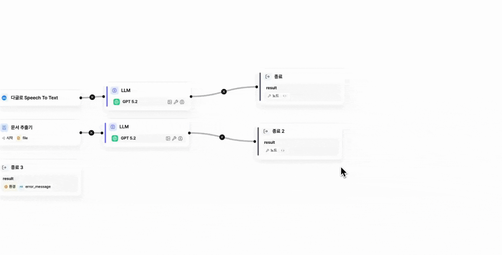

# \[레벨 3] 회의록 이메일 발송하기

이번 단계에서는 LLM 노드로 요약한 회의록 결과를 이메일로 자동 발송하는 방법을 알아보겠습니다. 앞 단계에서 생성한 요약 결과를 활용해, 지정한 수신자에게 회의 내용을 전달하는 워크플로우를 완성해보겠습니다.

## 변수 집계기 노드

변수 집계기 노드는 여러 경로에서 생성된 변수를 하나로 모아, 다음 단계에서 공통으로 사용할 수 있도록 정리해주는 노드입니다.

<figure><figcaption></figcaption></figure>

워크플로우가 **조건 노드**를 통해 여러 갈래로 분기되더라도, 실제 실행 시에는 그중 **하나의 경로만 동작**합니다. 즉, 여러 변수가 동시에 생성되는 것이 아니라 **선택된 한 경로의 결과만** 만들어집니다.

문제는 분기 이후에 **동일한 작업을 다시 수행해야 하는 구간**이 있을 때입니다. 예를 들어 각 분기마다 요약 결과를 이메일로 보내야 한다면, 원래는 각 경로마다 동일한 **이메일 발송 노드**를 각각 따로 구성해야 합니다.

이때 **변수 집계기 노드**를 사용하면, 분기된 흐름을 다시 하나로 합칠 수 있습니다. 각 경로에서 생성된 결과 중 실제로 실행된 값 하나만 받아 **공통 변수**로 정리하고, 이후 단계는 **하나의 워크플로우**로만 구성하면 됩니다.

즉, 변수 집계기는 여러 변수를 단순히 합치는 개념이라기보다, **분기된 흐름을 다시 하나로 모아 이후 작업을 공통으로 처리할 수 있게 해주는 연결 지점**이라고 이해하시면 됩니다.

### STEP 1. 변수 집계기 노드 구성하기

1.  **LLM 노드 다음에 변수 집계기 노드**를 추가한 뒤, **분기된 두 개의 노드**를 모두 해당 집계기 노드에 연결합니다.

    <figure><figcaption></figcaption></figure>
2. 변수 집계기 노드를 클릭한 후, **입력 변수 설정**에서 **두 개의 LLM 노드 출력 변수를 모두 추가**합니다.

<figure><figcaption></figcaption></figure>


Tip. 노드를 복사하면 동일한 이름으로 생성되어 선택 시 혼동이 생길 수 있습니다. 이 경우 노드 편집창에서 노드 이름을 클릭하면 원하는 이름으로 수정할 수 있습니다.


변수 집계기의 출력 변수에는 여러 LLM 노드 중 **실제로 실행된 노드의 결과만** 담깁니다. 따라서 이후 노드를 구성할 때 음성용 로직, 문서용 로직을 각각 따로 만들 필요가 없습니다. 변수 집계기 뒤에서는 하나의 로직만 만들면 됩니다.

이때 기존에 사용하던 LLM 출력 변수를 그대로 쓰는 것이 아니라, **변수 집계기의 출력 변수로 바꿔서 사용하면 됩니다.**

즉, 분기 전에는 여러 갈래였지만, 변수 집계기 이후부터는 하나의 결과만 전달되므로 이후 작업을 단순하게 구성할 수 있습니다.

## 템플릿 노드

회의록 요약 내용만 그대로 메일로 보내면 다소 딱딱하고 어색하게 느껴질 수 있습니다. 이때 템플릿 노드를 활용하면 “안녕하세요. 금일 회의 내용을 공유드립니다.”와 같이 자연스러운 인사말과 안내 문구를 추가해, 실제 업무에서 사용하는 메일 형식으로 정리할 수 있습니다. 요약 결과를 템플릿 안에 변수로 삽입해 보다 완성도 있는 메일 본문을 구성해보겠습니다.

***

### STEP 2. 템플릿 노드 구성하기

1. 변수 집계기 노드 다음으로 **템플릿 노드**를 추가합니다.

<figure><figcaption></figcaption></figure>

2.  템플릿 노드를 아래와 같이 구성합니다.

    1. **변수 매핑** : 입력 변수를 설정
       1. user\_name(시스템 변수) : 발신인 명
       2. meeting\_name(입력 변수 - file - name) : 회의 명
       3. meeting\_summary(변수 집계기 - output) : LLM 요약 결과
    2. **템플릿**

    ```
    안녕하세요. {{ user_name }} 입니다.

    {{ meeting_name }} 관련 회의록 공유드립니다.

    회의록
    ----------------------------------
    {{ meeting_summary }}
    ----------------------------------

    감사합니다.
    ```

<figure><figcaption></figcaption></figure>

3. 템플릿 노드 다음에 종료 노드를 연결해 테스트해보면, 아래와 같이 설정한 변수에 앞선 노드들의 값이 정상적으로 반영된 결과를 확인할 수 있습니다.

<figure><figcaption></figcaption></figure>

이번 예제에서는 간단한 메일 양식을 작성하는 용도로 사용했지만,\
조건문(\{% if %\}), 반복문(\{% for %\}) 등도 지원하여 훨씬 더 복잡한 문서 생성에도 활용할 수 있습니다.

보다 상세한 활용 방법은 추후 예제에서 단계적으로 다루겠습니다.

## 메일 전송 도구

SMTP는 이메일을 보내기 위한 표준 통신 방식입니다. 쉽게 말해, 우리가 작성한 이메일을 상대방 메일 서버까지 안전하게 전달해주는 역할을 합니다.

<figure><figcaption></figcaption></figure>

MISO의 이메일(SMTP) 도구는 이 방식을 이용해 워크플로우에서 자동으로 메일을 발송할 수 있도록 도와줍니다. 관리자가 Gmail이나 사내 메일 계정 등을 미리 등록하고 인증해두면, 해당 계정을 발신자로 설정해 이메일을 보낼 수 있습니다.

<figure><figcaption></figcaption></figure>

단, 메일은 도구에 인증 설정된 고정된 발신자 계정으로만 발송할 수 있습니다. 즉, 사용자가 실행할 때마다 임의의 발신자 주소로 바꿔 보내는 방식은 지원되지 않으며, 관리자가 사전에 등록한 계정으로만 발송됩니다.

### STEP 3. 메일 도구 등록하기

메일 도구가 비활성화 상태라면, 관리자에게 문의하여 SMTP 계정이 정상적으로 등록·인증되어 있는지 확인하시기 바랍니다.

관리자가 아닌 경우에는 아래의 **\[참고] gmail로 메일 도구 설정하기** 페이지를 참고하여 SMTP 계정을 직접 설정할 수 있습니다. 다만, 이메일(SMTP) 도구를 등록하면 현재 워크스페이스에 소속된 모든 사용자가 해당 계정으로 인증된 메일 도구를 함께 사용하게 됩니다.

[gmail.md](gmail.md "mention")

따라서 개인 계정보다는 팀에서 공용으로 사용할 수 있는 메일 계정으로 설정하는 것을 권장드립니다. 가능하다면 관리자와 협의 후 공용 계정으로 등록해 주세요.

### STEP 4. 메일 도구 구성하기

1. 템플릿 노드 다음으로 **도구 - 여러 수신자에게 메일 보내기**를 추가합니다.

<figure><figcaption></figcaption></figure>

2. 메일 도구를 아래와 같이 설정합니다.

<figure><figcaption></figcaption></figure>

3. 마지막으로 종료 노드를 추가합니다. 최종 출력이 사용자에게 이메일을 발송하는 것이라면, 종료 노드에는 별도의 변수를 설정하지 않아도 됩니다.

## 테스트하기

\[레벨 2]와 같이 파일을 첨부하여 워크플로우를 실행하면 아래와 같이 실제로 메일이 전송된 것을 확인할 수 있습니다.

<figure><figcaption></figcaption></figure>


### &#x20;메일에 불필요한 기호가 포함된다면?

마크다운 기호는 이를 지원하는 플랫폼에서만 제대로 보입니다.&#x20;

예를 들어, Notion에서는 제목이 크게 표시되지만, 이메일에서는 `##` 등의 기호가 그대로 나타날 수 있습니다. 따라서 이메일 본문을 생성하는 경우 마크다운 사용을 피하는 것이 좋습니다.&#x20;

다음과 같은 프롬프트를 활용해보세요: "출력은 순수 텍스트로만 작성하고, 마크다운 문법 사용은 피할 것."

