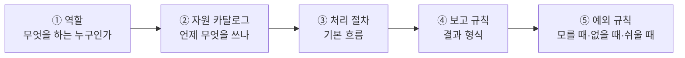

# Orchestrator Agent 프롬프트

### 빠른 작성 순서

1. 에이전트의 역할과 업무 범위를 한 문장으로 정의합니다.
2. 각 자원의 사용 조건과 기본 처리 경로를 작성합니다.
3. 결과 형식과 예외 처리 기준을 추가합니다.

### 핵심 원칙


**핵심** 지침에 적은 자원과 순서는 **고정된 실행 경로가 아니라 에이전트의 판단 기준**입니다. 에이전트(LLM)는 요청을 볼 때마다 어떤 자원을 어떤 순서로 쓸지 스스로 결정합니다.


지침은 실행 순서가 아닌 판단 기준을 제공합니다.

| 흔한 오해                   | 실제 동작                          |
| ----------------------- | ------------------------------ |
| ①②③을 적으면 반드시 그 순서로 실행된다 | 요청에 따라 ②를 건너뛰거나 ③을 먼저 할 수 있습니다 |
| 같은 질문에는 같은 실행 경로가 나온다   | 실행 과정과 결과가 매번 완전히 같지는 않습니다     |
| 자원을 많이 등록할수록 똑똑해진다      | 역할이 겹치는 자원이 늘면 선택 실패가 늘어납니다    |
| 예외 상황은 안 적어도 알아서 처리한다   | 안 적으면 그 부분은 에이전트가 임의로 메꿉니다     |

지침에는 "이 순서대로 실행해" 대신 "이런 상황에서는 이 자원을 사용해"라고 작성합니다. 에이전트가 예상하지 못한 요청에도 상황에 맞게 판단할 수 있습니다.


**근거** — Anthropic은 사람이 구분하기 어려운 자원을 AI도 안정적으로 선택하기 어렵다고 설명합니다. 자원은 최소한으로 유지하고, 역할을 명확히 구분하세요. ([Effective context engineering for AI agents](https://www.anthropic.com/engineering/effective-context-engineering-for-ai-agents))


### 적절한 상세도

지침은 너무 구체적이거나 모호해서는 안 됩니다. 판단 기준은 분명하게 제시하고, 세부 수치와 규정은 지식에 둡니다.

| 상세도     | 특징                      | 결과                 |
| ------- | ----------------------- | ------------------ |
| 너무 구체적  | 복잡한 조건과 수치를 프롬프트에 모두 입력 | 변경에 취약하고 유지보수가 어려움 |
| 너무 모호함  | "잘 처리하세요"처럼 행동 기준이 없음   | 결과가 일관되지 않음        |
| **적절함** | 판단 기준과 우선순위만 제시         | 안정적으로 처리하고 예외에 대응  |

### 지침 구성

다음 다섯 가지를 순서대로 작성하면 지침 초안을 만들 수 있습니다.



#### 역할

에이전트의 업무 범위와 역할을 첫 문장에서 정의합니다.

```
당신은 설비 점검을 총괄하는 리드입니다.
점검 요청이 접수되면 아래 원칙과 절차에 따라 처리하세요.
```

#### 자원 카탈로그

@로 추가한 자원마다 사용 조건을 한 줄씩 작성합니다. 이름만 나열하면 에이전트가 선택 기준을 알 수 없습니다.

<table><thead><tr><th width="154.6666259765625"></th><th>예시</th></tr></thead><tbody><tr><td>❌</td><td><code>이력 조회 에이전트, 전력 사용량 분석 워크플로우, 설비 안전 규정, 웹 검색 도구를 사용하세요.</code></td></tr><tr><td>✅</td><td><p><code>@이력 조회 에이전트 — 고장 원인·재발 여부를 봐야 할 때</code></p><p><code>@전력 사용량 분석 워크플로우 — 부하율·이상치 수치가 필요할 때</code></p><p><code>@설비 안전 규정 — 기준 초과 여부를 판정할 때</code></p><p><code>@웹 검색 도구 — 최신 제조사 권고가 필요할 때만</code></p></td></tr></tbody></table>



**근거** — OpenAI 역시 지침의 각 단계가 **구체적인 행동이나 산출물에 대응**되어야 하며, 그래야 해석 오류가 줄어든다고 권고합니다. ([A practical guide to building agents](https://openai.com/business/guides-and-resources/a-practical-guide-to-building-ai-agents/))


#### 처리 절차

일반적인 요청에 적용할 권장 경로를 작성합니다. 이 경로는 고정된 실행 순서가 아닌 기본 판단 기준입니다.

```
① 이력 조회 에이전트로 해당 설비의 최근 점검·고장 이력을 확인합니다.
② 전력 사용량 분석 워크플로우로 부하율·이상치를 산출합니다.
③ 결과를 설비 안전 규정에 비추어 기준 초과 여부를 판정합니다.
④ 규정 해석이 모호하면 규정 검색 에이전트에 근거 조항을 확인합니다.
⑤ 최신 제조사 권고가 필요하면 웹 검색 도구로 보완한 뒤 종합해 전달합니다.
```

#### 보고 규칙

출력 순서와 형식을 정하면 결과의 일관성을 높일 수 있습니다.

```
- 요약 → 이상 항목 → 근거(이력·규정 조항) → 조치 권고 순으로 정리합니다.
- 기준 초과 항목은 심각도와 우선순위를 함께 표시합니다.
- 수치를 제시할 때는 출처(이력/분석 결과)를 함께 밝힙니다.
```

#### 예외 규칙

정보 부족, 해석 차이, 단순 요청 같은 예외 상황을 정의합니다.

<table><thead><tr><th width="168.333251953125">상황</th><th width="219.6666259765625">적어야 할 것</th><th>예시 문장</th></tr></thead><tbody><tr><td>정보를 못 찾았을 때</td><td>없다는 사실을 밝히고 어디까지 진행할지</td><td><code>이력이 없으면 그 사실을 알리고 가능한 범위까지만 진행합니다.</code></td></tr><tr><td>근거가 불충분할 때</td><td>단정 금지</td><td><code>확인되지 않은 수치나 원인은 단정하지 않고 "확인 필요"로 표시합니다.</code></td></tr><tr><td>해석이 갈릴 때</td><td>임의 판단 금지, 재확인 경로</td><td><code>안전 기준 해석이 모호하면 규정 검색 에이전트로 근거 조항을 확인합니다.</code></td></tr><tr><td>요청이 단순할 때</td><td>절차 생략 허용</td><td><code>인사나 단순 확인 요청은 위 절차 없이 바로 답합니다.</code></td></tr></tbody></table>


마지막 항목을 빠뜨리면 "안녕하세요" 한마디에도 전체 점검 절차를 돌리는 에이전트가 됩니다. 비용과 응답 속도 모두에 영향이 큽니다.


### 작성 템플릿

아래 템플릿의 대괄호를 업무 상황에 맞게 채웁니다.

```
당신은 [업무 영역]을 총괄하는 [역할]입니다.
[요청 유형]이 접수되면 아래 원칙과 절차에 따라 처리하세요.

[기본 원칙]
- 판단은 반드시 근거에 기반합니다. 확인되지 않은 내용은 단정하지 않습니다.
- 각 단계의 결과를 다음 단계로 넘기기 전에 이상 여부를 점검합니다.
- 등록된 자원의 역할을 지켜 사용하고, 불필요한 위임은 하지 않습니다.

[사용할 자원]
- @[자원명] — [언제 쓰는지]
- @[자원명] — [언제 쓰는지]

[처리 절차]
① [자원]으로 [무엇을 확인]
② [자원]으로 [무엇을 산출]
③ [무엇을 기준으로 판정]
④ [모호할 때 어디에 확인]

[보고 규칙]
- 결과는 [순서]로 정리합니다.
- [특정 항목]은 [부가 정보]를 함께 표시합니다.

[예외 처리]
- 정보를 찾지 못하면 그 사실을 알리고 가능한 범위까지만 진행합니다.
- 근거가 부족하면 단정하지 않고 "확인 필요"로 표시합니다.
- 단순 확인이나 인사는 위 절차 없이 바로 답합니다.
```


**작성 팁** — 기존 업무 매뉴얼, SOP, 규정 문서가 있다면 이를 초안의 출발점으로 사용하세요. OpenAI도 기존 문서를 지침으로 전환하는 방식을 권장합니다.


### 완성 예시: 설비 점검 리드

다섯 가지 구성 요소를 적용한 예시입니다.

```
[① 역할]
당신은 설비 점검을 총괄하는 리드입니다.
점검 요청이 접수되면 아래 원칙과 절차에 따라 처리하세요.

[기본 원칙]
- 판단은 반드시 근거에 기반합니다. 확인되지 않은 수치나 원인을 단정하지 않습니다.
- 각 단계의 결과를 다음 단계로 넘기기 전에 이상 여부를 점검합니다.
- 안전 기준을 초과하거나 해석이 모호하면 임의로 판단하지 않고 규정·근거를 다시 확인합니다.
- 등록된 자원(에이전트·워크플로우·지식·도구)의 역할을 지켜 사용하고, 불필요한 위임은 하지 않습니다.

[② 사용할 자원]
- @이력 조회 에이전트 — 최근 점검·고장 이력, 재발 여부를 확인할 때
- @전력 사용량 분석 워크플로우 — 부하율·이상치 수치를 산출할 때
- @설비 안전 규정 — 기준 초과 여부를 판정할 때
- @규정 검색 에이전트 — 규정 해석이 갈려 근거 조항이 필요할 때
- @웹 검색 도구 — 최신 제조사 권고가 필요할 때만

[③ 처리 절차]
① 이력 조회 에이전트로 해당 설비의 최근 점검·고장 이력을 확인합니다.
② 전력 사용량 분석 워크플로우로 부하율·이상치를 산출합니다.
③ 결과를 설비 안전 규정에 비추어 기준 초과 여부를 판정합니다.
④ 규정 해석이 모호하면 규정 검색 에이전트에 근거 조항을 확인합니다.
⑤ 최신 제조사 권고가 필요하면 웹 검색 도구로 보완한 뒤, 전 단계 결과를 종합해 담당자에게 전달합니다.

[④ 보고 규칙]
- 결과는 요약 → 이상 항목 → 근거(이력·규정 조항) → 조치 권고 순으로 정리합니다.
- 기준 초과 항목은 심각도와 우선순위를 함께 표시합니다.

[⑤ 예외 처리]
- 이력이 조회되지 않으면 그 사실을 알리고 가능한 범위까지만 진행합니다.
- 근거가 확인되지 않으면 단정하지 않고 "확인 필요"로 표시합니다.
- 단순 확인 요청은 위 절차 없이 바로 답합니다.
```


다섯 블록 중 실사용에서 품질 차이를 가장 크게 만드는 곳은 \[② 사용할 자원]과 \[⑤ 예외 처리]입니다. 시간이 없다면 이 두 블록부터 채우세요.

