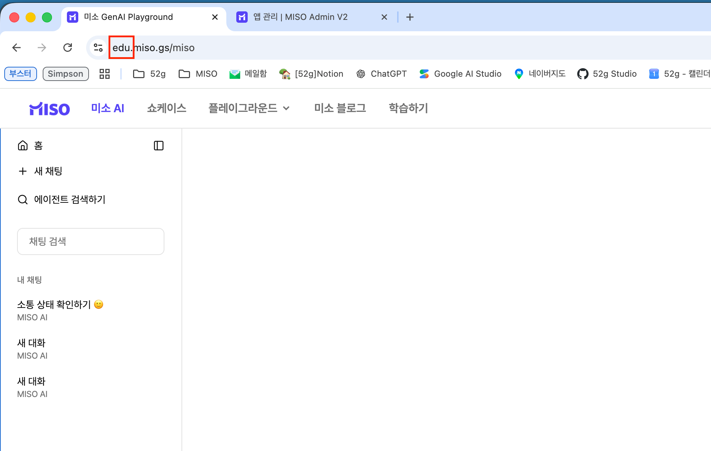

# 사전 세팅

기본 준비물은 2가지입니다.

1. MISO 워크스페이스
2. MISO Admin 계정

이때, 사전에 도메인 설정이 제대로 되어 있는지 확인해봐야 합니다.


\[사전 체크 사항] **Tenant 일치 확인**

현재 **내가 가지고 있는 Admin 계정**이 내가 쓰고자 하는 **워크스페이스를 포함**하고 있는지 확인해야 합니다.

아래 두 가지 방법 중 편하신 방법으로 확인해주세요 😊


<확인 방법 (1) - URL 비교>

각 페이지의 URL 에서 아래 빨간 박스 부분이 서로 일치하는지 확인해주세요!




[MISO 화면]

<figure><figcaption></figcaption></figure>




[Admin 계정]

<figure><figcaption></figcaption></figure>




<확인 방법 (2) - MISO Adnin 워크스페이스 목록>

<figure><figcaption></figcaption></figure>

현재 내가 있는 워크스페이스는  `미소-템플릿` 입니다.

<figure><figcaption></figcaption></figure>

Admin의 워크스페이스 관리 탭에 들어갔을 때, 이 `미소-템플릿` 워크스페이스가 존재하는지 확인해야 합니다.

서로 맞지 않을 경우, 진행할 수 없으니 꼭 확인해주시길 바랍니다 🙂
